# Arsitektur Sistem WebKRSV3

## Diagram Arsitektur 3-Tier

```mermaid
flowchart TD

%% ============================================================
%% STYLING
%% ============================================================
classDef presentationStyle fill:#e8f0fe,stroke:#1a73e8,stroke-width:2px,color:#174ea6,font-size:12px
classDef applicationStyle fill:#e6f4ea,stroke:#137333,stroke-width:2px,color:#137333,font-size:12px
classDef dataStyle fill:#fef7e0,stroke:#b06000,stroke-width:2px,color:#b06000,font-size:12px
classDef externalStyle fill:#fce8e6,stroke:#c5221f,stroke-width:2px,color:#c5221f,font-size:12px
classDef dbStyle fill:#fef7e0,stroke:#b06000,stroke-width:2px,color:#b06000,font-size:12px

%% ============================================================
%% PRESENTATION TIER
%% ============================================================
subgraph PRESENTATION["🖥️ Presentation Tier — Client-Side & GUI"]
    direction LR

    USER_PORTAL["<b>User Portal UI — Client PWA</b>
    • Laravel Blade Templates
    • Tailwind CSS v4 & Alpine.js
    • Leaflet.js Map Viewer
    • sw.js & manifest.json"]

    ADMIN_UI["<b>Admin Dashboard UI — Management GUI</b>
    • Admin Blade Templates
    • Admin Control Panel
    • GeoJSON Boundary Editor
    • Data Export CSV/Excel"]
end

%% ============================================================
%% APPLICATION TIER
%% ============================================================
subgraph APPLICATION["⚙️ Application Tier — Server-Side Logic — Laravel 12"]

    ROUTER["<b>Web Router & Middleware</b>
    routes/web.php
    • Route Handler
    • Middleware: auth, verified, admin"]

    subgraph CONTROLLERS["Controllers"]
        direction LR
        AUTH_CTRL["<b>Auth & Profile</b>
        • AuthController
        • SocialiteController
        • ProfileController"]

        MAP_CTRL["<b>Koleksi & Map</b>
        • KoleksiController
        • Admin/MapController
        • Admin/UserController"]

        PEND_CTRL["<b>Pendaftaran</b>
        • PendaftaranController
        • Admin/PendaftaranManageController
        • Logika Persetujuan"]
    end

    SERVICES["<b>Application Services & Helpers</b>
    • ImageOptimizer — Kompresi & Konversi AVIF
    • PendaftaranPenelitiMail — Mailer SMTP"]
end

%% ============================================================
%% DATA TIER
%% ============================================================
subgraph DATA["🗄️ Data Tier — Database & Data Access Layer"]
    direction TB

    MODELS["<b>Eloquent ORM Models — Data Access Layer</b>
    User.php • Koleksi.php • MapMarker.php
    PendaftaranPengunjung.php • PendaftaranPeneliti.php"]

    DB[("🐘 <b>PostgreSQL Database</b>
    Penyimpanan Relasional & Spasial
    Tabel: users, koleksis,
    map_markers, pendaftarans")]
end

%% ============================================================
%% EXTERNAL SERVICES
%% ============================================================
subgraph EXTERNAL["🌐 External Services"]
    direction TB
    OSM(["🗺️ <b>OpenStreetMap</b>
    Basemap Tiles"])

    GOOGLE(["🔐 <b>Google OAuth API</b>
    Laravel Socialite"])

    SMTP(["📧 <b>SMTP Gmail Server</b>
    Notifikasi Admin"])
end

%% ============================================================
%% FORWARD ARROWS — Solid Lines (Request/Forward Flow)
%% ============================================================

%% Step 1: Presentation → Router / External
USER_PORTAL -->|"1a. HTTP Request
Kunjungan, Riset"| ROUTER
ADMIN_UI -->|"1b. HTTP Request
CRUD, Persetujuan"| ROUTER
USER_PORTAL -->|"1c. Load Basemap Tiles"| OSM

%% Step 2: Router → Controllers
ROUTER -->|"2a. Route &
Auth Middleware"| AUTH_CTRL
ROUTER -->|"2b. Route &
Admin Middleware"| MAP_CTRL
ROUTER -->|"2c. Route &
Verified Middleware"| PEND_CTRL

%% Step 3: Controllers → External / Services
AUTH_CTRL -->|"3a. Google
Socialite Auth"| GOOGLE
MAP_CTRL -->|"3b. Optimasi AVIF"| SERVICES
PEND_CTRL -->|"3c. Notifikasi Email"| SERVICES

%% Step 4: Services/Controllers → External / Models
SERVICES -->|"4a. SMTP Relay"| SMTP
AUTH_CTRL -->|"4b. User Query"| MODELS
MAP_CTRL -->|"4c. Spasial &
Katalog Query"| MODELS
PEND_CTRL -->|"4d. Reservasi Query"| MODELS

%% Step 5a: Models → Database
MODELS -->|"5a. SQL Query /
DDL Execution"| DB

%% ============================================================
%% RETURN ARROWS — Dashed Lines (Response/Return Flow)
%% ============================================================

%% Step 5b: Database → Models
DB -.->|"5b. Return ResultSet /
Records"| MODELS

%% Step 4: Models → Controllers (return)
MODELS -.->|"4b. Return
User Data"| AUTH_CTRL
MODELS -.->|"4c. Return Koleksi /
MapMarker Data"| MAP_CTRL
MODELS -.->|"4d. Return
Pendaftaran Records"| PEND_CTRL

%% Step 4a: SMTP → Services (return)
SMTP -.->|"4a. Return
SMTP Response"| SERVICES

%% Step 3: Services / External → Controllers (return)
GOOGLE -.->|"3a. Return
OAuth User Data"| AUTH_CTRL
SERVICES -.->|"3b. Return
AVIF Path"| MAP_CTRL
SERVICES -.->|"3c. Return
Mail Status"| PEND_CTRL

%% Step 1c: OSM → User Portal (return)
OSM -.->|"1c. Return
Tile Images"| USER_PORTAL

%% Step 6: Router → Presentation (return)
ROUTER -.->|"6a. Return HTML / Cache"| USER_PORTAL
ROUTER -.->|"6b. Return HTML /
JSON Response"| ADMIN_UI

%% ============================================================
%% APPLY STYLES
%% ============================================================
class USER_PORTAL,ADMIN_UI presentationStyle
class ROUTER,AUTH_CTRL,MAP_CTRL,PEND_CTRL,SERVICES applicationStyle
class MODELS dataStyle
class DB dbStyle
class OSM,GOOGLE,SMTP externalStyle
```



---

## Keterangan Alur

### Konvensi Arrow

| Tipe Garis | Arti |
|:---|:---|
| **→ Solid (garis penuh)** | Request / Forward flow |
| **⇢ Dashed (garis putus-putus)** | Response / Return flow |
| **Nomor sama (misal 4b → 4b)** | Forward & Return merupakan pasangan satu alur |

---

### Path 1a — User Portal Flow (Round-Trip Lengkap)

```
User Portal UI
    │
    ├── 1a ──→ Router & Middleware
    │              │
    │              ├── 2a ──→ Auth Controllers ── 4b ──→ Models ── 5a ──→ DB
    │              │              │                         ↑              │
    │              │              │                    4b ←─┘         5b ──┘
    │              │              │
    │              │              ├── 3a ──→ Google OAuth
    │              │              └── 3a ←── Return OAuth User Data
    │              │
    │              ├── 2b ──→ Map/Koleksi Controllers ── 4c ──→ Models
    │              │              │                         ↑
    │              │              │                    4c ←─┘
    │              │              ├── 3b ──→ Services ── 4a ──→ SMTP
    │              │              └── 3b ←── Return AVIF Path
    │              │
    │              ├── 2c ──→ Pendaftaran Controllers ── 4d ──→ Models
    │              │              │                         ↑
    │              │              │                    4d ←─┘
    │              │              ├── 3c ──→ Services ── 4a ──→ SMTP
    │              │              └── 3c ←── Return Mail Status
    │              │
    │              └── 6a ──→ Return HTML / Cache
    │
    └── ← 6a ── Kembali ke User Portal UI ✅
```

### Path 1b — Admin Dashboard Flow

```
Admin Dashboard UI
    │
    ├── 1b ──→ Router & Middleware
    │              │
    │              ├── (Sama seperti 2a/2b/2c di path 1a)
    │              │
    │              └── 6b ──→ Return HTML / JSON Response
    │
    └── ← 6b ── Kembali ke Admin Dashboard UI ✅
```

### Path 1c — External OSM Flow

```
User Portal UI
    │
    ├── 1c ──→ OpenStreetMap (Load Basemap Tiles)
    │
    └── 1c ←── Return Tile Images ✅
```

---

## Daftar Lengkap Arrow

### Forward Arrows (→ Solid)

| Step | Label | Source | Target |
|:---|:---|:---|:---|
| 1a | HTTP Request (Kunjungan, Riset) | User Portal UI | Router & Middleware |
| 1b | HTTP Request (CRUD, Persetujuan) | Admin Dashboard UI | Router & Middleware |
| 1c | Load Basemap Tiles | User Portal UI | OpenStreetMap |
| 2a | Route & Auth Middleware | Router | Auth Controllers |
| 2b | Route & Admin Middleware | Router | Map/Koleksi Controllers |
| 2c | Route & Verified Middleware | Router | Pendaftaran Controllers |
| 3a | Google Socialite Auth | Auth Controllers | Google OAuth API |
| 3b | Optimasi AVIF | Map/Koleksi Controllers | Services & Helpers |
| 3c | Notifikasi Email | Pendaftaran Controllers | Services & Helpers |
| 4a | SMTP Relay | Services & Helpers | SMTP Gmail Server |
| 4b | User Query | Auth Controllers | Eloquent Models |
| 4c | Spasial & Katalog Query | Map/Koleksi Controllers | Eloquent Models |
| 4d | Reservasi Query | Pendaftaran Controllers | Eloquent Models |
| 5a | SQL Query / DDL Execution | Eloquent Models | PostgreSQL Database |

### Return Arrows (⇢ Dashed)

| Step | Label | Source | Target |
|:---|:---|:---|:---|
| 5b | Return ResultSet / Records | PostgreSQL Database | Eloquent Models |
| 4b | Return User Data | Eloquent Models | Auth Controllers |
| 4c | Return Koleksi/MapMarker Data | Eloquent Models | Map/Koleksi Controllers |
| 4d | Return Pendaftaran Records | Eloquent Models | Pendaftaran Controllers |
| 4a | Return SMTP Response | SMTP Gmail Server | Services & Helpers |
| 3a | Return OAuth User Data | Google OAuth API | Auth Controllers |
| 3b | Return AVIF Path | Services & Helpers | Map/Koleksi Controllers |
| 3c | Return Mail Status | Services & Helpers | Pendaftaran Controllers |
| 1c | Return Tile Images | OpenStreetMap | User Portal UI |
| 6a | Return HTML / Cache | Router & Middleware | User Portal UI |
| 6b | Return HTML / JSON Response | Router & Middleware | Admin Dashboard UI |
