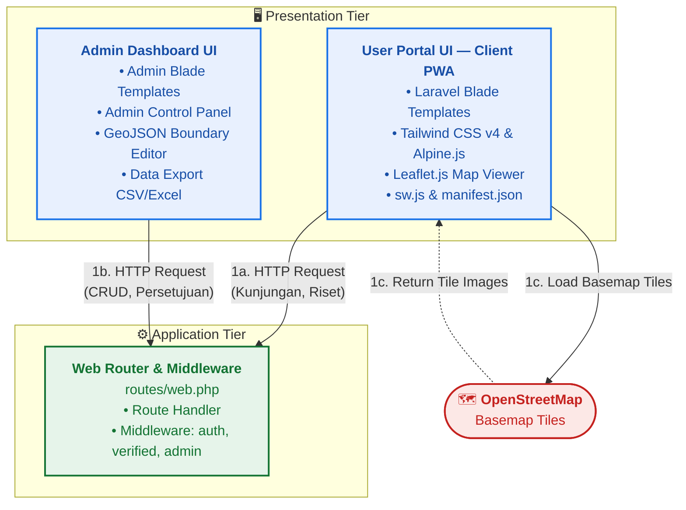
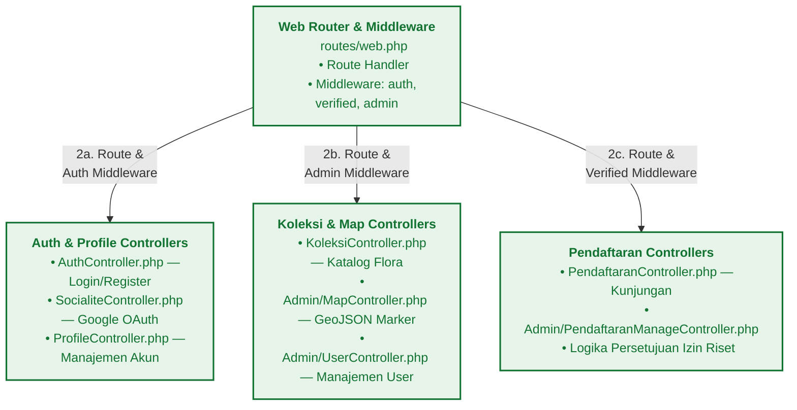
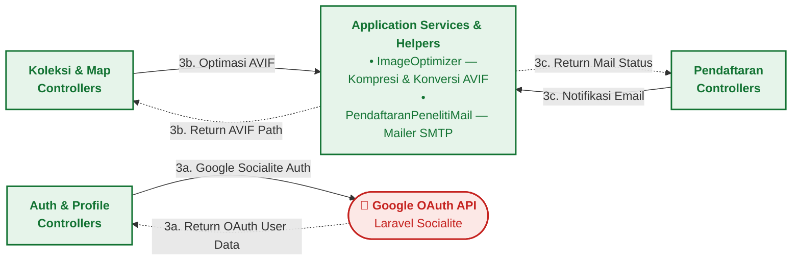
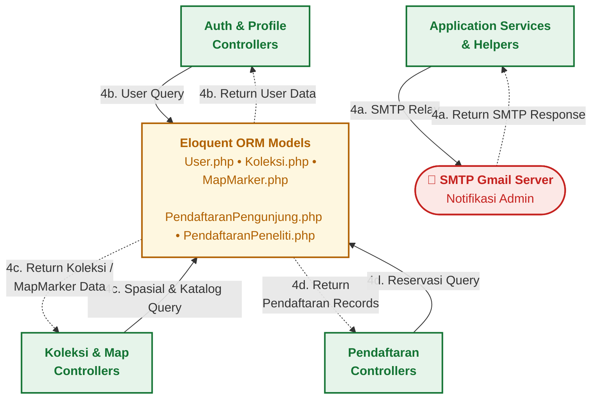
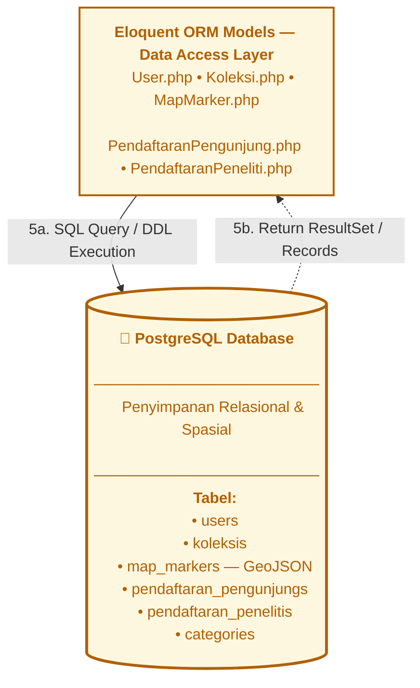
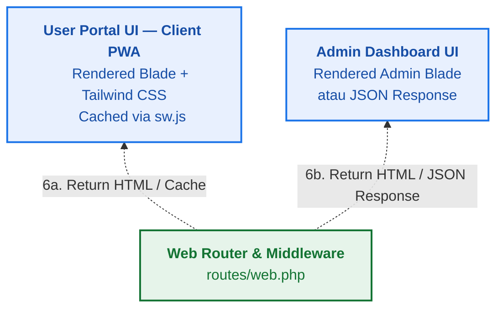
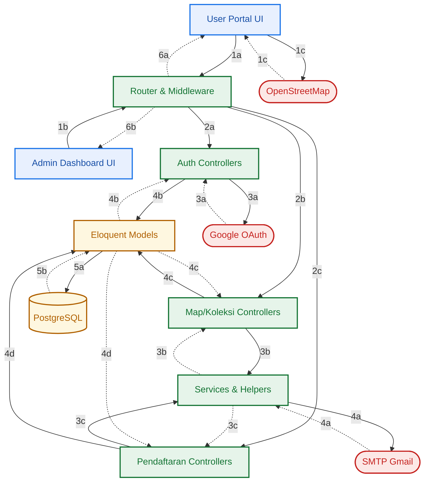

# Arsitektur Sistem WebKRSV3 — Diagram Per Fase

> Setiap fase menunjukkan satu lapisan interaksi dalam arsitektur 3-tier.
> **→ Solid** = Request/Forward | **⇢ Dashed** = Response/Return

---

## Fase A — Entry Point (Presentation → Router & External)

> Titik masuk request dari sisi klien menuju server dan layanan eksternal.

---

## Fase B — Routing & Middleware (Router → Controllers)

> Router memetakan HTTP request ke controller yang sesuai melalui middleware keamanan.

---

## Fase C — Side Effects (Controllers → External Services & Helpers)

> Controller memanggil layanan eksternal dan helper internal untuk proses tambahan.

---

## Fase D — Data Query & External Relay (Controllers/Services → Models & SMTP)

> Controller dan Services melakukan query data via Eloquent ORM dan mengirim email via SMTP.

---

## Fase E — Database Access (Models ↔ PostgreSQL)

> Eloquent ORM mentranslasi operasi model menjadi SQL query ke database PostgreSQL.

---

## Fase F — Response Return (Router → Presentation Tier)

> Router mengembalikan HTTP response berupa rendered HTML atau JSON ke sisi klien.

---

## Diagram Gabungan — Full Round-Trip

> Seluruh fase A–F digabung dalam satu diagram alur penuh.

---

## Ringkasan Fase

| Fase | Nama | Step | Deskripsi |
|:---:|:---|:---:|:---|
| **A** | Entry Point | 1a, 1b, 1c | Presentation Tier mengirim HTTP request ke Router dan memuat tile peta dari OSM |
| **B** | Routing & Middleware | 2a, 2b, 2c | Router memetakan request ke Controller melalui middleware keamanan |
| **C** | Side Effects | 3a, 3b, 3c | Controller memanggil layanan eksternal (Google OAuth) dan helper internal (AVIF, Mail) |
| **D** | Data Query & Relay | 4a, 4b, 4c, 4d | Controller query data via Eloquent ORM, Services relay email via SMTP |
| **E** | Database Access | 5a, 5b | Eloquent ORM mengeksekusi SQL ke PostgreSQL dan menerima ResultSet |
| **F** | Response Return | 6a, 6b | Router mengembalikan rendered HTML/JSON ke Presentation Tier |
