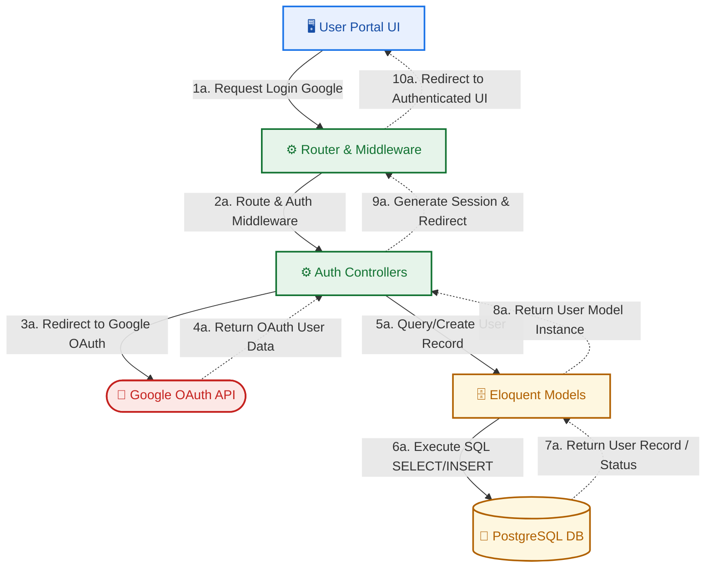
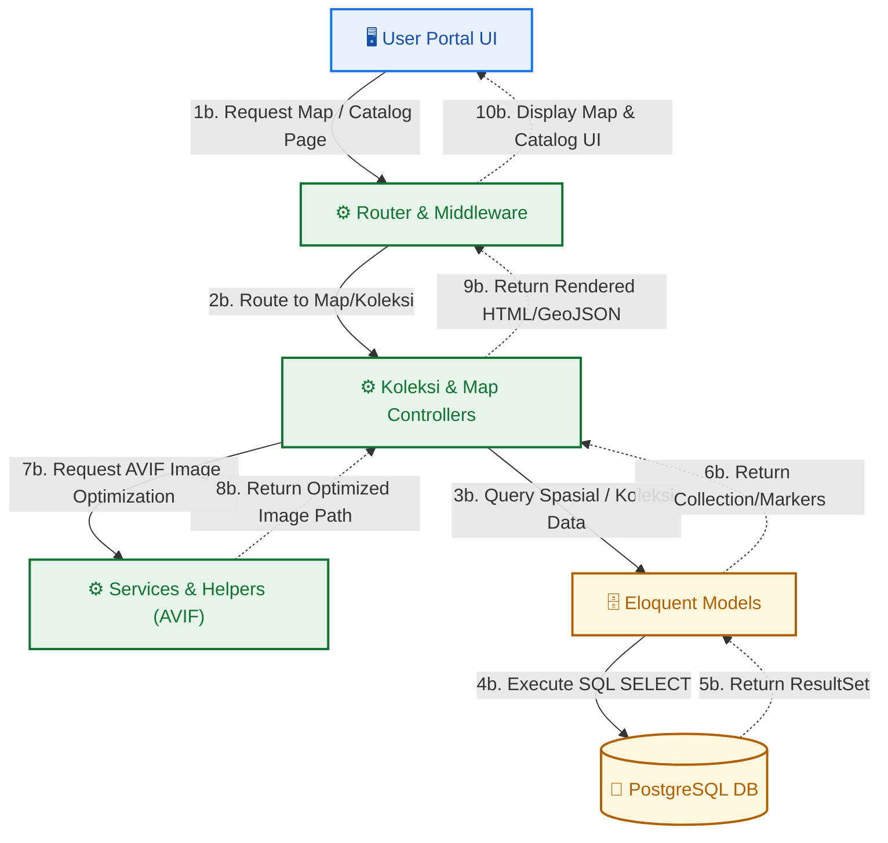
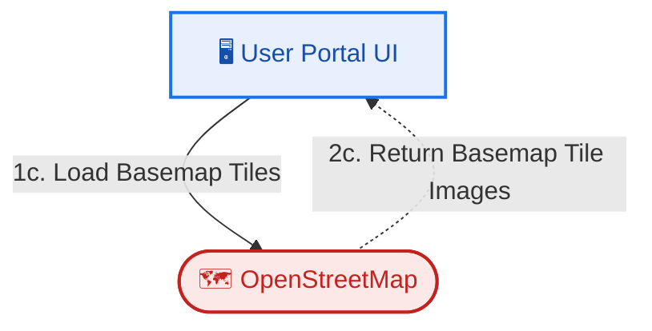
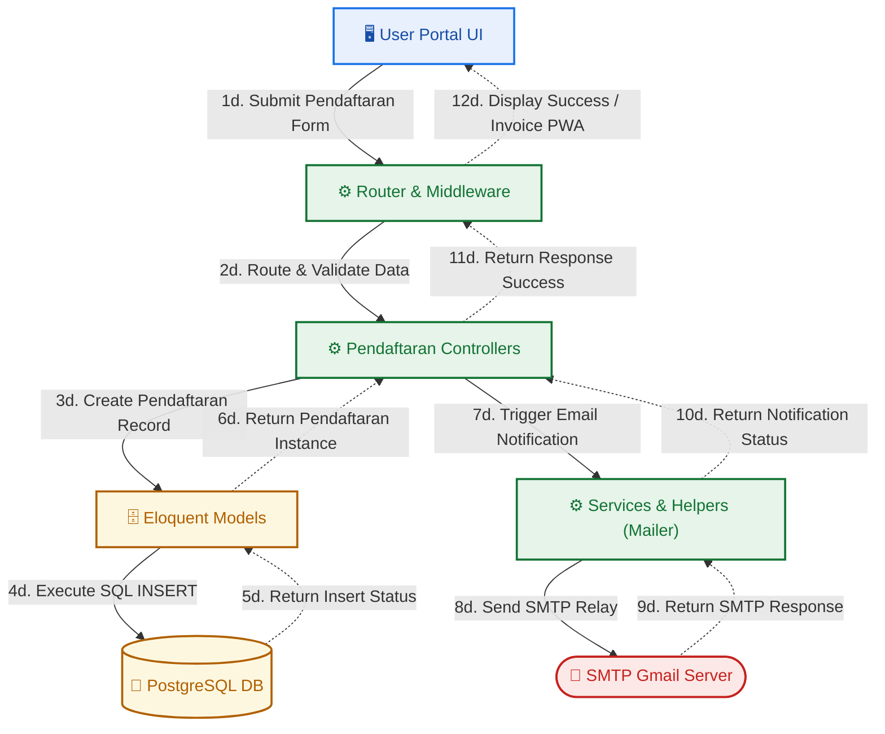
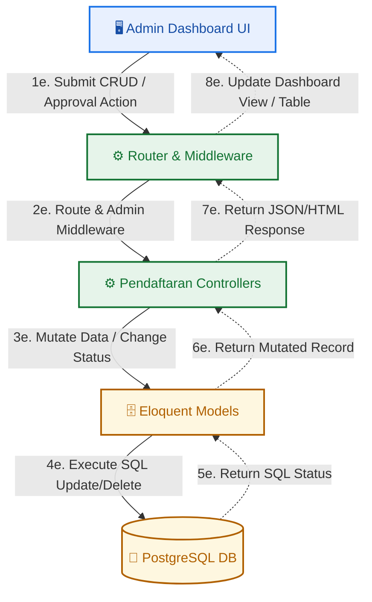

# Arsitektur Sistem WebKRSV3 — Diagram Per Alur (V3)

Setiap alur (*data flow*) didefinisikan secara linear dan mandiri menggunakan kode akhiran huruf (`a`, `b`, `c`, `d`, `e`). Tidak ada percampuran alur, percabangan liar, ataupun duplikasi nomor langkah. Setiap alur diawali dari **Presentation Tier** dan diakhiri kembali di **Presentation Tier** (Full Round-Trip).

---

## 🖥️ Pembagian Tier Arsitektur
1. **Presentation Tier**: Lapisan GUI paling atas yang diakses pengguna (desktop, laptop, tablet, ponsel/PWA).
   - `User Portal UI — Client PWA` (Laravel Blade, Tailwind CSS v4, Alpine.js, Leaflet.js)
   - `Admin Dashboard UI — Management GUI` (Admin templates, control panel, boundary editor)
2. **Application Tier**: Tempat logika bisnis dijalankan pada application server (Laravel 12).
   - `Web Router & Middleware` (`routes/web.php`)
   - **Controllers**:
     - `Auth & Profile Controllers`
     - `Koleksi & Map Controllers`
     - `Pendaftaran Controllers`
   - `Application Services & Helpers` (AVIF image optimizer & SMTP mail helper)
3. **Data Tier**: Lapisan penyimpanan dan retrieval data.
   - `Eloquent ORM Models` (Data Access Layer)
   - `PostgreSQL Database` (Penyimpanan Spasial & Relasional)

---

## 🔄 Rincian Alur Data (Round-Trip)

### Alur A — Autentikasi & Google OAuth (Suffix `a`)
> Alur masuk untuk login pengguna via Google OAuth dan penyimpanan sesi.

---

### Alur B — Peta Spasial & Katalog Flora (Suffix `b`)
> Memuat halaman katalog flora dan visualisasi spasial peta boundary flora.

---

### Alur C — Load Basemap Tiles (Suffix `c`)
> Klien melakukan pemuatan tiles basemap langsung dari API eksternal OpenStreetMap.

---

### Alur D — Pendaftaran Kunjungan & Peneliti (Suffix `d`)
> Formulir reservasi diajukan oleh pengunjung, divalidasi, disimpan, dan mengirim konfirmasi via email.

---

### Alur E — Admin Dashboard (CRUD & Persetujuan) (Suffix `e`)
> Pengelola sistem menyetujui izin penelitian/kunjungan atau melakukan CRUD flora.

---

## 📊 Ringkasan Penomoran Alur

| Kode Alur | Suffix | Komponen Utama | Langkah Mulai | Langkah Akhir | Penjelasan Singkat |
|:---:|:---:|:---|:---:|:---:|:---|
| **Alur A** | `a` | AuthController, Google OAuth | `1a` | `10a` | Alur autentikasi Google OAuth & inisialisasi sesi. |
| **Alur B** | `b` | KoleksiController, MapController, ImageOptimizer | `1b` | `10b` | Pemuatan katalog flora, data spasial, dan optimasi gambar. |
| **Alur C** | `c` | OpenStreetMap | `1c` | `2c` | Pemuatan gambar basemap peta spasial secara asinkron. |
| **Alur D** | `d` | PendaftaranController, SMTP Mailer | `1d` | `12d` | Proses reservasi kunjungan/penelitian dan notifikasi email. |
| **Alur E** | `e` | PendaftaranManageController, Admin Control Panel | `1e` | `8e` | Tindakan administratif/CRUD oleh admin. |

---

## 🗺️ Diagram Gabungan — Full Round-Trip (Unified)
> Seluruh alur data A-E divisualisasikan bersama dalam satu sistem 3-Tier yang terbungkus rapi dalam *boundary boxes* (subgraphs).

```mermaid
flowchart TD
    classDef pres fill:#e8f0fe,stroke:#1a73e8,stroke-width:2px,color:#174ea6
    classDef app fill:#e6f4ea,stroke:#137333,stroke-width:2px,color:#137333
    classDef data fill:#fef7e0,stroke:#b06000,stroke-width:2px,color:#b06000
    classDef ext fill:#fce8e6,stroke:#c5221f,stroke-width:2px,color:#c5221f

    %% --- External Services (Placed on the left, outside boundary boxes) ---
    OSM(["🗺️ OpenStreetMap"])
    GOO(["🔐 Google OAuth API"])
    SMTP(["📧 SMTP Gmail Server"])

    subgraph PRESENTATION["🖥️ Presentation Tier"]
        UP["User Portal UI — Client PWA"]
        AD["Admin Dashboard UI"]
    end

    subgraph APPLICATION["⚙️ Application Tier"]
        RT["Router & Middleware"]
        AUTH["Auth Controllers"]
        MAP["Koleksi & Map Controllers"]
        PEND["Pendaftaran Controllers"]
        SVC["Services & Helpers"]
    end

    subgraph DATA["🗄️ Data Tier"]
        MDL["Eloquent Models"]
        DB[("PostgreSQL Database")]
    end

    %% --- Alur A: Auth (Google OAuth) ---
    UP -->|"1a. Request Login Google"| RT
    RT -->|"2a. Route & Auth Middleware"| AUTH
    AUTH -->|"3a. Redirect to Google OAuth"| GOO
    GOO -.->|"4a. Return OAuth User Data"| AUTH
    AUTH -->|"5a. Query/Create User Record"| MDL
    MDL -->|"6a. Execute SQL (SELECT/INSERT)"| DB
    DB -.->|"7a. Return User Record / Status"| MDL
    MDL -.->|"8a. Return User Model Instance"| AUTH
    AUTH -.->|"9a. Generate Session & Redirect"| RT
    RT -.->|"10a. Redirect to Authenticated UI"| UP

    %% --- Alur B: Map & Flora Catalog ---
    UP -->|"1b. Request Map / Catalog Page"| RT
    RT -->|"2b. Route to Map/Koleksi"| MAP
    MAP -->|"3b. Query Spasial / Koleksi Data"| MDL
    MDL -->|"4b. Execute SQL (SELECT)"| DB
    DB -.->|"5b. Return ResultSet"| MDL
    MDL -.->|"6b. Return Collection/Markers"| MAP
    MAP -->|"7b. Request AVIF Image Optimization"| SVC
    SVC -.->|"8b. Return Optimized Image Path"| MAP
    MAP -.->|"9b. Return Rendered HTML/GeoJSON"| RT
    RT -.->|"10b. Display Map & Catalog UI"| UP

    %% --- Alur C: OSM Tiles ---
    UP -->|"1c. Load Basemap Tiles"| OSM
    OSM -.->|"2c. Return Basemap Tile Images"| UP

    %% --- Alur D: Reservasi & Email Notification ---
    UP -->|"1d. Submit Pendaftaran Form"| RT
    RT -->|"2d. Route & Validate Data"| PEND
    PEND -->|"3d. Create Pendaftaran Record"| MDL
    MDL -->|"4d. Execute SQL (INSERT)"| DB
    DB -.->|"5d. Return Insert Status"| MDL
    MDL -.->|"6d. Return Pendaftaran Instance"| PEND
    PEND -->|"7d. Trigger Email Notification"| SVC
    SVC -->|"8d. Send SMTP Relay"| SMTP
    SMTP -.->|"9d. Return SMTP Response"| SVC
    SVC -.->|"10d. Return Notification Status"| PEND
    PEND -.->|"11d. Return Response Success"| RT
    RT -.->|"12d. Display Success / Invoice PWA"| UP

    %% --- Alur E: Admin Control Panel Action ---
    AD -->|"1e. Submit CRUD / Approval Action"| RT
    RT -->|"2e. Route & Admin Middleware"| PEND
    PEND -->|"3e. Mutate Data / Change Status"| MDL
    MDL -->|"4e. Execute SQL Update/Delete"| DB
    DB -.->|"5e. Return SQL Status"| MDL
    MDL -.->|"6e. Return Mutated Record"| PEND
    PEND -.->|"7e. Return JSON/HTML Response"| RT
    RT -.->|"8e. Update Dashboard View / Table"| AD

    class UP,AD pres
    class RT,AUTH,MAP,PEND,SVC app
    class MDL,DB data
    class OSM,GOO,SMTP ext
```

