# BAB 5
# HASIL DAN PENELITIAN

## 5.1 Perancangan dan Pengembangan
Tahap perancangan dan pengembangan bertujuan menerjemahkan kebutuhan sistem WebGIS berbasis Progressive Web App (PWA) pada Kebun Raya Sambas menjadi rancangan teknis yang siap diimplementasikan sebagai sistem aplikasi web terintegrasi. Pendekatan yang digunakan mencakup arsitektur web berbasis kerangka kerja (framework) Laravel 12, pengelolaan basis data spasial dan relasional menggunakan PostgreSQL, serta visualisasi peta interaktif berbasis Leaflet.js. Sistem ini juga mengintegrasikan Google OAuth untuk mempermudah pendaftaran pengguna serta Service Worker untuk mendukung kemampuan akses luring (offline-first).

Untuk menjabarkan tahapan tersebut secara terstruktur, pembahasan pada sub-bab ini diawali dengan pendefinisian kebutuhan (requirement) sebagai dasar spesifikasi sistem, dilanjutkan dengan pemaparan arsitektur aplikasi secara menyeluruh. Selanjutnya, rancangan logika dan perilaku sistem divisualisasikan melalui beberapa diagram Unified Modelling Language (UML) yang meliputi Use Case Diagram, Activity Diagram, Class Diagram, dan Sequence Diagram. Pembahasan ini kemudian ditutup dengan pemodelan struktur penyimpanan data yang dipetakan menggunakan Diagram Hubungan Entitas (Entity Relationship Diagram - ERD) serta spesifikasi tabel database.

### 5.1.1 Requirement
Pendefinisian requirement dilakukan guna mengidentifikasi secara mendalam kebutuhan fungsional dan non-fungsional dari sistem WebGIS Berbasis PWA Pada Kebun Raya Sambas.

#### 5.1.1.1 Kebutuhan Sistem
Kebutuhan sistem dirumuskan untuk menggambarkan apa saja kemampuan (fitur) yang harus disediakan oleh sistem berdasarkan hak akses (role) pengguna yang terdaftar, yaitu Pengunjung Umum, Peneliti, dan Administrator (Pengelola). Rincian kebutuhan sistem adalah sebagai berikut:
a. **Kebutuhan Sistem dari Sisi Pengunjung Umum**:
   1. Menampilkan halaman beranda yang memuat informasi ringkas profil Kebun Raya Sambas, galeri katalog flora terbaru, dan ringkasan peta fasilitas dan zonasi area.
   2. Menampilkan profil lengkap UPTD Kebun Raya Sambas (sejarah, visi, misi, dan struktur organisasi).
   3. Menampilkan peta geografis interaktif (WebGIS) berbasis Leaflet.js yang memvisualisasikan titik lokasi fasilitas umum, kantor pengelola, pos keamanan, dan batas-area koleksi flora.
   4. Melakukan registrasi akun baru menggunakan email dan password secara aman.
   5. Melakukan login manual serta login cepat terintegrasi Google Account (Google Socialite/OAuth).
   6. Melakukan verifikasi email (Email Verification) demi keamanan data pengguna.
   7. Melakukan pendaftaran rencana kunjungan umum untuk rombongan secara mandiri dengan mengisi form (nama lengkap, nomor HP, tanggal kunjungan, instansi, keperluan, dan rincian data anggota rombongan).
   8. Mengakses dasbor pengguna untuk memantau riwayat pendaftaran kunjungan, status persetujuan admin (pending, disetujui, ditolak), serta mengedit atau membatalkan pendaftaran sebelum disetujui.
   9. Menyediakan fitur *Add to Home Screen* (A2HS) agar aplikasi web dapat diinstal di perangkat mobile tanpa melalui Google Play Store.
   10. Menyediakan kemampuan akses luring (*offline access*) melalui cache Service Worker agar halaman utama, profil, dan peta dasar yang pernah dimuat tetap dapat diakses tanpa koneksi internet.

b. **Kebutuhan Sistem dari Sisi Peneliti**:
   1. Memiliki seluruh hak akses dasar pengunjung umum.
   2. Melakukan pendaftaran izin penelitian di area Kebun Raya Sambas secara daring dengan mengisi form riset (institusi, program studi, jenjang akademik, judul penelitian, bidang penelitian, tanggal mulai, tanggal selesai, dan tujuan penelitian).
   3. Mengunggah dokumen administrasi pendukung, yaitu Surat Izin Penelitian (dari instansi/kampus) dan *Curriculum Vitae* (CV) dalam format PDF atau gambar.
   4. Memantau status persetujuan riset secara real-time melalui dasbor serta melihat status pelaksanaan riset (*sedang berjalan* atau *selesai*).
   5. Menerima email notifikasi konfirmasi secara otomatis ketika status pendaftaran diperbarui oleh admin.

c. **Kebutuhan Sistem dari Sisi Administrator**:
   1. Mengakses dasbor admin untuk melihat ringkasan statistik operasional (total pengguna, total koleksi flora, total penanda peta, total pengunjung disetujui, dan total peneliti terdaftar).
   2. Mengelola data master pengguna (CRUD Users) dan menentukan hak akses (role: admin atau user).
   3. Mengelola data master kategori flora (CRUD Categories).
   4. Mengelola katalog koleksi flora (CRUD Koleksi) secara dinamis, termasuk data taksonomi (Kerajaan, Divisi, Kelas, Order, Famili, Genus, Spesies, serta Otoritas takson).
   5. Melakukan optimasi kompresi gambar secara otomatis dengan mengonversi berkas foto koleksi tanaman yang diunggah ke format AVIF guna menghemat kapasitas penyimpanan server.
   6. Mengelola penanda peta (CRUD Maps/Markers) baik berupa titik koordinat tunggal (Point) maupun koordinat banyak yang membentuk jalur (Polyline) atau area batas zonasi (Polygon) berbasis data GeoJSON.
   7. Memproses status pendaftaran kunjungan umum dan permohonan izin penelitian (menyetujui atau menolak pendaftaran, serta memperbarui status penelitian).
   8. Melakukan ekspor data rekapitulasi pengunjung dan peneliti ke format dokumen unduhan (CSV/Excel).

#### 5.1.1.2 Kebutuhan Pengguna
Kebutuhan pengguna dilakukan untuk memahami siapa saja pihak yang terlibat dalam penggunaan sistem WebGIS Berbasis PWA Pada Kebun Raya Sambas serta kebutuhan mereka dalam menjalankan aktivitas di dalamnya. Pengguna sistem dibagi menjadi tiga kelompok utama sesuai dengan peran operasional yang ada, yaitu pengunjung umum sebagai pengguna publik yang mengakses informasi dan melakukan pendaftaran kunjungan, peneliti sebagai pengguna yang mengajukan permohonan izin riset di kawasan kebun raya, serta administrator sebagai pengelola keseluruhan sistem dan data. Kebutuhan pengguna ini menjadi dasar dalam merancang fitur, antarmuka, serta alur proses pada sistem yang dikembangkan.

a. Kebutuhan Pengguna dari Sisi Pengunjung Umum
   a) Pengunjung umum dapat mengakses halaman beranda yang memuat profil singkat Kebun Raya Sambas, galeri koleksi flora terbaru, dan ringkasan peta fasilitas dan zonasi area secara langsung tanpa harus login terlebih dahulu.
   b) Pengunjung umum dapat menjelajahi halaman profil UPTD Kebun Raya Sambas yang memuat informasi sejarah pendirian, visi dan misi, serta struktur organisasi pengelola.
   c) Pengunjung umum dapat melihat peta geografis interaktif berbasis Leaflet.js yang menampilkan titik lokasi fasilitas umum, kantor pengelola, pos keamanan, dan batas area zonasi koleksi dalam format GeoJSON.
   d) Pengunjung umum dapat menelusuri katalog koleksi flora yang tersedia dengan fitur pencarian berdasarkan nama lokal, nama ilmiah (genus/spesies), atau famili tanaman.
   e) Pengunjung umum dapat melihat halaman detail koleksi flora yang memuat foto spesimen, deskripsi botani, serta klasifikasi taksonomi lengkap (Kerajaan, Divisi, Kelas, Order, Famili, Genus, Spesies, dan Otoritas takson).
   f) Pengunjung umum dapat melakukan registrasi akun baru menggunakan email dan kata sandi, atau masuk menggunakan akun Google melalui fitur Google OAuth (Socialite).
   g) Pengunjung umum dapat melakukan verifikasi email setelah registrasi sebagai syarat aktivasi akun dan akses fitur pendaftaran kunjungan.
   h) Pengunjung umum yang telah login dan terverifikasi dapat mengajukan pendaftaran rencana kunjungan rombongan secara mandiri dengan mengisi formulir yang memuat nama lengkap, nomor HP, tanggal kunjungan, instansi, keperluan, serta rincian data anggota rombongan.
   i) Pengunjung umum dapat mengakses dasbor pribadi untuk memantau riwayat pendaftaran kunjungan, melihat status persetujuan admin (*pending*, *disetujui*, atau *ditolak*), serta mengedit atau membatalkan pendaftaran yang masih berstatus *pending*.
   j) Pengunjung umum dapat menginstal aplikasi WebGIS ke layar utama perangkat *smartphone* melalui fitur *Add to Home Screen* (PWA) tanpa perlu mengunduh melalui toko aplikasi.
   k) Pengunjung umum dapat mengakses halaman beranda, profil, dan tampilan peta yang pernah dimuat sebelumnya secara luring (*offline*) melalui mekanisme *cache* Service Worker.

b. Kebutuhan Pengguna dari Sisi Peneliti
   a) Peneliti dapat mengakses seluruh fitur yang dimiliki oleh pengunjung umum.
   b) Peneliti yang telah login dan terverifikasi dapat mengajukan permohonan izin penelitian di kawasan Kebun Raya Sambas secara daring dengan mengisi formulir yang memuat nama institusi, program studi, jenjang akademik, judul penelitian, bidang kajian, tanggal mulai dan selesai, serta tujuan penelitian.
   c) Peneliti dapat mengunggah dokumen administrasi pendukung berupa Surat Izin Penelitian dari instansi atau kampus dan *Curriculum Vitae* (CV) dalam format PDF atau gambar.
   d) Peneliti dapat memantau status persetujuan permohonan riset secara *real-time* melalui dasbor pribadi, termasuk melihat status pelaksanaan penelitian (*sedang berjalan* atau *selesai*).
   e) Peneliti dapat mengedit atau membatalkan permohonan riset yang masih berstatus *pending* sebelum diproses oleh administrator.

c. Kebutuhan Pengguna dari Sisi Administrator
   a) Administrator dapat mengakses dasbor admin yang menampilkan ringkasan statistik operasional secara visual, meliputi total pengguna terdaftar, total koleksi flora, total penanda peta, total pengunjung yang disetujui, dan total peneliti aktif.
   b) Administrator dapat mengelola data pengguna sistem (CRUD Users) serta menentukan hak akses peran (*role*) masing-masing pengguna, yaitu *admin* atau *user*.
   c) Administrator dapat mengelola data kategori koleksi flora (CRUD Categories) sebagai klasifikasi pengelompokan tanaman dalam sistem.
   d) Administrator dapat mengelola katalog koleksi flora (CRUD Koleksi) secara dinamis, termasuk menginput data taksonomi botani lengkap dan mengunggah foto spesimen yang secara otomatis dioptimalkan ke format AVIF.
   e) Administrator dapat mengelola penanda peta (CRUD Maps/Markers) berupa titik koordinat tunggal (*Point*), jalur jalan (*Polyline*), maupun batas zonasi area (*Polygon*) berbasis data GeoJSON langsung melalui antarmuka peta Leaflet.
   f) Administrator dapat memproses status pendaftaran kunjungan rombongan dengan menyetujui atau menolak permohonan yang masuk, disertai kemampuan mengekspor rekapitulasi data pengunjung ke format CSV/Excel.
   g) Administrator dapat memproses permohonan izin penelitian dengan menyetujui atau menolak berkas, menuliskan catatan masukan, serta memperbarui status pelaksanaan riset dari *sedang berjalan* menjadi *selesai*.


#### 5.1.1.3 Kebutuhan Perangkat Lunak
Pengembangan Sistem WebGIS Berbasis PWA Pada Kebun Raya Sambas ini menggunakan spesifikasi perangkat lunak sebagai berikut:
a. Perangkat lunak lingkungan pengembangan:
   1) Sistem Operasi: Windows 10/11 sebagai lingkungan pengembangan lokal.
   2) PHP versi 8.2.12 sebagai bahasa pemrograman sisi server (*backend*).
   3) Visual Studio Code versi terbaru sebagai *code editor* pengembangan aplikasi.
   4) Git versi terbaru sebagai *version control system* pengelolaan kode sumber.
b. Perangkat lunak framework dan library backend:
   1) Laravel Framework versi 12.43.1 sebagai *framework* MVC *backend* utama aplikasi.
   2) Laravel Socialite versi 5.24 sebagai paket integrasi autentikasi Google OAuth.
c. Perangkat lunak frontend dan build tools:
   1) Node.js versi 24.12.0 sebagai *runtime* JavaScript untuk proses kompilasi aset.
   2) npm versi 11.7.0 sebagai manajer paket JavaScript.
   3) Vite versi 7.0.7 sebagai *build tool* dan *dev server* aset *frontend*.
   4) Tailwind CSS versi 4 (^4.1.18) sebagai *framework* CSS *utility-first* untuk perancangan antarmuka.
   5) Alpine.js versi 3.15.3 sebagai *library* JavaScript ringan untuk interaktivitas antarmuka.
   6) Leaflet.js versi 1.9.4 sebagai *library* pemetaan interaktif berbasis JavaScript.
d. Perangkat lunak basis data dan layanan eksternal:
   1) PostgreSQL versi 15+ sebagai sistem manajemen basis data relasional.
   2) SMTP Gmail sebagai layanan pengiriman email notifikasi administrasi.

#### 5.1.1.4 Kebutuhan Perangkat Keras
Perangkat keras yang digunakan dalam pengembangan dan operasional sistem WebGIS Berbasis PWA Pada Kebun Raya Sambas adalah sebagai berikut:
1. Perangkat Server / *Hosting*
   a. Spesifikasi minimal server yang dibutuhkan:
      a) Prosesor: Minimal 2 *Core* CPU (disarankan 4 *Core* untuk proses konversi gambar ke format AVIF secara otomatis).
      b) RAM: Minimal 2 GB (disarankan 4 GB untuk kelancaran kompilasi aset Vite dan pengelolaan koneksi PostgreSQL).
      c) Penyimpanan: SSD minimal 20 GB untuk penyimpanan kode aplikasi, aset foto koleksi flora, dan berkas dokumen peneliti.
   b. Digunakan untuk menjalankan aplikasi web Laravel, Vite *build server*, dan database PostgreSQL (dapat di-*deploy* secara lokal *on-premise* maupun di VPS *Cloud*).
2. Perangkat Administrator / Pengelola
   a. Laptop atau PC dengan spesifikasi minimal:
      a) Prosesor: Intel Core i3 atau setara.
      b) RAM: Minimal 4 GB.
      c) *Browser* modern (Google Chrome, Microsoft Edge) versi terbaru.
   b. Digunakan untuk mengelola panel admin, memproses verifikasi pendaftaran pengunjung dan peneliti, mengelola peta Leaflet, katalog flora dan taksonomi, serta mengekspor laporan rekapitulasi.
3. Perangkat Pengguna (*User / Client*)
   a. *Smartphone* atau *Tablet* berbasis Android / iOS:
      a) Versi sistem operasi minimal: Android 8.0 (*Oreo*) atau iOS 12.
      b) RAM minimal: 3 GB.
      c) *Browser* modern (Chrome, Safari, Edge) yang mendukung Service Worker API dan Geolocation API.
   b. Digunakan untuk mengakses peta WebGIS interaktif, menelusuri katalog flora, melakukan pendaftaran kunjungan secara mandiri, serta menginstal aplikasi melalui fitur *Progressive Web App* (PWA).
4. Jaringan Internet
   a. Koneksi internet stabil minimal 10 Mbps dan *Router* Wi-Fi/LAN berkualitas baik.
   b. Digunakan untuk komunikasi dengan server aplikasi Laravel, integrasi Google OAuth, pengiriman notifikasi email via SMTP Gmail, serta pemuatan ubin peta dasar (*basemap tiles*) OpenStreetMap secara *real-time*.


---

### 5.1.2 Arsitektur Sistem
Arsitektur Sistem WebGIS Berbasis PWA Pada Kebun Raya Sambas dirancang menggunakan pola arsitektur 3-Tier (tiga lapis) yang terstruktur, modular, dan handal untuk memastikan pemisahan tanggung jawab yang jelas antara antarmuka pengguna (GUI), logika bisnis server, dan penyimpanan data. Pola 3-Tier ini membagi sistem menjadi Presentation Tier, Application Tier, dan Data Tier, dengan integrasi layanan pihak ketiga (External Services) yang diletakkan di luar batasan sistem utama. Rincian desain arsitektur sistem ini divisualisasikan secara menyeluruh pada Gambar 5.1.


Berdasarkan gambar arsitektur sistem tersebut, penjelasan mengenai komponen pada masing-masing lapisan didefinisikan sebagai berikut:
a. **Presentation Tier (Lapisan Presentasi)**: Merupakan antarmuka grafis pengguna (GUI) paling atas dari sistem yang berjalan langsung di sisi peramban web (*client-side*) pada perangkat pengguna (seperti komputer desktop, laptop, tablet, maupun ponsel pintar). Lapisan ini bertanggung jawab menyajikan visualisasi data spasial dan menerima masukan pengguna. Di dalamnya terdapat dua komponen antarmuka utama:
   1) *User Portal UI (Client PWA)*: Antarmuka utama untuk pengunjung umum dan peneliti yang dibangun menggunakan mesin templat Laravel Blade, dipadukan dengan Tailwind CSS v4 untuk penataan visual, Alpine.js untuk interaktivitas dinamis ringan, serta Leaflet.js untuk merender data spasial berupa *marker*, *polyline*, dan *polygon* dari data GeoJSON. Pada lapisan ini dipasang berkas `manifest.json` dan Service Worker (`sw.js`) agar aplikasi dapat berjalan sebagai Progressive Web App (PWA) dengan kemampuan instalasi di layar utama perangkat (*Add to Home Screen*) dan akses luring (*offline access*).
   2) *Admin Dashboard UI*: Antarmuka khusus untuk administrator (pengelola) yang memuat berbagai panel kontrol administratif, antarmuka manajemen pengguna, pengelolaan kategori dan katalog tanaman, pengelolaan data GeoJSON batas area, serta halaman pemrosesan persetujuan pendaftaran.
b. **Application Tier (Lapisan Aplikasi)**: Merupakan lapisan tengah yang bertanggung jawab mengeksekusi logika bisnis aplikasi dan berjalan pada server aplikasi berbasis kerangka kerja Laravel 12. Lapisan ini memproses masukan dari klien dan berinteraksi dengan lapisan data. Komponen utama pada lapisan ini meliputi:
   1) *Web Router & Middleware*: Berkas `routes/web.php` memetakan request URL ke controller yang sesuai, dilindungi oleh middleware keamanan seperti `auth` (proteksi sesi login), `verified` (verifikasi email aktif), dan `admin` (proteksi hak akses pengelola).
   2) *Auth & Profile Controllers*: Mengelola proses autentikasi akun (pendaftaran akun baru, verifikasi email, login pengguna, serta manajemen akun profil).
   3) *Koleksi & Map Controllers*: Menangani logika pengelolaan katalog tanaman flora (CRUD koleksi) serta titik koordinat spasial dan batas area geografis (GeoJSON).
   4) *Pendaftaran Controllers*: Mengelola logika pengajuan rencana kunjungan rombongan bagi pengunjung umum dan pengajuan izin penelitian/riset untuk peneliti.
   5) *Application Services & Helpers*: Kelas pembantu pendukung, meliputi `ImageOptimizer` untuk kompresi dan konversi otomatis berkas foto koleksi tanaman ke format AVIF untuk efisiensi penyimpanan, serta kelas mailer `PendaftaranPenelitiMail` untuk memproses pengiriman notifikasi surat elektronik.
c. **Data Tier (Lapisan Data)**: Merupakan lapisan terbawah yang berkaitan erat dengan penyimpanan, pengelolaan, dan pengambilan data sistem secara terpusat. Lapisan ini berkomunikasi dengan Application Tier melalui lapisan abstraksi model internal. Komponennya terdiri atas:
   1) *Eloquent ORM Models*: Model-model data relasional (`User.php`, `Koleksi.php`, `MapMarker.php`, `PendaftaranPengunjung.php`, `PendaftaranPeneliti.php`) yang menerjemahkan objek pemrograman Laravel menjadi query basis data relasional.
   2) *PostgreSQL Database*: DBMS utama untuk menyimpan tabel database (users, koleksis, map_markers, pendaftaran_pengunjungs, pendaftaran_penelitis, categories) serta menyimpan batas area geografis spasial dalam bentuk data string GeoJSON.
d. **External Services (Layanan Eksternal)**: Komponen layanan pihak ketiga yang berada di luar server aplikasi dan diakses melalui koneksi jaringan internet API. Seluruh layanan ini diletakkan bebas di sisi kiri luar diagram sistem untuk menegaskan batas arsitektur lokal, meliputi:
   1) *OpenStreetMap*: Menyediakan API ubin peta dasar (*basemap tiles*) yang dimuat secara dinamis oleh Leaflet.js pada sisi klien.
   2) *Google OAuth API*: Menyediakan layanan autentikasi pihak ketiga terintegrasi menggunakan paket Laravel Socialite agar pengguna dapat login menggunakan akun Google.
   3) *SMTP Gmail Server*: Menyediakan layanan SMTP relay eksternal untuk pengiriman notifikasi email administratif sistem ke pengelola.

Untuk menjamin kejelasan interaksi data tanpa terjadinya tumpang tindih (*overlap*) atau duplikasi langkah, seluruh pertukaran data (*data flow*) dirancang sebagai siklus tertutup (*round-trip*) yang terisolasi ke dalam lima alur operasional utama berakhiran huruf akhiran unik (`a` sampai `e`) sebagai berikut:
1) **Alur A (Autentikasi Pengguna & Google OAuth - Suffix `a`)**: Alur login via Google Socialite. Dimulai dari langkah `1a. Request Login Google` dari User Portal ke Router, diteruskan melalui `2a. Route & Auth Middleware` ke Auth Controller, dilanjutkan dengan request redirect `3a` ke Google OAuth API dan return data pengguna `4a` ke Auth Controller. Auth Controller memanggil model `5a` untuk eksekusi SQL SELECT/INSERT `6a` ke PostgreSQL Database. Database mengembalikan status `7a` ke model, dilanjutkan return model instance `8a` ke Auth Controller, pembuatan sesi `9a` ke Router, dan diakhiri dengan redirect `10a. Redirect to Authenticated UI` kembali ke User Portal UI.
2) **Alur B (Peta Spasial & Katalog Flora - Suffix `b`)**: Pemuatan katalog dan visualisasi spasial tanaman. Request berawal dari `1b. Request Map / Catalog Page` ke Router, diarahkan via `2b` ke Koleksi & Map Controller, yang melakukan query `3b` ke model dan eksekusi SQL SELECT `4b` ke PostgreSQL. Database mengembalikan data `5b` ke model, dilanjutkan ke controller `6b`. Controller memanggil `7b` ke ImageOptimizer untuk kompresi AVIF, menerima return path `8b`, mengirim return rendered HTML/GeoJSON `9b` ke Router, dan berakhir di `10b. Display Map & Catalog UI` di User Portal.
3) **Alur C (Load Basemap Tiles - Suffix `c`)**: Alur asinkron di mana browser memuat ubin peta Leaflet langsung dari OpenStreetMap melalui request `1c. Load Basemap Tiles` dan menerima return gambar ubin peta pada `2c. Return Basemap Tile Images` langsung ke sisi User Portal.
4) **Alur D (Pendaftaran Kunjungan & Peneliti - Suffix `d`)**: Formulir pendaftaran dikirim via `1d` ke Router, diteruskan via `2d` ke Pendaftaran Controller, yang memanggil model `3d` untuk eksekusi INSERT `4d` ke PostgreSQL. Database mengembalikan status `5d` ke model dan `6d` ke Controller. Controller memicu notifikasi email `7d` ke SMTP Mailer Helper, yang mengirim data SMTP Relay `8d` ke SMTP Gmail Server. Server eksternal mengembalikan respon status SMTP `9d` ke Mailer, diteruskan ke Controller `10d`, lalu dikirim kembali via `11d` ke Router, dan diakhiri dengan tampilan sukses `12d. Display Success / Invoice PWA` di User Portal.
5) **Alur E (Admin Dashboard - Manajemen & Persetujuan - Suffix `e`)**: Aksi admin dikirim via `1e` dari Admin UI ke Router, diteruskan via `2e` ke Pendaftaran Controller. Controller memicu mutasi status `3e` ke model, dilanjutkan eksekusi SQL UPDATE/DELETE `4e` ke PostgreSQL. Database mengembalikan status update `5e` ke model, diteruskan ke Controller `6e`, lalu dikirim kembali via `7e` ke Router, dan diakhiri dengan pembaruan tampilan tabel `8e. Update Dashboard View / Table` di Admin Dashboard UI.

---


---

### 5.1.3 Unified Modelling Language (UML)
Pemodelan UML digunakan untuk memvisualisasikan struktur statis dan interaksi dinamis dari sistem WebGIS Kebun Raya Sambas yang dibangun. Menurut Gomaa, use case menggambarkan interaksi antara aktor dengan sistem untuk mencapai tujuan tertentu, sementara diagram aktivitas dan sekuens digunakan untuk memodelkan alur proses dan komunikasi antarobjek secara kronologis.

#### 5.1.3.1 Use Case Diagram
Use Case Diagram dirancang untuk menggambarkan batasan sistem dan interaksi fungsional yang dapat dilakukan oleh setiap pengguna. Pemodelan Use Case Diagram Sistem WebGIS Berbasis PWA Kebun Raya Sambas (seperti yang ditunjukkan pada Gambar 5.2) mengilustrasikan interaksi dua aktor utama dengan hak akses fungsionalitas yang terstruktur.

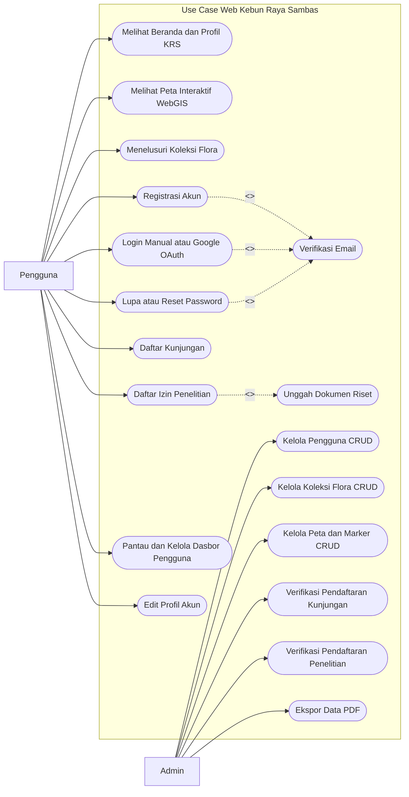
```mermaid
graph LR
    PU["Pengguna"]
    AD["Admin"]

    subgraph SYS["Use Case Web Kebun Raya Sambas"]
        direction TB
        UC1(["Melihat Beranda dan Profil KRS"])
        UC2(["Melihat Peta Interaktif WebGIS"])
        UC3(["Menelusuri Koleksi Flora"])
        UC4(["Registrasi Akun"])
        UC5(["Login Manual atau Google OAuth"])
        UC6(["Lupa atau Reset Password"])
        UC7(["Daftar Kunjungan"])
        UC8(["Daftar Izin Penelitian"])
        UC9(["Pantau dan Kelola Dasbor Pengguna"])
        UC10(["Edit Profil Akun"])
        UC11(["Verifikasi Email"])
        UC12(["Unggah Dokumen Riset"])
        UC13(["Kelola Pengguna CRUD"])
        UC14(["Kelola Koleksi Flora CRUD"])
        UC15(["Kelola Peta dan Marker CRUD"])
        UC16(["Verifikasi Pendaftaran Kunjungan"])
        UC17(["Verifikasi Pendaftaran Penelitian"])
        UC18(["Ekspor Data PDF"])
    end

    PU --> UC1
    PU --> UC2
    PU --> UC3
    PU --> UC4
    PU --> UC5
    PU --> UC6
    PU --> UC7
    PU --> UC8
    PU --> UC9
    PU --> UC10

    AD --> UC13
    AD --> UC14
    AD --> UC15
    AD --> UC16
    AD --> UC17
    AD --> UC18

    UC4 -.->|"<<include>>"| UC11
    UC5 -.->|"<<include>>"| UC11
    UC6 -.->|"<<include>>"| UC11
    UC8 -.->|"<<include>>"| UC12
```

Gambar 5.2 Use Case Diagram Sistem WebGIS Berbasis PWA Kebun Raya Sambas

Secara detail, aktor **Pengguna** mencakup seluruh pengguna terdaftar dengan peran *user* dalam sistem — baik pengunjung umum yang berencana melakukan kunjungan wisata maupun peneliti yang mengajukan izin penelitian. Aktor Pengguna dapat mengakses halaman beranda dan profil KRS, melihat peta interaktif WebGIS, menelusuri katalog koleksi flora, melakukan registrasi akun, login manual atau melalui Google OAuth, serta mereset password. Tiga use case tersebut — *Registrasi Akun*, *Login Manual atau Google OAuth*, dan *Lupa atau Reset Password* — memiliki relasi *<<include>>* ke *Verifikasi Email*, yang berarti ketiga fungsi tersebut secara teknis melibatkan mekanisme verifikasi email dalam prosesnya. Pengguna yang telah login dan terverifikasi dapat mendaftar kunjungan rombongan (*Daftar Kunjungan*), mengajukan izin penelitian (*Daftar Izin Penelitian*) yang wajib disertai pengunggahan dokumen riset melalui relasi *<<include>>* ke *Unggah Dokumen Riset*, memantau dan mengelola dasbor pendaftaran, serta mengedit profil akun. Aktor **Admin** memegang otorisasi pengelolaan sistem meliputi kelola data pengguna, koleksi flora, peta dan marker (CRUD), memverifikasi kedua jenis pendaftaran (kunjungan dan penelitian), serta mengekspor laporan rekapitulasi data ke format PDF.


#### 5.1.3.2 Activity Diagram
Activity diagram menggambarkan alur kerja (workflow) atau urutan aktivitas dalam suatu proses bisnis maupun proses sistem, mencakup elemen seperti titik keputusan (decision node) untuk percabangan kondisi, fork/join untuk aksi paralel, serta initial dan final node yang menandai awal dan akhir suatu alur.

##### 5.1.3.2.1 Activity Diagram Registrasi Akun
Diagram ini menggambarkan alur kerja saat pengguna baru mendaftarkan akun secara manual melalui formulir registrasi.

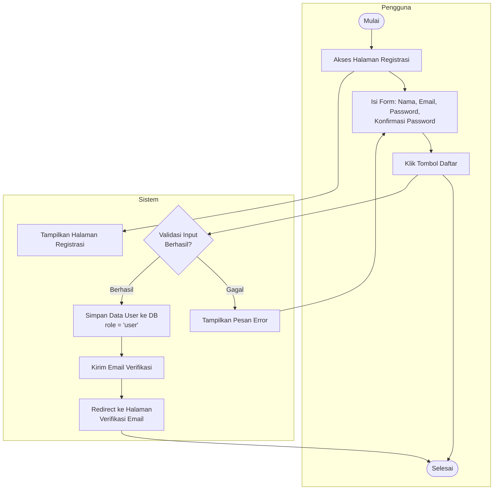
```mermaid
graph TB
    subgraph Pengguna
        P1([Mulai]) --> P2[Akses Halaman Registrasi]
        P2 --> P3[Isi Form: Nama, Email, Password,\nKonfirmasi Password]
        P3 --> P4[Klik Tombol Daftar]
        P4 --> P7([Selesai])
    end

    subgraph Sistem
        S1[Tampilkan Halaman Registrasi]
        S2{Validasi Input\nBerhasil?}
        S3[Tampilkan Pesan Error]
        S4[Simpan Data User ke DB\nrole = 'user']
        S5[Kirim Email Verifikasi]
        S6[Redirect ke Halaman\nVerifikasi Email]
    end

    P2 --> S1
    P4 --> S2
    S2 -- Gagal --> S3
    S3 --> P3
    S2 -- Berhasil --> S4
    S4 --> S5
    S5 --> S6
    S6 --> P7
```

**Deskripsi Activity Diagram Registrasi Akun:**
Berdasarkan diagram aktivitas pada gambar di atas, alur proses registrasi akun memodelkan interaksi antara entitas Pengguna dan Sistem. Proses diawali ketika pengguna mengakses halaman registrasi. Selanjutnya, sistem akan menampilkan formulir pendaftaran yang wajib diisi oleh pengguna, meliputi kolom nama, alamat surel (email), kata sandi (password), serta konfirmasi kata sandi. Setelah data diinputkan dan pengguna menekan tombol "Daftar", sistem mengambil alih kendali untuk melakukan validasi input secara komprehensif pada sisi peladen (*server-side*). Pada tahap *decision node* validasi, apabila ditemukan ketidaksesuaian data (misalnya email telah terdaftar atau format tidak valid), sistem akan mengarahkan alur kembali ke form pengisian beserta pesan galat (error) spesifik. Sebaliknya, apabila validasi berhasil, sistem akan mengeksekusi penyimpanan persisten data pengguna baru ke dalam basis data tabel `users` dengan mendefinisikan *role* atau hak akses sebagai *'user'* secara asali (*default*). Proses diakhiri dengan sistem secara otomatis mengirimkan surel verifikasi ke alamat terkait dan mengarahkan pengguna ke halaman pemberitahuan verifikasi email, yang menandai *final state* dari alur pendaftaran akun.

##### 5.1.3.2.2 Activity Diagram Login
Diagram ini menggambarkan alur kerja saat pengguna terdaftar masuk ke sistem, baik melalui login manual maupun Google OAuth.

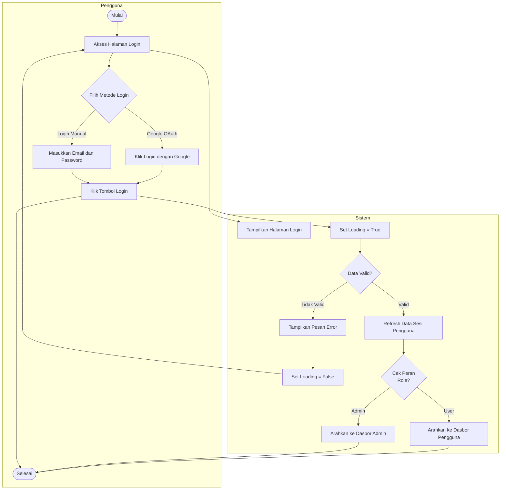
```mermaid
graph TB
    subgraph Pengguna
        P1([Mulai]) --> P2[Akses Halaman Login]
        P2 --> P3{Pilih Metode Login}
        P3 -- Login Manual --> P4[Masukkan Email dan Password]
        P4 --> P5[Klik Tombol Login]
        P3 -- Google OAuth --> P6[Klik Login dengan Google]
        P6 --> P5
        P5 --> P9([Selesai])
    end

    subgraph Sistem
        S1[Tampilkan Halaman Login]
        S2[Set Loading = True]
        S3{Data Valid?}
        S4[Tampilkan Pesan Error]
        S5[Set Loading = False]
        S6[Refresh Data Sesi Pengguna]
        S7{Cek Peran\nRole?}
        S8[Arahkan ke Dasbor Admin]
        S9[Arahkan ke Dasbor Pengguna]
    end

    P2 --> S1
    P5 --> S2
    S2 --> S3
    S3 -- Tidak Valid --> S4
    S4 --> S5
    S5 --> P2
    S3 -- Valid --> S6
    S6 --> S7
    S7 -- Admin --> S8
    S7 -- User --> S9
    S8 --> P9
    S9 --> P9
```

**Deskripsi Activity Diagram Login:**
Diagram aktivitas di atas mengilustrasikan mekanisme autentikasi multi-metode yang diterapkan pada sistem. Alur dimulai ketika pengguna mengakses antarmuka login dan dihadapkan pada sebuah *decision node* untuk memilih pendekatan autentikasi: secara manual menggunakan kredensial surel dan kata sandi, atau melalui otorisasi pihak ketiga (Google OAuth). Apabila pengguna memilih metode manual, sistem akan langsung beralih ke proses indikator pemuatan (*loading*) untuk kemudian memvalidasi input secara internal. Sementara itu, untuk opsi Google OAuth, kredensial diotorisasi secara eksternal (*callback*) sebelum masuk ke fase *loading*. Kedua jalur tersebut bermuara pada proses validasi eksistensi dan otentisitas data di basis data. Jika data tidak valid, sistem akan menampilkan pesan galat (*error*), menghentikan indikator *loading*, dan mengembalikan pengguna ke halaman form. Namun, jika kredensial terverifikasi mutlak, sistem akan memperbarui sesi data pengguna dan memvalidasi tipe hak akses (*role*) pengguna melalui *decision node* hierarkis. Pengguna dengan entitas *role 'admin'* akan direstusikan ke Dasbor Administrator, sedangkan entitas dengan *role 'user'* diarahkan menuju Dasbor Pengguna. Seluruh proses pengalihan ini berujung pada *final state* yang menandakan selesainya siklus login.

##### 5.1.3.2.3 Activity Diagram Pendaftaran Kunjungan
Diagram ini menggambarkan alur kerja saat pengunjung mengajukan rencana kunjungan rombongan secara online.

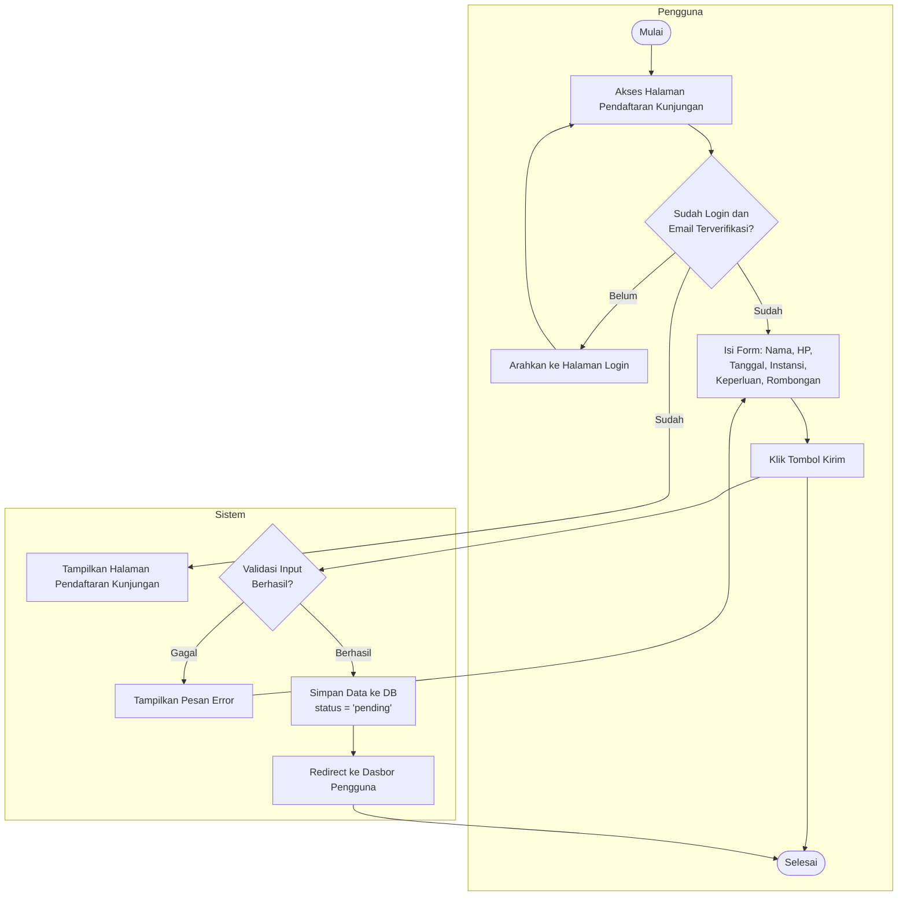
```mermaid
graph TB
    subgraph Pengguna
        P1([Mulai]) --> P2[Akses Halaman Pendaftaran Kunjungan]
        P2 --> P3{Sudah Login dan\nEmail Terverifikasi?}
        P3 -- Belum --> P4[Arahkan ke Halaman Login]
        P4 --> P2
        P3 -- Sudah --> P5[Isi Form: Nama, HP,\nTanggal, Instansi,\nKeperluan, Rombongan]
        P5 --> P6[Klik Tombol Kirim]
        P6 --> P9([Selesai])
    end

    subgraph Sistem
        S1[Tampilkan Halaman Pendaftaran Kunjungan]
        S2{Validasi Input\nBerhasil?}
        S3[Tampilkan Pesan Error]
        S4[Simpan Data ke DB\nstatus = 'pending']
        S5[Redirect ke Dasbor Pengguna]
    end

    P3 -- Sudah --> S1
    P6 --> S2
    S2 -- Gagal --> S3
    S3 --> P5
    S2 -- Berhasil --> S4
    S4 --> S5
    S5 --> P9
```

**Deskripsi Activity Diagram Pendaftaran Kunjungan:**
Gambar di atas merepresentasikan alur aktivitas struktural yang dilakukan oleh aktor Pengguna ketika hendak mengajukan permohonan pendaftaran kunjungan rombongan. Prasyarat awal dari alur ini ditunjukkan secara tegas melalui *decision node* yang mengevaluasi secara simultan apakah sesi pengguna telah aktif (status *login*) dan apakah status kepemilikan surelnya telah tervalidasi. Jika prasyarat tersebut bersifat negatif (belum terpenuhi), sistem akan melakukan intervensi dengan memotong alur dan mengarahkan pengguna ke halaman login terlebih dahulu. Setelah kondisi prasyarat terpenuhi (jalur *Sudah*), pengguna akan diberikan otorisasi untuk mengakses dan mengisi formulir pendaftaran kunjungan. Formulir ini memuat parameter input krusial mencakup data diri, nomor kontak, tanggal pelaksanaan kunjungan, identitas instansi, urgensi keperluan, hingga detail kuantitatif anggota rombongan. Pengiriman *form* (submit) akan memicu sistem untuk melakukan validasi *input* secara kondisional. Validasi berstatus *Gagal* akan memaksa rotasi alur kembali ke form pengisian disertai pesan galat diagnostik. Pada kondisi validasi berstatus *Berhasil*, sistem akan mengamankan rekaman transaksi ke dalam entitas tabel `pendaftaran_pengunjungs` dengan menginisialisasi parameter status awal sebagai *'pending'*. Aktivitas ditutup dengan pengalihan rute statis (*redirect*) antarmuka menuju *Dashboard* pengguna.

##### 5.1.3.2.4 Activity Diagram Pendaftaran Izin Penelitian
Diagram ini menggambarkan alur pendaftaran izin penelitian yang mewajibkan pengunggahan dokumen administrasi pendukung.

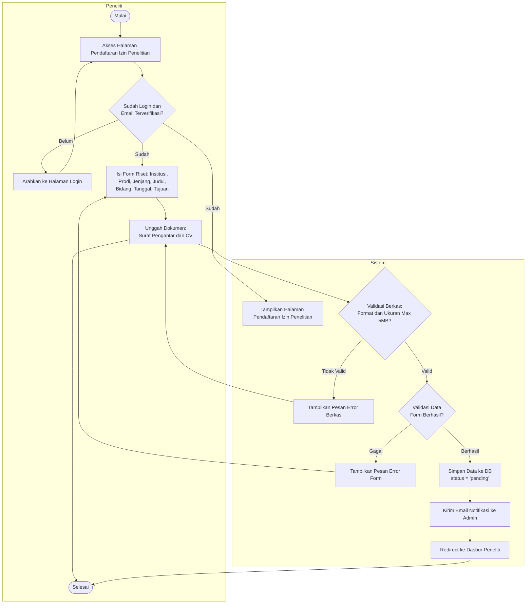
```mermaid
graph TB
    subgraph Peneliti
        P1([Mulai]) --> P2[Akses Halaman Pendaftaran Izin Penelitian]
        P2 --> P3{Sudah Login dan\nEmail Terverifikasi?}
        P3 -- Belum --> P4[Arahkan ke Halaman Login]
        P4 --> P2
        P3 -- Sudah --> P5[Isi Form Riset: Institusi,\nProdi, Jenjang, Judul,\nBidang, Tanggal, Tujuan]
        P5 --> P6[Unggah Dokumen:\nSurat Pengantar dan CV]
        P6 --> P9([Selesai])
    end

    subgraph Sistem
        S1[Tampilkan Halaman Pendaftaran Izin Penelitian]
        S2{Validasi Berkas:\nFormat dan Ukuran Max 5MB?}
        S3[Tampilkan Pesan Error Berkas]
        S4{Validasi Data\nForm Berhasil?}
        S5[Tampilkan Pesan Error Form]
        S6[Simpan Data ke DB\nstatus = 'pending']
        S7[Kirim Email Notifikasi ke Admin]
        S8[Redirect ke Dasbor Peneliti]
    end

    P3 -- Sudah --> S1
    P6 --> S2
    S2 -- Tidak Valid --> S3
    S3 --> P6
    S2 -- Valid --> S4
    S4 -- Gagal --> S5
    S5 --> P5
    S4 -- Berhasil --> S6
    S6 --> S7
    S7 --> S8
    S8 --> P9
```

**Deskripsi Activity Diagram Pendaftaran Izin Penelitian:**
Diagram aktivitas pendaftaran izin penelitian memvisualisasikan alur kerja asinkronus yang lebih kompleks karena melibatkan pertukaran berkas (dokumen administratif). Menyerupai prosedur pada kunjungan rombongan, siklus ini diinisiasi dengan gerbang pengecekan status autentikasi dan validasi surel pengguna. Apabila sesi dinyatakan valid, pengguna (dalam hal ini sebagai Peneliti) diwajibkan melakukan dua tahap pengisian komplementer: pengisian rincian *metadata* penelitian (institusi, program studi, jenjang akademik, judul riset, ruang lingkup bidang, estimasi tanggal, dan tujuan spesifik) serta pengunggahan (*upload*) berkas digital yang terdiri dari Surat Pengantar resmi dan *Curriculum Vitae* (CV). Di sisi Sistem, untuk menjaga integritas dan ketahanan peladen, diimplementasikan dua lapisan *decision node*. Lapisan pertama berfokus pada filtrasi teknis berkas, di mana sistem mengonfirmasi kesesuaian tipe ekstensi dan membendung ukuran berkas yang melampaui kuota maksimal 5MB. Lapisan kedua berfungsi sebagai validasi kelengkapan isian string pada form. Apabila terdapat anomali pada salah satu *checkpoint* validasi tersebut, sistem akan melemparkan *feedback* galat secara spesifik. Jika keseluruhan parameter lolos uji validasi, sistem melakukan tindakan rangkap tiga secara berurutan: persistensi data operasional ke tabel `pendaftaran_penelitis` dengan *flag* status *'pending'*, peluncuran instruksi *trigger* pengiriman surel notifikasi administratif kepada Administrator sebagai penanda adanya pendaftaran baru, dan penutup alur melalui redereksi paksa ke halaman *Dashboard* Peneliti.

##### 5.1.3.2.5 Activity Diagram Kelola Peta dan Marker (Admin)
Diagram ini menjelaskan alur kerja administrator saat menambahkan objek spasial baru (Point, Polyline, Polygon) ke dalam peta WebGIS.

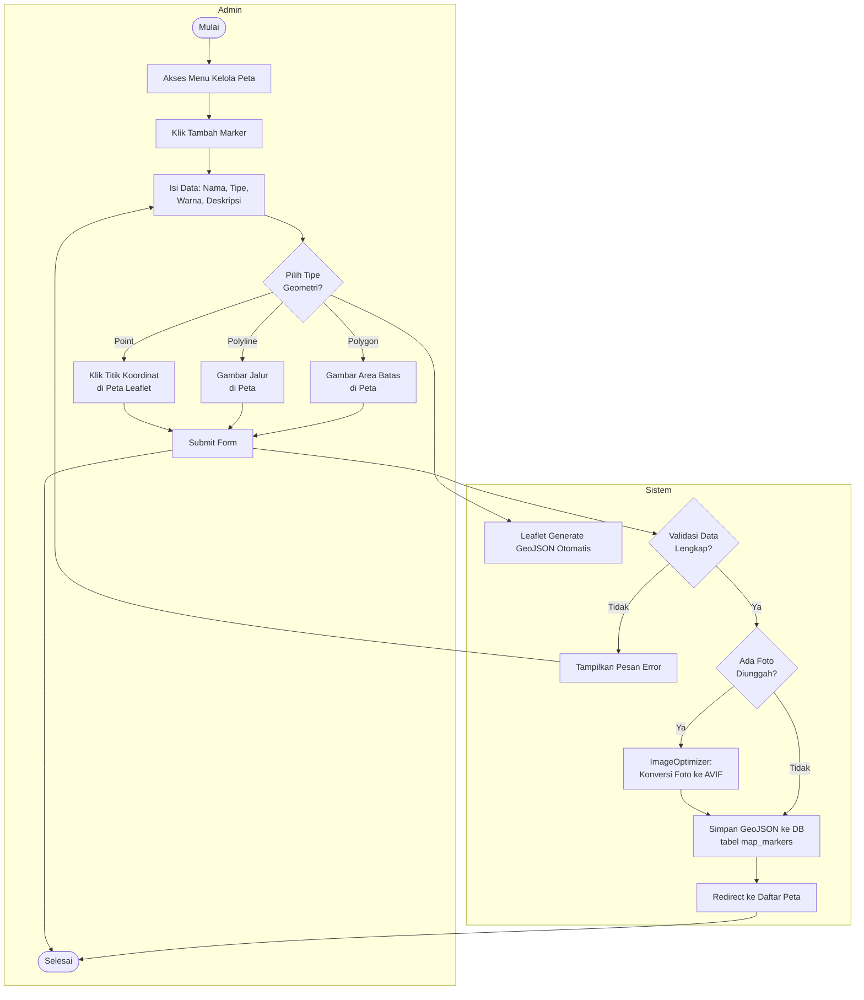
```mermaid
graph TB
    subgraph Admin
        P1([Mulai]) --> P2[Akses Menu Kelola Peta]
        P2 --> P3[Klik Tambah Marker]
        P3 --> P4[Isi Data: Nama, Tipe,\nWarna, Deskripsi]
        P4 --> P5{Pilih Tipe\nGeometri?}
        P5 -- Point --> P6[Klik Titik Koordinat\ndi Peta Leaflet]
        P5 -- Polyline --> P7[Gambar Jalur\ndi Peta]
        P5 -- Polygon --> P8[Gambar Area Batas\ndi Peta]
        P6 --> P9[Submit Form]
        P7 --> P9
        P8 --> P9
        P9 --> P12([Selesai])
    end

    subgraph Sistem
        S1[Leaflet Generate GeoJSON Otomatis]
        S2{Validasi Data\nLengkap?}
        S3[Tampilkan Pesan Error]
        S4{Ada Foto\nDiunggah?}
        S5[ImageOptimizer:\nKonversi Foto ke AVIF]
        S6[Simpan GeoJSON ke DB\ntabel map_markers]
        S7[Redirect ke Daftar Peta]
    end

    P5 --> S1
    P9 --> S2
    S2 -- Tidak --> S3
    S3 --> P4
    S2 -- Ya --> S4
    S4 -- Ya --> S5
    S5 --> S6
    S4 -- Tidak --> S6
    S6 --> S7
    S7 --> P12
```

**Deskripsi Activity Diagram Kelola Peta dan Marker (Admin):**
Gambar di atas menguraikan struktur alur kerja dari fitur manajemen data spasial (GIS) yang pembatasannya secara ketat diotorisasi eksklusif untuk aktor Administrator. Konstruksi aktivitas dimulai saat admin menavigasi menu kelola peta dan menginisialisasi pemicu tombol *Tambah Marker*. Sistem akan membuka akses pengisian *metadata* spasial dasar yang menuntut admin mendefinisikan entri nama objek, kategorisasi tipe, representasi warna visual, dan muatan deskripsi tekstual. Alur kemudian mencapai *decision node* operasional yang mewajibkan admin untuk mengkategorikan pendekatan dimensi spasial (*Tipe Geometri*): apakah berupa objek *Point* (titik lokasi tunggal), *Polyline* (garis simpul atau jalur), atau *Polygon* (area batasan luasan). Merujuk pada pilihan tersebut, komponen *front-end* pustaka Leaflet.js akan menerjemahkan interaksi *plotting* vektor dari kursor admin menjadi rumusan matematis dan otomatis men-*generate*-nya ke dalam format standar pertukaran data geografis terbuka (*GeoJSON*) di saat form disubmit. Selanjutnya, alur masuk ke dalam domain pemrosesan *back-end* di mana sistem memeriksa kelengkapan paket data spasial. Diagram ini juga mengadopsi *sub-process* situasional yang mengoptimasi performa; apabila admin melampirkan media foto dokumentasi visual, sistem akan menginjeksikan fungsi utilitas *ImageOptimizer* guna mentranskode format gambar primitif ke dalam ekstensi AVIF yang memiliki rasio kompresi tinggi. Pada konklusi alur, entitas spasial (GeoJSON) bersama relasi metadatanya ditransaksikan sebagai rekaman baru ke dalam tabel `map_markers` dan siklus purna dengan mengembalikan representasi layar (redirect) ke dalam daftar inventarisasi peta.

#### 5.1.3.3 Sequence Diagram
*Sequence diagram* (diagram urutan) merupakan salah satu representasi pemodelan perilaku (*behavioral modeling*) di dalam rekayasa perangkat lunak berbasis UML yang bertujuan mendemonstrasikan pertukaran pesan (*message passing*) antar objek atau komponen di dalam suatu kerangka fungsionalitas sistem secara terstruktur kronologis. Komponen grafis ini mengadopsi pendekatan berbasis *timeline* vertikal (direpresentasikan sebagai *lifeline* objek) untuk merinci secara presisi transisi aliran kontrol mulai dari entitas inisiator (Aktor/Pengguna), melewati lapisan antarmuka batas (*Boundary View*), dikelola oleh logika aplikasi (*Control/Controller*), hingga manipulasi permanen pada lapisan penyimpan data persisten (*Entity/Database*).

##### 5.1.3.3.1 Sequence Diagram Registrasi Pengguna
Diagram interaksi ini memetakan alur pertukaran pesan ketika seorang pengunjung publik mendaftarkan dan mematenkan kredensial baru ke dalam sistem untuk menjadi pengguna terdaftar.

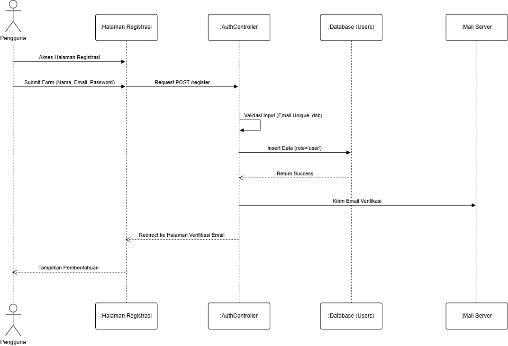

**Deskripsi Sequence Diagram Registrasi Akun:**
Alur sekuensial dimulai saat entitas Pengguna memancarkan *request* akses menuju komponen representasi visual `:Halaman Registrasi`. Pengguna menginjeksi entri *input* formulir pada antarmuka dan memicu aksi *submit*, yang kemudian memanggil *method* POST `/register` menuju lapisan pemrosesan pusat yaitu `:AuthController`. Sesampainya di *controller*, objek ini akan membangkitkan metode evaluasi internal (*self-call*) untuk memverifikasi kesesuaian atribut masukan, termasuk memastikan orisinalitas parameter surel (*email unique*) terhadap pangkalan data. Setelah data distempel valid, kontroler mentransmisikan instruksi manipulasi *Insert* yang dibekali penyematan konstan (*hard-coded*) *role* pengguna baru bernilai *'user'* ke dalam abstraksi penyimpan data `:Database (users)`. Ketika sinyal pantul asinkronus keberhasilan dari basis data diterima (`Return Success`), kontroler akan mengeksekusi operasi sekunder dengan mendelegasikan perintah kepada komponen independen `:Mail Server` untuk mengeksekusi proses latar belakang transmisi surel verifikasi otentikasi. Begitu seluruh tahapan transaksi *back-end* konklusif, `:AuthController` meneruskan respons berantai menuju komponen antarmuka, yang menginstruksikan navigasi pengalihan rute (*redirect*) ke tampilan pemberitahuan instruksi verifikasi surel kepada Pengguna.

##### 5.1.3.3.2 Sequence Diagram Login
Diagram ini menguraikan sinkronisasi komunikasi dan pencocokan kredensial yang mendukung eksekusi multi-skenario, meliputi rute konvensional (Internal) dan otorisasi dari pihak ketiga (SSO).

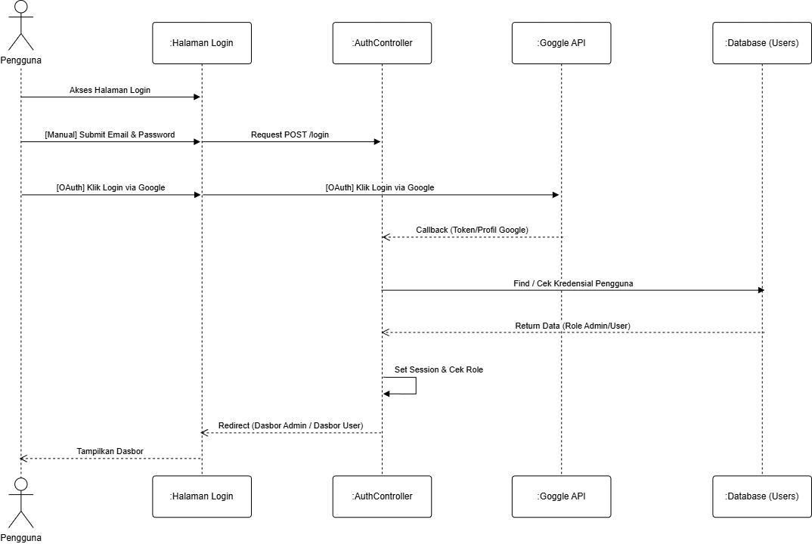

**Deskripsi Sequence Diagram Login:**
Pengguna memprakarsai alur dengan interaksi terhadap komponen UI `:Halaman Login`. Terdapat pencabangan skenario kondisional *alt* (alternatif) pada arsitektur ini. Pada blok operasional login manual, entri *input* kredensial diteruskan sebagai HTTP POST menuju `:AuthController`. Pada blok paralel operasional OAuth, tindakan interaksi klik tombol login memicu sistem menerbitkan fungsi otorisasi keluar menuju lapisan penyedia layanan `:Google API`, di mana setelah persetujuan otorisasi terpenuhi oleh klien eksternal, komponen Google akan menerbitkan objek kembalian (*callback*) berupa *Token/Profil Google* yang sah ke `:AuthController`. Lepas dari asal rute masuknya pesan (metode manapun), `:AuthController` mengambil alih sesi dengan merekonsiliasi pengidentifikasi kredensial tadi kepada eksistensi rekaman di dalam `:Database (users)`. Entitas basis data menanggapi *query* dengan pengembalian *tuple* data akun pengguna termasuk variabel *role*-nya. Kontroler kemudian menjalankan subrutin *self-message* `Set Session & Cek Role` untuk menghidupkan *session state* peramban klien dan secara evaluatif mendistribusikan jalur *redirect* sesuai otorisasi hak akses (mengarahkan pengguna menuju Dasbor Administrator untuk administrator *root*, dan Dasbor Pengguna bagi pengguna standar sistem).

##### 5.1.3.3.3 Sequence Diagram Pendaftaran Kunjungan
Diagram sekuensial ini merinci aliran pengajuan dan transfer parameter administratif permohonan kunjungan rombongan dari aktor tamu ke entitas operasional Kebun Raya Sambas.

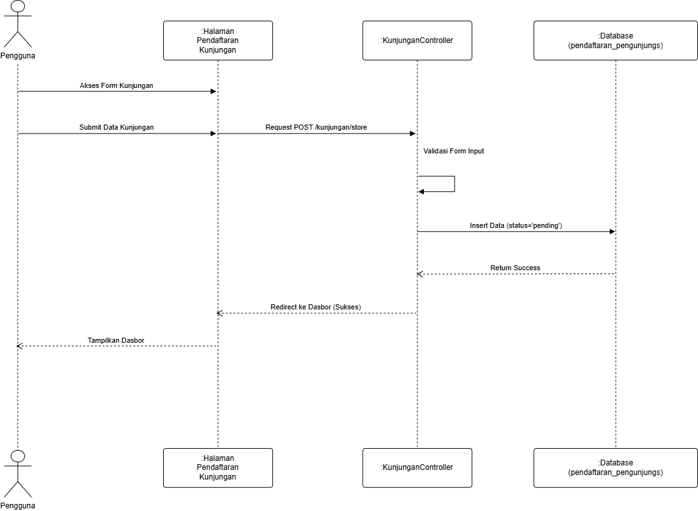

**Deskripsi Sequence Diagram Pendaftaran Kunjungan:**
Interaksi dicanangkan kala entitas Aktor (yang pada fase ini memiliki kepastian *session* aktif dan berstatus valid) berinteraksi dengan antarmuka batas `:Halaman Pendaftaran Kunjungan` untuk men-*supply* metadata isian formulir. Operasi pengiriman form (pengajuan parameter *request*) direpresentasikan sebagai pesan *POST /kunjungan/store* yang mengaktifkan siklus hidup pada objek kontrol `:KunjunganController`. Entitas *controller* membangkitkan metode sterilisasi data secara internal (`Validasi Form Input`) untuk mereduksi celah kerentanan *payload* dan kelalaian data kosong. Mengikuti lolosnya saringan kelayakan, kontroler mengirimkan permintaan kueri persistensi *Insert* menuju struktur data tabel `:Database (pendaftaran_pengunjungs)` yang dikemas otomatis dengan konstruksi *flag* atribut bawaan `status='pending'`. Sistem penyimpanan memberikan respons timbal-balik konfirmasi keberhasilan injeksi *record* (`Return Success`), yang akan direspon oleh komponen logika bisnis dengan membendung eksekusi lebih lanjut dan melempar arahan respons akhir (berupa pengalihan lokasi peramban / *redirect*) menuju proksi *View* Dasbor guna divisualisasikan kepada mata Pengguna sebagai tanda konklusif permohonan kunjungan sukses terekam.

##### 5.1.3.3.4 Sequence Diagram Pendaftaran Izin Penelitian
Diagram ini menjelaskan spesifikasi urutan integrasi komunikasi dari proses transaksional yang tidak hanya menuntut pertukaran *string data*, melainkan *file binari* eksternal.

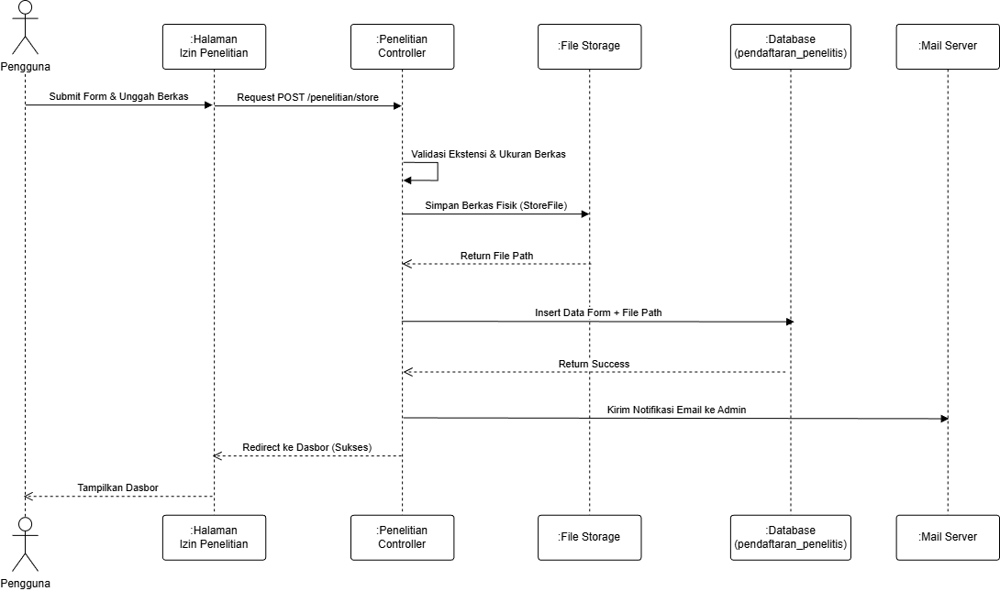

**Deskripsi Sequence Diagram Pendaftaran Izin Penelitian:**
Siklus perpesanan diinisiasi oleh Peneliti melalui penyerahan isian *metadata* dan pelekatan media dokumen administratif secara terpadu melalui `:Halaman Izin Penelitian`. Keseluruhan struktur *payload* ditransmisikan ke antarmuka pengelola, yakni `:PenelitianController`. Menyadari eksistensi variabel berbasis *file*, kontroler menjalankan inspeksi komprehensif lewat metode interogasi internal mengenai validitas ekstensi MIME maupun pembatasan memori maksimum (*size constraint*). Menyusul hasil yang legal, *controller* memisahkan struktur *request*: komponen dokumen biner diumpankan ke *service provider* abstraksi penyimpanan lokal sistem `:File Storage` yang melaksanakan sinkronisasi *I/O disk* lalu memulangkan referensi *path* (alamat penyimpanan logis fail). Pasca penerimaan nilai *path* tersebut, `:PenelitianController` melakukan perakitan ulang (*reassembly*) paket perpesanan beserta metadata riset awal menjadi skema struktural persisten untuk disimpan (instruksi *Insert*) ke tabel `:Database (pendaftaran_penelitis)`. Begitu basis data mengembalikan konfirmasi *Success*, kontroler secara reaktif membangkitkan entitas delegasi `:Mail Server` untuk melakukan tembakan surel notifikasi sepihak ke kompartemen operasional Administrator, seraya mengeksekusi navigasi pemulangan klien (*redirect*) ke kanvas Dasbor pengguna yang menutup siklus eksekusi riset tersebut.

##### 5.1.3.3.5 Sequence Diagram Kelola Peta dan Marker (Admin)
Diagram interaksi terstruktur ini mendemonstrasikan kompleksitas komunikasi multi-layar dalam pengolahan integrasi data vektor geospasial oleh modul WebGIS pada otoritas pengelolaan.

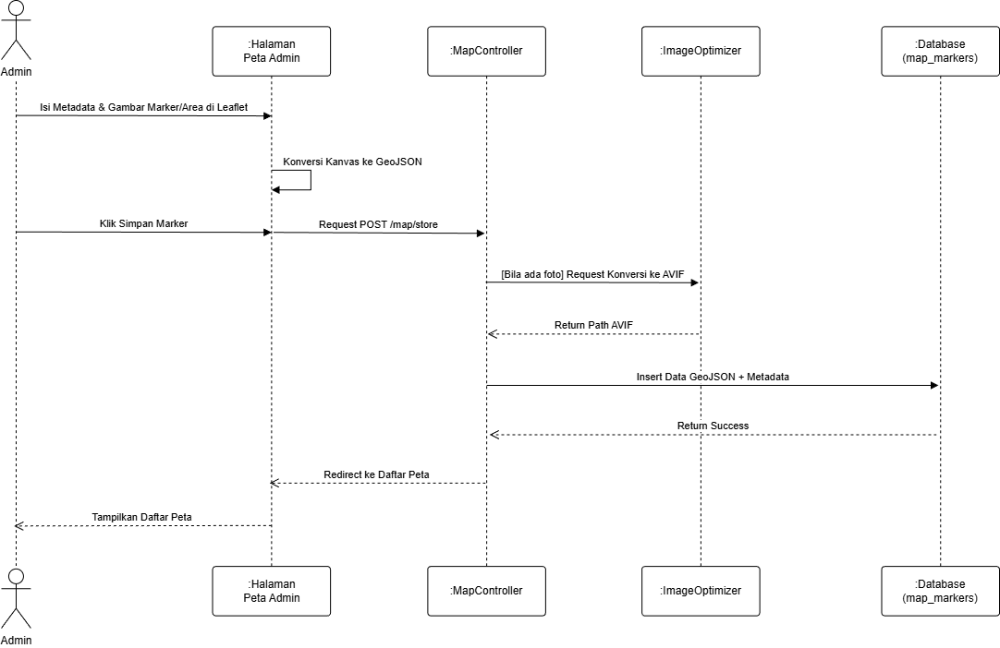

**Deskripsi Sequence Diagram Kelola Peta dan Marker:**
Aktor pemrakarsa (Administrator) mengaktifkan komponen antarmuka `:Halaman Peta Admin` dan men-dikte serangkaian instruksi interaksi grafis dengan mendefinisikan *nodes/vertices* koordinat vektor di atas *layer* kanvas interaktif spasial Leaflet. Sebelum pengiriman transaksi dilakukan ke lapis peladen (*server*), komponen presentasi `:Halaman Peta Admin` membangkitkan pemicu proaktif *self-message* asinkron untuk menerjemahkan objek vektor di sisi klien (*client-side*) secara serempak menjadi formulasi data terstandarisasi *GeoJSON*. Penekanan pemicu konfirmasi memindahkan *state* transmisi penggabungan form berformat *multipart* (apabila termuat elemen citra foto) yang menargetkan rute aksi ke lapisan objek `:MapController`. Sebagai respons observasional kontroler atas ada tidaknya parameter citra pendukung (*optional object*), `:MapController` melempar operasi transit kepada agen fungsi utilitas sekunder `:ImageOptimizer` untuk memotong resolusi serta memampatkan rasio dimensi ke algoritma citra mutakhir (format AVIF), lalu memulangkan rujukan parameter direktori asalnya kembali ke pelukan kontroler. Eksekusi integral bermuara saat `:MapController` mengagregasi representasi topologi GeoJSON dan meta-informasi tekstual lainnya dalam satu kueri masif berstruktur `Insert` menuju koleksi penyimpanan pada `:Database (map_markers)`. Pasca penyelesaian transaksi pengikatan relasional tersebut dengan indikator keberhasilan, siklus fungsional ditutup manakala alur navigasi representasional dibanting-silang (*redirect*) ke tampilan referensial daftar inventori pemetaan.

#### 5.1.3.4 Class Diagram
Rancangan arsitektur sistem WebGIS ini digambarkan melalui *Class Diagram* yang disusun berdasarkan tabel-tabel utama di dalam *database*. Secara keseluruhan, diagram ini memodelkan struktur inti dari sistem yang menghubungkan fitur login pengguna, proses pendaftaran (kunjungan wisata dan izin penelitian), pengelolaan data tumbuhan, serta pemetaan area dan fasilitas di dalam kawasan. Gambaran lebih jelas mengenai arsitektur tabel dan hubungan antar kelas tersebut dapat dilihat pada Gambar 5.12 di bawah ini.

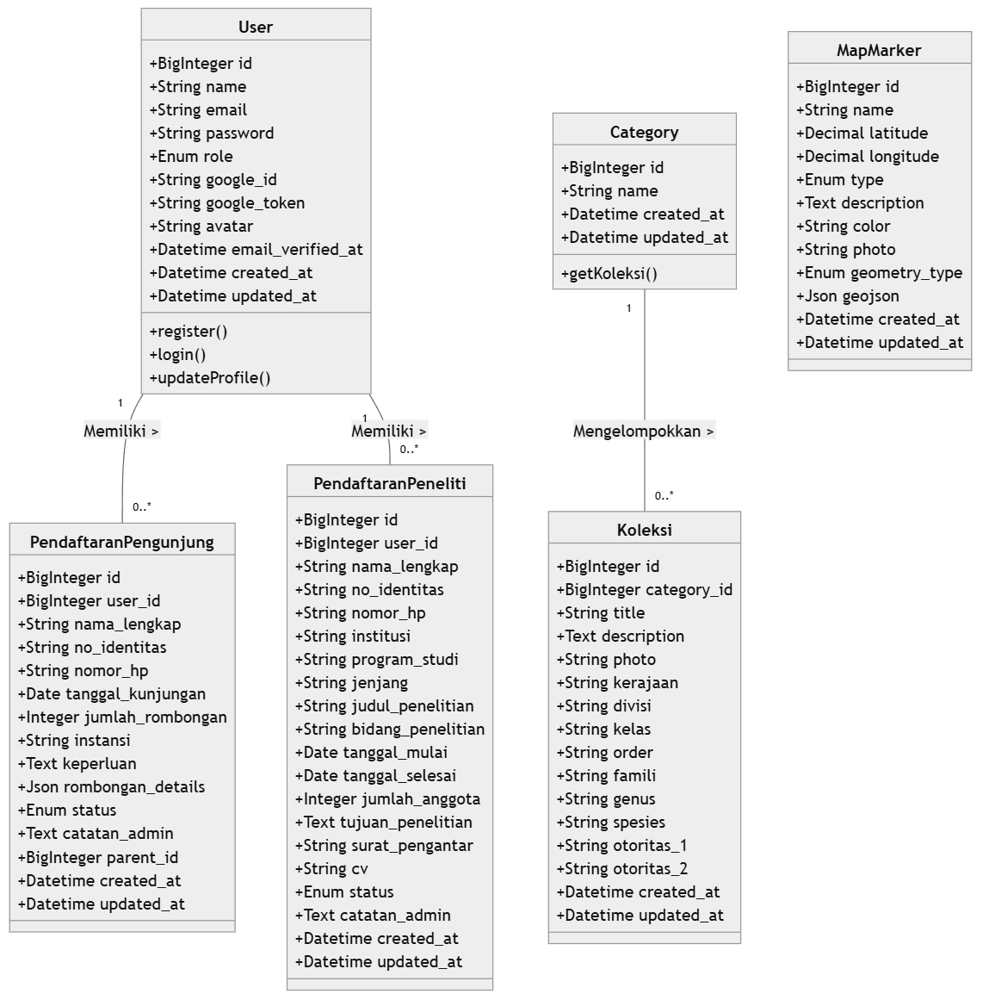

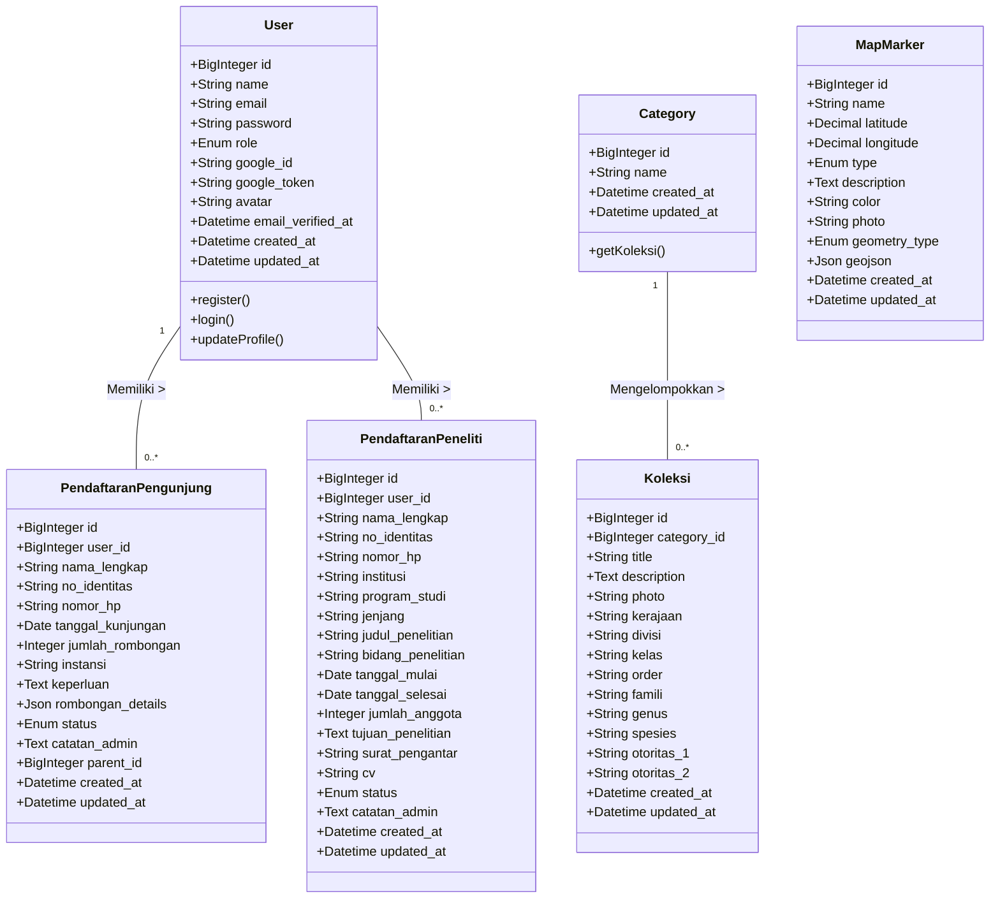
```mermaid
classDiagram
    class User {
        +BigInteger id
        +String name
        +String email
        +String password
        +Enum role
        +String google_id
        +String google_token
        +String avatar
        +Datetime email_verified_at
        +Datetime created_at
        +Datetime updated_at
        +register()
        +login()
        +updateProfile()
    }

    class Category {
        +BigInteger id
        +String name
        +Datetime created_at
        +Datetime updated_at
        +getKoleksi()
    }

    class Koleksi {
        +BigInteger id
        +BigInteger category_id
        +String title
        +Text description
        +String photo
        +String kerajaan
        +String divisi
        +String kelas
        +String order
        +String famili
        +String genus
        +String spesies
        +String otoritas_1
        +String otoritas_2
        +Datetime created_at
        +Datetime updated_at
    }

    class MapMarker {
        +BigInteger id
        +String name
        +Decimal latitude
        +Decimal longitude
        +Enum type
        +Text description
        +String color
        +String photo
        +Enum geometry_type
        +Json geojson
        +Datetime created_at
        +Datetime updated_at
    }

    class PendaftaranPengunjung {
        +BigInteger id
        +BigInteger user_id
        +String nama_lengkap
        +String no_identitas
        +String nomor_hp
        +Date tanggal_kunjungan
        +Integer jumlah_rombongan
        +String instansi
        +Text keperluan
        +Json rombongan_details
        +Enum status
        +Text catatan_admin
        +BigInteger parent_id
        +Datetime created_at
        +Datetime updated_at
    }

    class PendaftaranPeneliti {
        +BigInteger id
        +BigInteger user_id
        +String nama_lengkap
        +String no_identitas
        +String nomor_hp
        +String institusi
        +String program_studi
        +String jenjang
        +String judul_penelitian
        +String bidang_penelitian
        +Date tanggal_mulai
        +Date tanggal_selesai
        +Integer jumlah_anggota
        +Text tujuan_penelitian
        +String surat_pengantar
        +String cv
        +Enum status
        +Text catatan_admin
        +Datetime created_at
        +Datetime updated_at
    }

    User "1" -- "0..*" PendaftaranPengunjung : Memiliki >
    User "1" -- "0..*" PendaftaranPeneliti : Memiliki >
    Category "1" -- "0..*" Koleksi : Mengelompokkan >
```

**Deskripsi Class Diagram Database:**
Berdasarkan gambar arsitektur di atas, sistem WebGIS Kebun Raya Sambas berpusat pada tabel pengguna (`User`) yang menyimpan data akun dari semua pihak yang terlibat (admin, pengunjung umum, dan peneliti). Setiap pengguna yang memiliki akun dapat melakukan pengajuan kunjungan yang datanya dicatat di tabel `PendaftaranPengunjung`, atau mengajukan izin riset yang datanya masuk ke tabel `PendaftaranPeneliti`. Kedua tabel pendaftaran ini saling terhubung secara langsung dengan identitas pengguna pembuatnya (*foreign key*), sehingga sistem dapat melacak secara pasti siapa yang mengajukan permohonan tersebut.

Sementara itu, untuk keperluan pendataan tumbuhan, sistem menyimpan detail informasi flora ke dalam tabel `Koleksi`. Setiap jenis tumbuhan yang dicatat kemudian dikelompokkan berdasarkan kategorinya masing-masing ke dalam tabel `Category` agar lebih tertata dan mudah dicari. Selain mengelola data teks, sistem ini juga memiliki fitur peta interaktif yang datanya disimpan khusus di tabel `MapMarker`. Tabel `MapMarker` bertugas menyimpan titik koordinat (lintang dan bujur) serta bentuk wilayah di peta (dalam format *GeoJSON*), yang nantinya dimunculkan sebagai penanda lokasi fasilitas bangunan, jalur navigasi jalan, hingga batas wilayah di kawasan Kebun Raya. Seluruh alur kerja antar tabel ini saling terhubung untuk memastikan layanan administrasi dan pemetaan berjalan lancar setiap harinya.

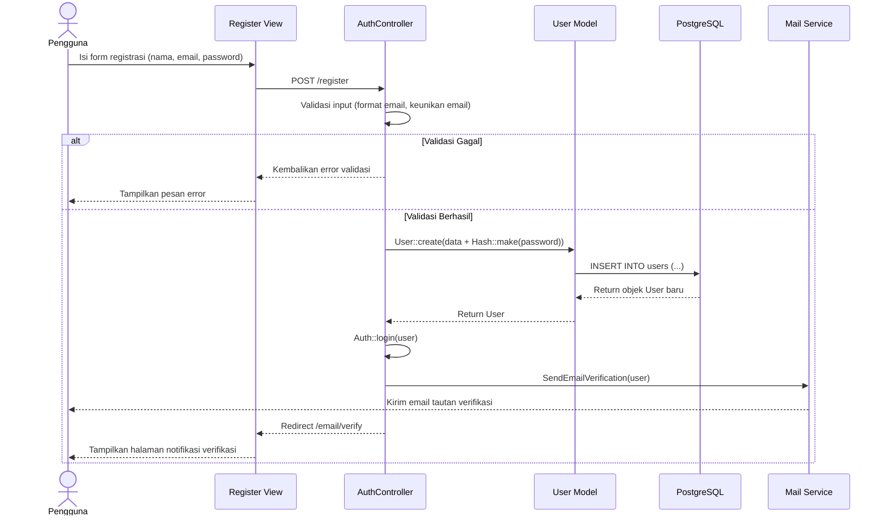
```mermaid
sequenceDiagram
    actor Pengguna
    participant View as Register View
    participant Controller as AuthController
    participant Model as User Model
    participant DB as PostgreSQL
    participant Mailer as Mail Service

    Pengguna->>View: Isi form registrasi (nama, email, password)
    View->>Controller: POST /register
    Controller->>Controller: Validasi input (format email, keunikan email)
    alt Validasi Gagal
        Controller-->>View: Kembalikan error validasi
        View-->>Pengguna: Tampilkan pesan error
    else Validasi Berhasil
        Controller->>Model: User::create(data + Hash::make(password))
        Model->>DB: INSERT INTO users (...)
        DB-->>Model: Return objek User baru
        Model-->>Controller: Return User
        Controller->>Controller: Auth::login(user)
        Controller->>Mailer: SendEmailVerification(user)
        Mailer-->>Pengguna: Kirim email tautan verifikasi
        Controller-->>View: Redirect /email/verify
        View-->>Pengguna: Tampilkan halaman notifikasi verifikasi
    end
```

**Deskripsi Sequence Diagram Registrasi Pengguna:**
Interaksi diawali ketika pengguna mengisi dan mengirimkan formulir registrasi melalui `Register View`. View meneruskan data ke `AuthController` melalui request HTTP POST ke rute `/register`. Controller pertama-tama memvalidasi input: memeriksa format email, panjang minimum password, kecocokan konfirmasi password, dan keunikan email di database. Jika validasi gagal, error dikembalikan ke View dan ditampilkan kepada pengguna. Jika berhasil, Controller memanggil `User::create()` pada model Eloquent, yang menjalankan perintah INSERT ke tabel `users` PostgreSQL dengan password yang di-hash menggunakan bcrypt. Database mengembalikan objek pengguna baru. Controller kemudian menjalankan `Auth::login()` untuk membuat sesi login otomatis, dan memanggil `Mail Service` untuk mengirimkan email verifikasi secara asinkron. Terakhir, pengguna diarahkan ke halaman notifikasi verifikasi email.

##### 5.1.3.3.2 Sequence Diagram Pendaftaran Pengunjung
Diagram ini memetakan urutan interaksi kronologis saat pengguna yang telah login mengajukan pendaftaran kunjungan rombongan.

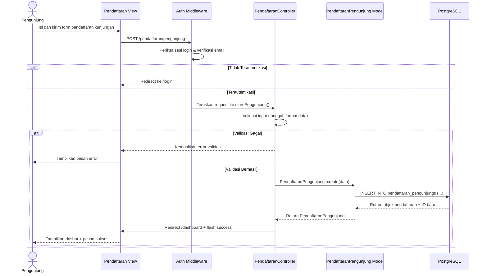
```mermaid
sequenceDiagram
    actor Pengunjung
    participant View as Pendaftaran View
    participant Middleware as Auth Middleware
    participant Controller as PendaftaranController
    participant Model as PendaftaranPengunjung Model
    participant DB as PostgreSQL

    Pengunjung->>View: Isi dan kirim form pendaftaran kunjungan
    View->>Middleware: POST /pendaftaran/pengunjung
    Middleware->>Middleware: Periksa sesi login & verifikasi email
    alt Tidak Terautentikasi
        Middleware-->>View: Redirect ke /login
    else Terautentikasi
        Middleware->>Controller: Teruskan request ke storePengunjung()
        Controller->>Controller: Validasi input (tanggal, format data)
        alt Validasi Gagal
            Controller-->>View: Kembalikan error validasi
            View-->>Pengunjung: Tampilkan pesan error
        else Validasi Berhasil
            Controller->>Model: PendaftaranPengunjung::create(data)
            Model->>DB: INSERT INTO pendaftaran_pengunjungs (...)
            DB-->>Model: Return objek pendaftaran + ID baru
            Model-->>Controller: Return PendaftaranPengunjung
            Controller-->>View: Redirect /dashboard + flash success
            View-->>Pengunjung: Tampilkan dasbor + pesan sukses
        end
    end
```

**Deskripsi Sequence Diagram Pendaftaran Pengunjung:**
Pengunjung mengisi dan mengirimkan formulir pendaftaran kunjungan melalui `Pendaftaran View`. Request HTTP POST diterima oleh `Auth Middleware` yang langsung memeriksa validitas sesi login dan status verifikasi email. Jika pengguna belum terautentikasi atau belum memverifikasi email, middleware mengarahkan ke halaman login. Jika terautentikasi, request diteruskan ke `PendaftaranController::storePengunjung()`. Controller memvalidasi data input termasuk format tanggal kunjungan yang tidak boleh di masa lampau. Jika validasi gagal, error dikembalikan ke View. Jika valid, Controller memanggil `PendaftaranPengunjung::create()` yang mengeksekusi INSERT ke tabel `pendaftaran_pengunjungs` di PostgreSQL. Database mengembalikan objek pendaftaran beserta ID yang baru dibuat. Controller mengakhiri alur dengan mengalihkan pengguna ke dasbor disertai pesan sukses.

##### 5.1.3.3.3 Sequence Diagram Kelola Peta/Markers oleh Admin
Diagram ini memetakan urutan interaksi kronologis saat administrator menambahkan penanda spasial baru ke dalam sistem peta.

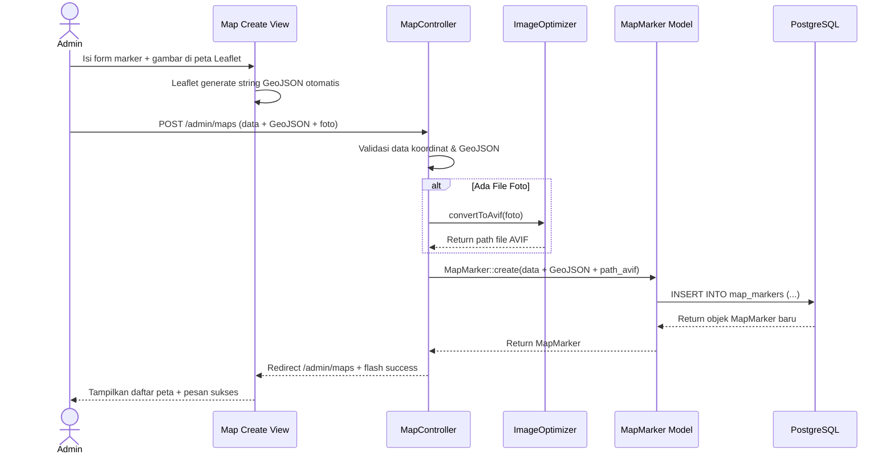
```mermaid
sequenceDiagram
    actor Admin
    participant View as Map Create View
    participant Controller as MapController
    participant Optimizer as ImageOptimizer
    participant Model as MapMarker Model
    participant DB as PostgreSQL

    Admin->>View: Isi form marker + gambar di peta Leaflet
    View->>View: Leaflet generate string GeoJSON otomatis
    Admin->>Controller: POST /admin/maps (data + GeoJSON + foto)
    Controller->>Controller: Validasi data koordinat & GeoJSON
    alt Ada File Foto
        Controller->>Optimizer: convertToAvif(foto)
        Optimizer-->>Controller: Return path file AVIF
    end
    Controller->>Model: MapMarker::create(data + GeoJSON + path_avif)
    Model->>DB: INSERT INTO map_markers (...)
    DB-->>Model: Return objek MapMarker baru
    Model-->>Controller: Return MapMarker
    Controller-->>View: Redirect /admin/maps + flash success
    View-->>Admin: Tampilkan daftar peta + pesan sukses
```

**Deskripsi Sequence Diagram Kelola Peta Admin:**
Admin mengisi formulir penanda melalui antarmuka `Map Create View` dan menggambar geometri spasial di atas peta Leaflet.js. Leaflet secara otomatis menghasilkan representasi GeoJSON dari gambar tersebut. Admin mengirimkan data beserta GeoJSON dan opsional foto ke `MapController` melalui POST. Controller memvalidasi kelengkapan data koordinat dan format GeoJSON. Jika admin menyertakan foto, Controller memanggil helper `ImageOptimizer::convertToAvif()` yang mengompresi dan mengonversi gambar ke format AVIF lebih efisien. Setelah optimasi, Controller memanggil `MapMarker::create()` yang mengeksekusi INSERT ke tabel `map_markers` di PostgreSQL. Database mengonfirmasi penyimpanan dan mengembalikan objek marker baru. Controller mengakhiri alur dengan mengalihkan admin ke halaman daftar peta disertai notifikasi sukses.

#### 5.1.3.4 Class Diagram
Class diagram menggambarkan struktur statis sistem, yaitu kelas-kelas yang menyusun sistem beserta atribut, operasi (method), dan relasi antarkelasnya seperti asosiasi, agregasi, komposisi, generalisasi (pewarisan), dan dependency. Diagram ini menjadi dasar untuk memodelkan struktur data dan hubungan antarentitas dalam desain berorientasi objek.

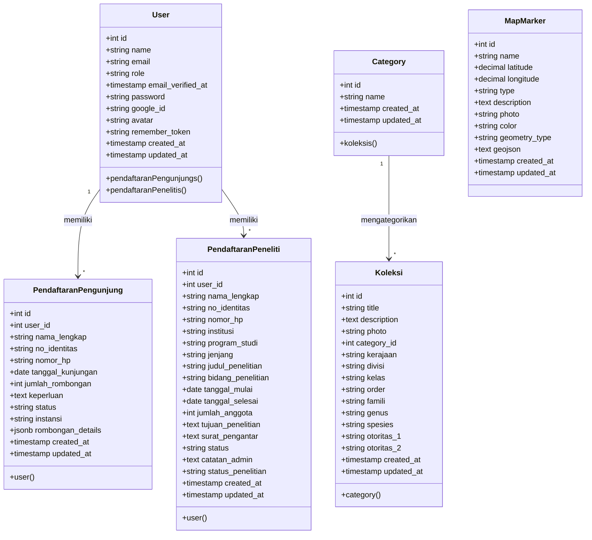
```mermaid
classDiagram
    class User {
        +int id
        +string name
        +string email
        +string role
        +timestamp email_verified_at
        +string password
        +string google_id
        +string avatar
        +string remember_token
        +timestamp created_at
        +timestamp updated_at
        +pendaftaranPengunjungs()
        +pendaftaranPenelitis()
    }

    class Category {
        +int id
        +string name
        +timestamp created_at
        +timestamp updated_at
        +koleksis()
    }

    class Koleksi {
        +int id
        +string title
        +text description
        +string photo
        +int category_id
        +string kerajaan
        +string divisi
        +string kelas
        +string order
        +string famili
        +string genus
        +string spesies
        +string otoritas_1
        +string otoritas_2
        +timestamp created_at
        +timestamp updated_at
        +category()
    }

    class MapMarker {
        +int id
        +string name
        +decimal latitude
        +decimal longitude
        +string type
        +text description
        +string photo
        +string color
        +string geometry_type
        +text geojson
        +timestamp created_at
        +timestamp updated_at
    }

    class PendaftaranPengunjung {
        +int id
        +int user_id
        +string nama_lengkap
        +string no_identitas
        +string nomor_hp
        +date tanggal_kunjungan
        +int jumlah_rombongan
        +text keperluan
        +string status
        +string instansi
        +jsonb rombongan_details
        +timestamp created_at
        +timestamp updated_at
        +user()
    }

    class PendaftaranPeneliti {
        +int id
        +int user_id
        +string nama_lengkap
        +string no_identitas
        +string nomor_hp
        +string institusi
        +string program_studi
        +string jenjang
        +string judul_penelitian
        +string bidang_penelitian
        +date tanggal_mulai
        +date tanggal_selesai
        +int jumlah_anggota
        +text tujuan_penelitian
        +text surat_pengantar
        +string status
        +text catatan_admin
        +string status_penelitian
        +timestamp created_at
        +timestamp updated_at
        +user()
    }

    User "1" --> "*" PendaftaranPengunjung : memiliki
    User "1" --> "*" PendaftaranPeneliti : memiliki
    Category "1" --> "*" Koleksi : mengategorikan
```

**Deskripsi Class Diagram:**
Class diagram WebGIS Kebun Raya Sambas memodelkan enam kelas utama yang merepresentasikan model Eloquent ORM dalam arsitektur Laravel. **Kelas `User`** berfungsi sebagai kelas sentral yang menyimpan data akun seluruh pengguna sistem dengan atribut peran (*role*) yang membedakan hak akses antara admin dan pengguna biasa; kelas ini memiliki relasi *One-to-Many* ke dua kelas pendaftaran. **Kelas `Category`** berfungsi sebagai pengelompokan master untuk koleksi flora dan berelasi *One-to-Many* ke kelas `Koleksi`. **Kelas `Koleksi`** menyimpan data katalog spesimen tanaman beserta klasifikasi taksonomi botani lengkap dari tingkat Kerajaan hingga Spesies dan Otoritas takson; kelas ini berelasi Many-to-One ke `Category` melalui `category_id`. **Kelas `MapMarker`** berdiri mandiri menyimpan data objek spasial peta dalam format GeoJSON. **Kelas `PendaftaranPengunjung`** dan **Kelas `PendaftaranPeneliti`** masing-masing berelasi Many-to-One ke `User` melalui `user_id`, menyimpan data pengajuan layanan administrasi beserta atribut status yang diperbarui oleh administrator.

### 5.1.4 Perancangan Basis Data
Basis data pada aplikasi WebGIS ini dirancang menggunakan sistem manajemen basis data PostgreSQL. Pangkalan data ini memegang peran krusial karena sifat sistem yang sangat bergantung pada penyimpanan relasional untuk pendataan transaksional dan operasional spasial untuk pemetaan. Struktur utama pangkalan data ini menaungi beberapa entitas esensial yang meliputi akun pengguna, master klasifikasi kategori, katalog spesimen flora, titik koordinat spasial, hingga riwayat pengajuan layanan publik (kunjungan wisata dan riset akademik).

#### 5.1.4.1 Normalisasi
Berdasarkan identifikasi kebutuhan sistem dan alur fungsionalitas yang telah dijabarkan, perancangan arsitektur basis data harus disusun secara sistematis agar dapat menangani pemrosesan data dengan efisien. Dalam penelitian ini, skema tabel dibentuk melalui pendekatan normalisasi (*bottom-up*) guna memangkas duplikasi data, menghindari anomali saat manipulasi data (insert, update, delete), serta memastikan setiap tabel terhubung melalui relasi yang solid. Proses normalisasi ini menghasilkan struktur penyimpanan yang menyokong berbagai fungsi krusial mulai dari keamanan akun, pencatatan katalog botani, pemetaan keruangan, hingga pendataan formulir daring. Tahapan normalisasi data ini dijabarkan sebagai berikut:

a. **Bentuk Tidak Normal (UNF)**
{ id_user + name + email + role + email_verified_at + password + google_id + avatar + id_category + category_name + id_koleksi + title + description + photo + category_id + kerajaan + divisi + kelas + order + famili + genus + spesies + otoritas_1 + otoritas_2 + id_marker + marker_name + latitude + longitude + type + marker_description + marker_photo + color + geometry_type + geojson + id_pengunjung + pengunjung_user_id + nama_lengkap + no_identitas + nomor_hp + tanggal_kunjungan + jumlah_rombongan + keperluan + status_pengunjung + instansi + rombongan_details + id_peneliti + peneliti_user_id + peneliti_nama_lengkap + peneliti_no_hp + institusi + program_studi + jenjang + judul_penelitian + bidang_penelitian + tanggal_mulai + tanggal_selesai + jumlah_anggota + tujuan_penelitian + surat_pengantar + status_peneliti + catatan_admin + status_penelitian }

b. **Normalisasi I (1NF)**
{ @id_user + name + email + role + email_verified_at + password + google_id + avatar + @id_category + category_name + @id_koleksi + title + description + photo + category_id + kerajaan + divisi + kelas + order + famili + genus + spesies + otoritas_1 + otoritas_2 + @id_marker + marker_name + latitude + longitude + type + marker_description + marker_photo + color + geometry_type + geojson + @id_pengunjung + user_id + nama_lengkap + no_identitas + nomor_hp + tanggal_kunjungan + jumlah_rombongan + keperluan + status_pengunjung + instansi + rombongan_details + @id_peneliti + user_id + nama_lengkap + no_identitas + nomor_hp + institusi + program_studi + jenjang + judul_penelitian + bidang_penelitian + tanggal_mulai + tanggal_selesai + jumlah_anggota + tujuan_penelitian + surat_pengantar + status_peneliti + catatan_admin + status_penelitian }

c. **Normalisasi II (2NF)**
tb_users = { @id_user + name + email + role + email_verified_at + password + google_id + avatar }
tb_categories = { @id_category + category_name }
tb_koleksis = { @id_koleksi + title + description + photo + category_id + kerajaan + divisi + kelas + order + famili + genus + spesies + otoritas_1 + otoritas_2 }
tb_map_markers = { @id_marker + marker_name + latitude + longitude + type + marker_description + marker_photo + color + geometry_type + geojson }
tb_pendaftaran_pengunjungs = { @id_pengunjung + user_id + nama_lengkap + no_identitas + nomor_hp + tanggal_kunjungan + jumlah_rombongan + keperluan + status_pengunjung + instansi + rombongan_details }
tb_pendaftaran_penelitis = { @id_peneliti + user_id + nama_lengkap + no_identitas + nomor_hp + institusi + program_studi + jenjang + judul_penelitian + bidang_penelitian + tanggal_mulai + tanggal_selesai + jumlah_anggota + tujuan_penelitian + surat_pengantar + status_peneliti + catatan_admin + status_penelitian }

d. **Normalisasi III (3NF)**
tb_categories = { @id_category + category_name }
tb_users = { @id_user + name + email + role + email_verified_at + password + google_id + avatar }
tb_koleksis = { @id_koleksi + @@id_category + title + description + photo + kerajaan + divisi + kelas + order + famili + genus + spesies + otoritas_1 + otoritas_2 }
tb_map_markers = { @id_marker + marker_name + latitude + longitude + type + marker_description + marker_photo + color + geometry_type + geojson }
tb_pendaftaran_pengunjungs = { @id_pengunjung + @@id_user + nama_lengkap + no_identitas + nomor_hp + tanggal_kunjungan + jumlah_rombongan + keperluan + status_pengunjung + instansi + rombongan_details }
tb_pendaftaran_penelitis = { @id_peneliti + @@id_user + nama_lengkap + no_identitas + nomor_hp + institusi + program_studi + jenjang + judul_penelitian + bidang_penelitian + tanggal_mulai + tanggal_selesai + jumlah_anggota + tujuan_penelitian + surat_pengantar + status_peneliti + catatan_admin + status_penelitian }

#### 5.1.4.2 Spesifikasi Struktur Tabel Database
**Tabel 5.1** Spesifikasi Struktur Tabel Database

| Tabel | Kolom Utama | Keterangan |
|---|---|---|
| `users` | id, name, email, password, role, google_id, avatar | Menyimpan data akun autentikasi beserta peran (admin/user) dari seluruh aktor sistem. |
| `categories` | id, name | Berfungsi sebagai referensi master klasifikasi untuk mengelompokkan keluarga tanaman. |
| `koleksis` | id, category_id, title, description, photo, kerajaan, divisi, kelas, order, famili, genus, spesies | Menyimpan rekam jejak katalog spesimen flora lengkap dengan penjabaran hierarki taksonominya. |
| `map_markers` | id, name, latitude, longitude, type, geometry_type, geojson, color | Menyimpan informasi geografis berupa titik koordinat dan bentuk geometri vektor (lokasi fasilitas, jalan, batas area). |
| `pendaftaran_pengunjungs` | id, user_id, nama_lengkap, no_identitas, tanggal_kunjungan, status, instansi, rombongan_details | Mendokumentasikan rekam transaksi pengajuan layanan kunjungan wisata secara kolektif maupun individu. |
| `pendaftaran_penelitis` | id, user_id, nama_lengkap, institusi, judul_penelitian, bidang_penelitian, tanggal_mulai, tanggal_selesai, surat_pengantar, status | Mencatat secara detail formulir permohonan izin riset akademik beserta lampiran berkas pendukungnya. |

Struktur basis data ini mengelola fungsionalitas inti dari sistem WebGIS Kebun Raya Sambas, mulai dari manajemen pengguna, pengelolaan katalog botani, hingga pemetaan area spasial. Pada aspek manajemen akses, data kredensial staf pengelola maupun masyarakat umum direkam secara terpusat di dalam tabel `users` yang juga menentukan tingkatan otoritas (*role*) setiap aktor. Terkait pendataan spesimen flora, tabel `categories` berfungsi mengklasifikasikan kelompok tumbuhan yang kemudian dirincikan lebih lanjut atribut taksonomi dan deskripsinya ke dalam tabel `koleksis`. Visualisasi tata ruang kawasan kebun raya turut diakomodasi melalui tabel `map_markers` yang bertugas melacak titik koordinat lokasi, infrastruktur fasilitas, hingga data lintasan geometri secara mandiri.

Selain fitur operasional informasi flora dan peta, basis data ini juga mengakomodasi kebutuhan pelayanan administratif di balik layar seperti pendataan agenda kunjungan dan perizinan riset lapangan. Tabel `pendaftaran_pengunjungs` bertugas sebagai penyimpan data utama terkait riwayat pengajuan tiket rombongan wisata, mencakup data instansi hingga jumlah anggota. Keterkaitan antara masyarakat ilmiah dan pihak pengelola dijembatani oleh tabel `pendaftaran_penelitis` yang memuat kelengkapan formulir riset akademik, jadwal penelitian, hingga penyerahan berkas pendukung. Kedua entitas pendaftaran tersebut saling terintegrasi dengan tabel pengguna, guna memastikan seluruh pelacakan riwayat administrasi tercatat secara runtut.

#### 5.1.4.3 Diagram Hubungan Entitas
Diagram Hubungan Entitas (*Entity Relationship Diagram*/ERD) merupakan kerangka pemetaan visual yang mendemonstrasikan bagaimana setiap tabel (*master* maupun transaksional) saling terkait di dalam pangkalan data. Relasi hierarkis ini bermula dari tabel pengguna (`users`) yang menaungi rekam jejak tabel transaksional pendaftaran (`pendaftaran_pengunjungs` dan `pendaftaran_penelitis`). Di sisi pengelolaan data botani, struktur tabel `koleksis` memiliki garis relasi kebergantungan terhadap tabel acuan klasifikasi `categories`. Sementara itu, tabel geometri spasial `map_markers` diposisikan secara independen karena beroperasi pada domain kanvas pemetaan.

```mermaid
erDiagram
    users {
        id bigint PK
        name varchar(100)
        email varchar(150)
        role varchar(20)
        email_verified_at timestamp(0)
        password varchar(255)
        remember_token varchar(100)
        created_at timestamp(0)
        updated_at timestamp(0)
        google_id varchar(50)
        google_token varchar(255)
        avatar text
    }
    categories {
        id bigint PK
        name varchar(100)
        created_at timestamp(0)
        updated_at timestamp(0)
    }
    koleksis {
        id bigint PK
        category_id bigint FK
        title varchar(150)
        description text
        photo varchar(255)
        kerajaan varchar(50)
        divisi varchar(50)
        kelas varchar(50)
        order varchar(50)
        famili varchar(100)
        genus varchar(100)
        spesies varchar(100)
        otoritas_1 varchar(100)
        otoritas_2 varchar(100)
        latitude numeric(10,8)
        longitude numeric(11,8)
        created_at timestamp(0)
        updated_at timestamp(0)
    }
    map_markers {
        id bigint PK
        name varchar(150)
        latitude numeric(10,8)
        longitude numeric(11,8)
        type varchar(50)
        description text
        color varchar(7)
        photo varchar(255)
        geometry_type varchar(30)
        geojson text
        created_at timestamp(0)
        updated_at timestamp(0)
    }
    pendaftaran_pengunjungs {
        id bigint PK
        user_id bigint FK
        parent_id bigint FK
        nama_lengkap varchar(100)
        no_identitas varchar(50)
        nomor_hp varchar(20)
        tanggal_kunjungan date
        jumlah_rombongan integer
        keperluan text
        status varchar(20)
        instansi varchar(150)
        rombongan_details json
        catatan_admin text
        created_at timestamp(0)
        updated_at timestamp(0)
    }
    pendaftaran_penelitis {
        id bigint PK
        user_id bigint FK
        parent_id bigint FK
        nama_lengkap varchar(100)
        no_identitas varchar(50)
        nomor_hp varchar(20)
        institusi varchar(150)
        program_studi varchar(100)
        jenjang varchar(20)
        judul_penelitian varchar(500)
        bidang_penelitian varchar(500)
        tanggal_mulai date
        tanggal_selesai date
        jumlah_anggota integer
        tujuan_penelitian text
        surat_pengantar text
        status varchar(20)
        status_penelitian varchar(20)
        catatan_admin text
        created_at timestamp(0)
        updated_at timestamp(0)
    }

    users ||--o{ pendaftaran_pengunjungs : "mengajukan"
    users ||--o{ pendaftaran_penelitis : "mengajukan"
    categories ||--o{ koleksis : "mengkategorikan"
    pendaftaran_pengunjungs ||--o{ pendaftaran_pengunjungs : "sub-rombongan"
    pendaftaran_penelitis ||--o{ pendaftaran_penelitis : "sub-peneliti"
```

**Gambar 5.15** Entity Relationship Diagram WebGIS Kebun Raya Sambas

Gambar 5.15 mengilustrasikan susunan skema basis data yang menjadi tulang punggung bagi sistem pelacakan data pendaftaran, penyajian keragaman flora, dan pemetaan geografis. Skema ini diawali oleh sentralitas entitas `users` yang dapat mencetak lebih dari satu dokumen pengajuan kunjungan wisata (`pendaftaran_pengunjungs`) dan juga permohonan izin penelitian (`pendaftaran_penelitis`) melalui relasi identitas. Pada domain ensiklopedia tanaman, entitas `categories` bertugas mengatur dan menaungi berbagai spesies tanaman yang tersimpan rapi di dalam entitas sekunder `koleksis`. Kehadiran entitas geospasial independen `map_markers` melengkapi arsitektur ini dengan menyediakan fondasi bagi fitur WebGIS interaktif. Dengan rancang bangun skema ERD yang terintegrasi penuh seperti ini, sistem mampu memastikan seluruh proses administratif hingga penyajian informasi spasial lingkungan dapat diakses, diaudit, dan dikelola secara efisien tanpa kehilangan integritas datanya.

**Penjelasan Relasi Entitas Database (ERD):**
- **Relasi `users` dengan `pendaftaran_pengunjungs`**: Relasi *One-to-Many* (1:N) yang dihubungkan melalui `users.id` ke `pendaftaran_pengunjungs.user_id` sebagai Foreign Key. Satu user terdaftar dapat mengajukan banyak rencana kunjungan rombongan.
- **Relasi `users` dengan `pendaftaran_penelitis`**: Relasi *One-to-Many* (1:N) yang dihubungkan melalui `users.id` ke `pendaftaran_penelitis.user_id` sebagai Foreign Key. Satu user dapat mengajukan banyak izin permohonan riset.
- **Relasi `categories` dengan `koleksis`**: Relasi *One-to-Many* (1:N) yang dihubungkan melalui `categories.id` ke `koleksis.category_id` sebagai Foreign Key. Satu kategori mengelompokkan banyak spesimen koleksi tanaman.
- **Tabel Mandiri `map_markers`**: Tidak memiliki kunci asing langsung ke tabel lain, karena bertindak sebagai data spasial murni untuk melayani peta dasar Leaflet.


---

## 5.2 Implementasi Sistem
Tahap implementasi sistem merupakan proses penerjemahan hasil perancangan ke dalam bentuk barisan kode program (*coding*) hingga menjadi sebuah perangkat lunak yang siap digunakan. Implementasi pada tahap ini dibagi menjadi dua bagian pokok, yaitu implementasi logika sistem pada sisi server (*backend*) dan implementasi antarmuka pengguna (*frontend*).

### 5.2.1 Implementasi Logika Sistem (Backend)
Implementasi logika *backend* dibangun pada direktori `app/Http/Controllers` dengan memanfaatkan standar pemetaan rute (routing) Laravel. Pengamanan akses pada fungsi operasional krusial diwujudkan melalui mekanisme autentikasi *session* dan perlindungan khusus pada *middleware* untuk memisahkan otoritas admin dari pengunjung umum.

**Tabel 5.2** Implementasi Logika Sistem (Backend Laravel MVC)

| Kelompok Controller | Modul Controller | Fungsi Utama |
|---|---|---|
| Autentikasi | `AuthController` | Menangani *login* email manual, registrasi pengguna baru, otorisasi sesi, serta integrasi masuk instan melalui Google OAuth. |
| Data Master Flora | `KoleksiController` | Mengekstraksi dan menyajikan data ensiklopedia katalog flora beserta detail hierarki taksonominya ke antarmuka publik. |
| Sistem Geospasial | `MapMarkerController` | Merender respons berformat GeoJSON yang merepresentasikan data titik koordinat, fasilitas, maupun poligon area pemetaan spasial. |
| Layanan Lapangan | `PendaftaranController` | Menampung logika input transaksi pendaftaran rombongan wisata dan perizinan riset, termasuk modul validasi berkas dokumen. |
| Manajemen Admin | `AdminController` | Memuat kalkulasi statistik *dashboard* operasional harian (jumlah populasi masyarakat, aset koleksi, dan rekapan status kunjungan). |

#### 5.2.1.1 Implementasi Koneksi Basis Data PostgreSQL
Koneksi basis data relasional dikonfigurasikan secara spesifik pada berkas *environment* rahasia `.env` dan dibaca secara global oleh kernel sistem melalui `config/database.php`. Konfigurasi ini menjamin kapabilitas kelancaran operasi data kompleks di sistem WebGIS. Variabel koneksi lingkungan (*environment variables*) yang mengarah ke peladen PostgreSQL diatur sebagai berikut:

```env
DB_CONNECTION=pgsql
DB_HOST=127.0.0.1
DB_PORT=5432
DB_DATABASE=krsv3_db
DB_USERNAME=postgres
DB_PASSWORD=kautsarqs2004
```

Dengan konfigurasi ini, kerangka kerja Eloquent ORM mampu menjalankan instruksi operasi baca tulis (CRUD) secara mulus melintasi jaringan *driver* PDO PostgreSQL. Mekanisme ini juga mendukung proteksi penuh atas transaksi database ketika proses membutuhkan *commit* dan *rollback*.

#### 5.2.1.2 Implementasi Autentikasi dan Otoritas Pengguna
Logika autentikasi pengguna secara manual ditampung di dalam metode `store` milik `AuthController`. Kata sandi pengguna di-*hash* sebelum disimpan, sedangkan saat proses masuk, sistem akan membandingkan input dengan nilai rahasia di dalam database. Berikut adalah potongan kode:

```php
public function store(Request $request)
{
    $credentials = $request->validate([
        'email' => ['required', 'email'],
        'password' => ['required'],
    ], [
        'email.required' => 'Email wajib diisi.',
        'email.email' => 'Format email tidak valid.',
        'password.required' => 'Password wajib diisi.',
    ]);

    if (Auth::attempt($credentials)) {
        $request->session()->regenerate();

        if (Auth::user()->role === 'admin') {
            return redirect()->intended('/admin/dashboard');
        }
        return redirect()->intended('/dashboard');
    }

    return back()->withErrors([
        'email' => 'Email atau password salah.',
    ])->onlyInput('email');
}
```

#### 5.2.1.3 Implementasi Registrasi Pengguna
Modul registrasi digunakan agar masyarakat awam dapat mendirikan akun baru. Sistem memvalidasi nama, email, dan *password*. Jika terkonfirmasi sah, pengguna diberi peran *default* pengguna (user). Berikut penjabaran kode pada fungsi pendaftarannya:

```php
public function storeRegister(Request $request)
{
    $request->validate([
        'name' => ['required', 'string', 'max:100'],
        'email' => ['required', 'string', 'email', 'unique:users'],
        'password' => ['required', 'confirmed', 'min:8'],
    ]);

    $user = User::create([
        'name' => $request->name,
        'email' => $request->email,
        'role' => 'user',
        'password' => \Illuminate\Support\Facades\Hash::make($request->password),
    ]);

    \Illuminate\Support\Facades\Auth::login($user);
    return redirect()->route('dashboard.index');
}
```

#### 5.2.1.4 Implementasi Integrasi Layanan Eksternal (Google OAuth)
Jika pelanggan atau tamu memilih untuk masuk secara instan, sistem memanfaatkan integrasi pihak ketiga menggunakan modul perantara otentikasi sosial. Data kredensial pengguna akan ditarik dari Google dan disalurkan secara aman ke peladen internal. Berikut adalah potongan fungsi transaksinya:

```php
public function callback()
{
    $googleUser = Socialite::driver('google')->user();
    $user = User::where('email', $googleUser->getEmail())->first();

    if (!$user) {
        $user = User::create([
            'name' => $googleUser->getName(),
            'email' => $googleUser->getEmail(),
            'role' => 'user',
            'google_id' => $googleUser->getId(),
            'avatar' => $googleUser->getAvatar(),
            'password' => \Illuminate\Support\Facades\Hash::make(uniqid()),
        ]);
    }
    
    Auth::login($user);
    return redirect()->intended(Auth::user()->role === 'admin' ? '/admin/dashboard' : '/dashboard');
}
```

#### 5.2.1.5 Implementasi Modul Penarikan Data Peta Spasial (GeoJSON)
Penyajian data spasial menjadi tulang punggung navigasi pada aplikasi WebGIS ini. `MapMarkerController` dibangun secara spesifik guna mengekstrak atribut lintang, bujur, dan poligon area pemetaan dari tabel khusus agar kompatibel dengan kanvas interaktif klien.

```php
public function apiMarkers()
{
    $markers = MapMarker::all()->map(function ($marker) {
        return [
            'type' => 'Feature',
            'geometry' => [
                'type' => $marker->geometry_type,
                'coordinates' => json_decode($marker->geojson, true),
            ],
            'properties' => [
                'name' => $marker->name,
                'description' => $marker->description,
                'type' => $marker->type,
                'color' => $marker->color,
            ],
        ];
    });

    return response()->json(['type' => 'FeatureCollection', 'features' => $markers]);
}
```

#### 5.2.1.6 Implementasi Logika Pemrosesan Transaksi Pendaftaran Layanan
Dalam menjembatani minat pengunjung, mekanisme pembuatan tiket kunjungan dikoordinasikan oleh endpoint utama sistem. Data rinci identitas rombongan yang dilempar dari layar publik akan dievaluasi ketat sebelum dibungkus ke arsitektur penyimpanan. Potongan kodenya adalah sebagai berikut:

```php
public function storePengunjung(Request $request)
{
    $data = $request->validate([
        'nama_lengkap' => 'required|string',
        'instansi' => 'required|string',
        'rombongan_details' => 'required|array',
    ]);
    
    PendaftaranPengunjung::create([
        'user_id' => Auth::id(),
        'nama_lengkap' => $data['nama_lengkap'],
        'instansi' => $data['instansi'],
        'status' => 'pending',
        'rombongan_details' => json_encode($data['rombongan_details']),
    ]);

    return redirect()->route('dashboard.index');
}
```

### 5.2.2 Implementasi Antarmuka Sistem (Frontend)
Halaman antarmuka web diimplementasikan menggunakan file berekstensi *.blade.php* pada folder *views*. Setiap folder di dalam *views* mewakili halaman aplikasi yang berbeda. Penataan desain *(layouting)* dan gaya antarmuka dikembangkan dengan menggunakan *framework* Tailwind CSS agar tampilan aplikasi menjadi responsif. Pada bagian *frontend* ini tidak dicantumkan potongan kode karena fokus dokumentasi diarahkan pada hasil tampilan antarmuka.

**Tabel 5.3** Implementasi Rute Antarmuka Web (Frontend)

| Kelompok Interface | Route / Halaman | Pengguna |
|---|---|---|
| Halaman Publik & Informasi | `/`, `/tentang-kami`, `/kebijakan-privasi`, `/syarat-ketentuan` | Publik & Pengunjung |
| Autentikasi & Sandi | `/login`, `/register`, `/forgot-password`, `/auth/google` | Pengunjung & Admin |
| Katalog Flora | `/koleksi`, `/koleksi/{koleksi}` | Publik, Akademisi, & Riset |
| Peta Interaktif | `/peta`, `/peta/{map}` | Publik & Pengunjung |
| Formulir Pendaftaran | `/pendaftaran/pengunjung`, `/pendaftaran/peneliti` | Pengguna Publik |
| Dashboard & Profil Pengguna | `/dashboard`, `/profile` | Pengguna Terdaftar |
| Panel Administrator | `/admin/dashboard`, `/admin/users`, `/admin/maps`, `/admin/koleksi`, `/admin/pengunjung`, `/admin/peneliti` | Admin Pengelola |

#### 5.2.2.1 Implementasi Halaman Beranda
Halaman beranda menjadi pintu masuk utama aplikasi WebKRSV3. Tampilan ini digunakan untuk memperkenalkan kebun raya dan mengarahkan pengguna menuju layanan pemesanan kunjungan, katalog flora, atau peta interaktif.

**Gambar 5.31** Tampilan halaman beranda WebKRSV3

Pada Gambar 5.31 ditampilkan desain antarmuka halaman beranda aplikasi yang berfungsi sebagai halaman pembuka ketika pengguna pertama kali mengakses sistem. Tampilan ini dirancang memanjang ke bawah (*scrolling*) dan terbagi menjadi beberapa segmen informatif. Bagian paling atas (*hero section*) menampilkan identitas visual Kebun Raya Sambas berlatar belakang foto resolusi tinggi yang estetik, lengkap dengan dua tombol aksi utama untuk mengarahkan pengguna ke formulir Pendaftaran Pengunjung maupun Pendaftaran Penelitian. Elemen ini dirancang untuk langsung memandu fokus audiens kepada fungsi utama aplikasi sejak detik pertama layar dimuat.

Saat pengguna menggulir layar ke bawah, mereka akan disambut oleh segmen "Fasilitas Penelitian" yang menampilkan tiga kartu layanan: Laboratorium Botani, Perpustakaan & Herbarium, serta Edukasi & Magang. Tepat di bawahnya, terdapat bagian "Eksplorasi Keanekaragaman Flora" yang memamerkan cuplikan foto koleksi unggulan seperti Anggrek Hutan Kalimantan, Paku Sarang Burung, dan Kantong Semar. Lebih jauh ke bawah, halaman ini menyajikan jendela pratinjau "Peta Kawasan Interaktif" untuk membuka peta WebGIS penuh, lalu ditutup dengan ajakan pelestarian hutan tropis yang kembali menyediakan tombol pendaftaran. Penjelasan ini menunjukkan bahwa rancangan antarmuka tidak hanya diposisikan sebagai tampilan visual, tetapi juga sebagai bagian dari alur kerja sistem yang membantu pengguna memahami fungsi halaman secara jelas, terarah, dan sesuai kebutuhan operasional WebKRSV3.

#### 5.2.2.2 Implementasi Halaman Login dan Register
Halaman login digunakan oleh pengguna dan staf admin untuk masuk ke dalam sistem. Halaman register disediakan khusus bagi pengunjung baru untuk membuat akun sebelum bisa mengajukan permohonan kunjungan atau riset.

**Gambar 5.32** Tampilan halaman login dan register

Pada Gambar 5.32 ditampilkan antarmuka halaman autentikasi pengguna. Desain form dibuat sangat sederhana agar pengguna bisa langsung fokus mengisi email dan password tanpa kebingungan. Selain form manual, halaman ini juga menyediakan tombol "Login dengan Google" sehingga pengguna bisa masuk lebih cepat tanpa harus mengetik password baru. Jika terjadi kesalahan saat memasukkan data, sistem akan langsung menampilkan pesan error yang jelas untuk memandu pengguna memperbaiki inputnya.

Halaman login dan register memegang peran penting dalam membagi hak akses di aplikasi. Setelah berhasil login, sistem akan mengecek peran (role) pengguna dan mengarahkan admin ke halaman dashboard pengelola, sedangkan pengunjung biasa akan diarahkan ke halaman dashboard profil mereka. Penjelasan ini menunjukkan bahwa rancangan antarmuka tidak hanya diposisikan sebagai tampilan visual, tetapi juga sebagai bagian dari alur kerja sistem yang membantu pengguna memahami fungsi halaman secara jelas, terarah, dan sesuai kebutuhan operasional WebKRSV3.

#### 5.2.2.3 Implementasi Halaman Peta Interaktif WebGIS
Halaman peta interaktif berfungsi untuk memvisualisasikan seluruh area konservasi, fasilitas umum, dan lokasi tanaman di Kebun Raya Sambas secara digital menggunakan Leaflet.js.

**Gambar 5.33** Tampilan halaman peta interaktif Leaflet

Pada Gambar 5.33 ditampilkan antarmuka utama WebGIS yang memanfaatkan peta dasar dari OpenStreetMap. Pengunjung dapat menggeser peta, melakukan *zoom in*, maupun *zoom out* dengan mudah. Layar ini dilengkapi dengan tombol *live location* (GPS) yang sangat berguna untuk mendeteksi posisi pengguna secara *real-time* saat mereka sedang berkeliling di dalam area kebun raya yang mungkin minim sinyal. Di bagian samping, terdapat keterangan (*legend*) untuk membedakan warna-warni penanda lokasi.

Peta digital ini terhubung langsung dengan database. Setiap penanda lokasi (*marker*) atau area batas poligon yang diklik oleh pengguna akan memunculkan *popup* berisi nama tempat, deskripsi singkat, dan foto lokasi tersebut. Penjelasan ini menunjukkan bahwa rancangan antarmuka tidak hanya diposisikan sebagai tampilan visual, tetapi juga sebagai bagian dari alur kerja sistem yang membantu pengguna memahami fungsi halaman secara jelas, terarah, dan sesuai kebutuhan operasional WebKRSV3.

#### 5.2.2.4 Implementasi Halaman Katalog Flora
Halaman katalog flora berfungsi sebagai ensiklopedia digital yang menampilkan seluruh daftar koleksi tanaman yang ada di area konservasi.

**Gambar 5.34** Tampilan halaman katalog flora

Pada Gambar 5.34 ditampilkan daftar tanaman dalam bentuk *grid* kartu yang rapi. Halaman ini menyediakan kolom pencarian yang memungkinkan pengguna untuk mencari nama lokal atau nama ilmiah tanaman dengan cepat. Terdapat juga fitur *filter* kategori di samping layar untuk membantu pengguna menyortir tanaman berdasarkan jenisnya, seperti pohon, tanaman hias, atau tanaman obat. Setiap kartu tanaman menampilkan nama dan foto yang jelas untuk memudahkan identifikasi visual.

Jika pengguna mengklik salah satu kartu tanaman, mereka akan dibawa ke halaman detail yang menampilkan informasi botani secara lengkap. Halaman detail ini memuat taksonomi tanaman mulai dari tingkat Kingdom hingga Spesies, serta deskripsi karakteristik fisik tanaman. Penjelasan ini menunjukkan bahwa rancangan antarmuka tidak hanya diposisikan sebagai tampilan visual, tetapi juga sebagai bagian dari alur kerja sistem yang membantu pengguna memahami fungsi halaman secara jelas, terarah, dan sesuai kebutuhan operasional WebKRSV3.

#### 5.2.2.5 Implementasi Halaman Formulir Pendaftaran
Halaman ini adalah tempat bagi pengunjung umum untuk mendaftarkan rombongan wisata, dan bagi kalangan akademisi untuk mengajukan izin penelitian secara online.

**Gambar 5.35** Tampilan halaman formulir pendaftaran layanan

Pada Gambar 5.35 ditampilkan antarmuka formulir pendaftaran. Untuk pendaftaran rombongan, form dirancang sangat dinamis sehingga pengguna bisa menekan tombol tambah untuk terus memasukkan nama anggota rombongan baru tanpa harus memuat ulang halaman. Sedangkan untuk formulir penelitian mahasiswa, form menyediakan kolom unggah (*upload*) untuk melampirkan file proposal riset dan surat pengantar dari kampus yang menjadi syarat wajib perizinan.

Dengan adanya formulir digital ini, proses reservasi manual menggunakan kertas atau pesan teks berhasil digantikan sepenuhnya. Data yang dikirimkan oleh pengguna akan langsung tersimpan di *database* dan masuk ke daftar antrean persetujuan admin. Penjelasan ini menunjukkan bahwa rancangan antarmuka tidak hanya diposisikan sebagai tampilan visual, tetapi juga sebagai bagian dari alur kerja sistem yang membantu pengguna memahami fungsi halaman secara jelas, terarah, dan sesuai kebutuhan operasional WebKRSV3.

#### 5.2.2.6 Implementasi Halaman Dashboard Pengunjung
Dashboard pengguna adalah halaman profil tempat pengunjung bisa melihat status riwayat pendaftaran rombongan atau riset yang pernah mereka ajukan.

**Gambar 5.36** Tampilan halaman dashboard pengunjung

Pada Gambar 5.36 ditampilkan daftar riwayat permohonan pengunjung. Setiap daftar permohonan dilengkapi dengan label status seperti "Pending" (menunggu), "Approved" (disetujui), atau "Rejected" (ditolak). Selama status pendaftaran masih *pending*, pengguna diberikan tombol untuk mengubah kembali data formulir mereka atau membatalkan pendaftaran. Namun, jika statusnya sudah disetujui, fitur edit akan disembunyikan secara otomatis.

Halaman ini sangat mendukung konsep pelayanan mandiri (*self-service*) karena pengunjung bisa terus memantau apakah izin mereka sudah keluar tanpa perlu terus-menerus bertanya kepada petugas admin. Penjelasan ini menunjukkan bahwa rancangan antarmuka tidak hanya diposisikan sebagai tampilan visual, tetapi juga sebagai bagian dari alur kerja sistem yang membantu pengguna memahami fungsi halaman secara jelas, terarah, dan sesuai kebutuhan operasional WebKRSV3.

#### 5.2.2.7 Implementasi Halaman Dashboard Admin
Dashboard admin adalah panel kendali utama bagi pengelola kebun raya untuk memantau ringkasan statistik harian dan melihat antrean perizinan terbaru.

**Gambar 5.37** Tampilan halaman dashboard admin

Pada Gambar 5.37 ditampilkan halaman ringkasan performa yang digunakan oleh admin. Dashboard ini menampilkan angka statistik penting seperti total akun pengunjung yang terdaftar, jumlah tanaman dalam katalog, dan jumlah pendaftaran kunjungan yang masih berstatus *pending*. Informasi ini disajikan dalam bentuk kartu ringkasan (*stat cards*) yang mudah dibaca.

Tampilan ringkasan ini membantu admin untuk langsung mengetahui beban kerja hari ini tanpa harus menghitung data satu per satu di tabel. Menu navigasi di sisi layar juga memudahkan admin untuk berpindah ke halaman pengelolaan yang lebih spesifik. Penjelasan ini menunjukkan bahwa rancangan antarmuka tidak hanya diposisikan sebagai tampilan visual, tetapi juga sebagai bagian dari alur kerja sistem yang membantu pengguna memahami fungsi halaman secara jelas, terarah, dan sesuai kebutuhan operasional WebKRSV3.

#### 5.2.2.8 Implementasi Halaman Moderasi Pendaftaran
Halaman moderasi digunakan oleh admin untuk meninjau, menyetujui, atau menolak berkas permohonan kunjungan dan izin riset yang dikirimkan oleh pengunjung.

**Gambar 5.38** Tampilan halaman moderasi perizinan pendaftaran

Pada Gambar 5.38 ditampilkan tabel daftar antrean permohonan. Di halaman ini, admin dapat melihat detail rombongan yang akan datang. Khusus untuk permohonan riset, admin disediakan tombol untuk mengunduh (*download*) file proposal dan surat pengantar yang dilampirkan oleh mahasiswa untuk diperiksa. Setelah mengevaluasi dokumen tersebut, admin bisa langsung menekan tombol setuju (*approve*) atau tolak (*reject*) yang dilengkapi dengan kolom catatan alasan penolakan.

Proses persetujuan digital ini membuat pengelolaan jadwal kunjungan dan penelitian menjadi sangat cepat dan efisien. Status yang diubah oleh admin di halaman ini akan langsung terlihat oleh pengguna di dashboard mereka masing-masing. Penjelasan ini menunjukkan bahwa rancangan antarmuka tidak hanya diposisikan sebagai tampilan visual, tetapi juga sebagai bagian dari alur kerja sistem yang membantu pengguna memahami fungsi halaman secara jelas, terarah, dan sesuai kebutuhan operasional WebKRSV3.

---

## 5.3 Evaluasi
Evaluasi dilakukan untuk menjamin keandalan sistem yang dibangun dari aspek internal kode pemrograman dan fungsionalitas antarmuka.

### 5.3.1 Pengujian White-Box (Basis Path Testing)
Pengujian white-box difokuskan pada analisis logika internal alur eksekusi kode menggunakan metode Basis Path Testing. Pengujian dilakukan dengan memetakan potongan kode ke dalam Control Flow Graph (CFG), menghitung kompleksitas siklomatis ($V(G)$), menentukan jalur independen (*independent paths*), dan menguji kasus uji (*test cases*).

#### Kasus 1: Evaluasi Logika Autentikasi Login (`AuthController::store`)
Fungsi `store` pada `AuthController` menangani validasi kredensial login manual, otentikasi kecocokan password, verifikasi role pengguna, dan pengalihan rute.

##### a. Pemetaan Node Control Flow Graph (CFG)
1. **Node 1**: Inisialisasi request parameter login.
2. **Node 2**: Menjalankan kueri validasi input `email` dan `password`.
3. **Node 3**: Percabangan `if (Auth::attempt($credentials))` (Otentikasi).
4. **Node 4**: Melakukan regenerasi session ID (`session()->regenerate()`).
5. **Node 5**: Percabangan `if (Auth::user()->role === 'admin')` (Verifikasi Peran).
6. **Node 6**: Redirect ke halaman admin `/admin/dashboard`.
7. **Node 7**: Redirect ke halaman dashboard user `/dashboard`.
8. **Node 8**: Mengembalikan error ke halaman login `back()->withErrors()`.
9. **Node 9**: Terminasi/Exit fungsi.

##### b. Hubungan Alir Kendali antar Node (Edges)
1 -> 2 -> 3  
3 -> 4 (Kondisi Otentikasi True)  
3 -> 8 (Kondisi Otentikasi False)  
4 -> 5  
5 -> 6 (Kondisi Role Admin True)  
5 -> 7 (Kondisi Role Admin False)  
6 -> 9  
7 -> 9  
8 -> 9  

##### c. Representasi Visual Control Flow Graph (CFG)
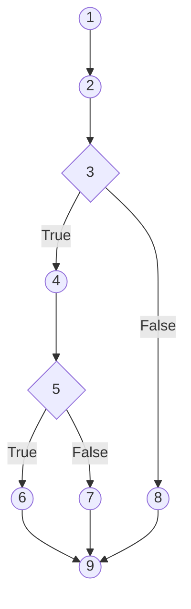
```mermaid
graph TD
    n1((1)) --> n2((2))
    n2 --> n3{3}
    n3 -->|True| n4((4))
    n3 -->|False| n8((8))
    n4 --> n5{5}
    n5 -->|True| n6((6))
    n5 -->|False| n7((7))
    n6 --> n9((9))
    n7 --> n9
    n8 --> n9
```

##### d. Perhitungan Kompleksitas Siklomatis ($V(G)$)
Perhitungan nilai $V(G)$ menggunakan rumus berdasarkan jumlah Edge ($E$) dan Node ($N$):
$E = 9$  
$N = 9$  
$V(G) = E - N + 2 = 9 - 9 + 2 = 2$  

Perhitungan berdasarkan jumlah Predicate Node ($P$, yaitu titik keputusan bercabang 3 dan 5):
$P = 2$  
$V(G) = P + 1 = 2 + 1 = 3$  

Perhitungan secara konsisten menghasilkan nilai kompleksitas siklomatis **$V(G) = 3$**, yang menandakan terdapat tepat 3 jalur independen yang wajib diuji.

##### e. Penentuan Jalur Independen (Independent Paths)
- **Jalur 1 (Kredensial Salah)**: Node 1 -> 2 -> 3 -> 8 -> 9.
- **Jalur 2 (Login Sukses - Role Admin)**: Node 1 -> 2 -> 3 -> 4 -> 5 -> 6 -> 9.
- **Jalur 3 (Login Sukses - Role User)**: Node 1 -> 2 -> 3 -> 4 -> 5 -> 7 -> 9.

##### f. Matriks Kasus Uji (Test Cases)
| Kasus Uji | Jalur | Input (Email, Password) | Output Harapan | Status |
| :--- | :--- | :--- | :--- | :--- |
| TC-WB-01-01 | Jalur 1 | Email/Password tidak cocok / salah | Kembali ke form + Pesan Error "Email atau password salah." | Lolos |
| TC-WB-01-02 | Jalur 2 | admin@kebunrayasambas.go.id, pass: admin123 | Login berhasil, redirect ke `/admin/dashboard` | Lolos |
| TC-WB-01-03 | Jalur 3 | pengunjung@gmail.com, pass: user123 | Login berhasil, redirect ke `/dashboard` | Lolos |

---

#### Kasus 2: Evaluasi Logika Menyimpan Pendaftaran Pengunjung (`PendaftaranController::storePengunjung`)
Fungsi `storePengunjung` bertugas memvalidasi input rombongan, mengkalkulasi total jumlah anggota rombongan, dan menyimpan data ke database.

##### a. Pemetaan Node Control Flow Graph (CFG)
1. **Node A**: Menerima request input pendaftaran rombongan.
2. **Node B**: Percabangan validasi kriteria input (nama, nomor HP, tanggal kunjungan).
3. **Node C**: Menghitung jumlah rombongan dinamis (`1 + count($rombonganDetails)`).
4. **Node D**: Melakukan kueri penyimpanan database `PendaftaranPengunjung::create()`.
5. **Node E**: Mengembalikan respon redirect ke dasbor dengan flash success.
6. **Node F**: Mengembalikan error validasi ke halaman form.
7. **Node G**: Terminasi/Exit fungsi.

##### b. Hubungan Alir Kendali antar Node (Edges)
A -> B  
B -> C (Validasi Sukses)  
B -> F (Validasi Gagal)  
C -> D -> E -> G  
F -> G  

##### c. Representasi Visual Control Flow Graph (CFG)
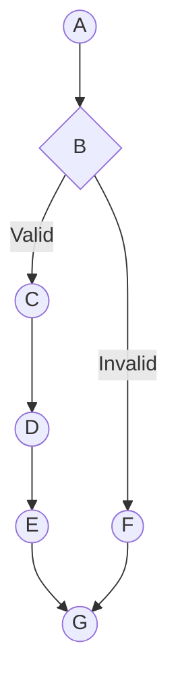
```mermaid
graph TD
    nA((A)) --> nB{B}
    nB -->|Valid| nC((C))
    nB -->|Invalid| nF((F))
    nC --> nD((D))
    nD --> nE((E))
    nE --> nG((G))
    nF --> nG
```

##### d. Perhitungan Kompleksitas Siklomatis ($V(G)$)
$E = 6$  
$N = 7$  
$V(G) = E - N + 2 = 6 - 7 + 2 = 1$ (Kalkulasi Node sederhana).  
Menggunakan rumus Predicate Node ($P = 1$, yaitu Node B):  
$V(G) = P + 1 = 1 + 1 = 2$.  
Diperoleh nilai **$V(G) = 2$** jalur independen yang wajib diuji.

##### e. Penentuan Jalur Independen (Independent Paths)
- **Jalur 1 (Validasi Gagal)**: Node A -> B -> F -> G.
- **Jalur 2 (Pendaftaran Sukses)**: Node A -> B -> C -> D -> E -> G.

##### f. Matriks Kasus Uji (Test Cases)
| Kasus Uji | Jalur | Input (Tanggal, HP, Rombongan) | Output Harapan | Status |
| :--- | :--- | :--- | :--- | :--- |
| TC-WB-02-01 | Jalur 1 | Tanggal: kemarin, HP: salahformat | Validasi gagal, kembali ke form + error | Lolos |
| TC-WB-02-02 | Jalur 2 | Tanggal: besok, HP: 081234567890, Rombongan: 3 orang | Berhasil disimpan ke DB dengan status 'pending', redirect ke dasbor | Lolos |

---

## 5.4 Komunikasi
Tahap komunikasi merupakan langkah pengenalan dan pelatihan penggunaan Sistem WebGIS Berbasis PWA Pada Kebun Raya Sambas kepada para pemangku kepentingan (*stakeholders*). Sosialisasi difokuskan pada dua kategori pengguna:

a. **Sosialisasi Sisi Administrator (Staff Kantor Pengelola UPTD)**:
   Pelatihan intensif dilakukan untuk membekali staff admin UPTD Kebun Raya Sambas mengenai cara mengoperasikan panel admin. Materi mencakup penambahan titik/area spasial di peta Leaflet secara presisi, pengunggahan foto spesimen flora yang secara otomatis dioptimalkan ke format AVIF, serta prosedur verifikasi berkas izin penelitian dan verifikasi kunjungan rombongan pengunjung. Staf administrasi kini dapat beralih sepenuhnya dari pencatatan logbook fisik konvensional ke database digital.

b. **Sosialisasi Sisi Pengguna (Pengunjung Umum & Peneliti)**:
   Pengenalan fitur Progressive Web App (PWA) kepada pengunjung di kawasan Kebun Raya Sambas. Pengunjung diberikan panduan visual untuk menginstal aplikasi ke layar utama smartphone mereka (*Add to Home Screen*) tanpa melalui Google Play Store. Melalui sosialisasi ini, pengunjung memahami manfaat caching offline, di mana mereka tetap dapat membuka katalog flora dan melacak posisi GPS mereka di peta interaktif meskipun berada di area blank spot konservasi hutan Kebun Raya Sambas yang minim sinyal internet.


