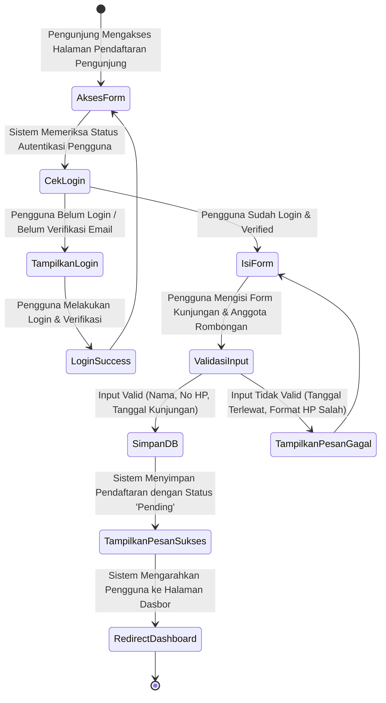
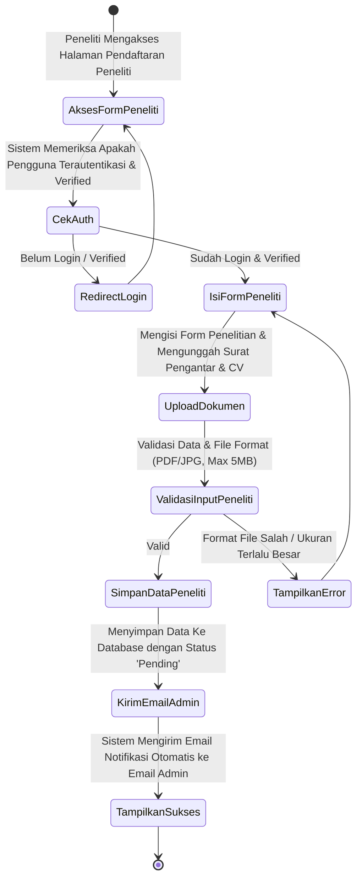
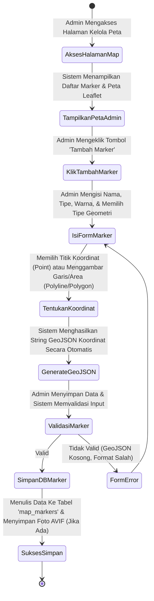
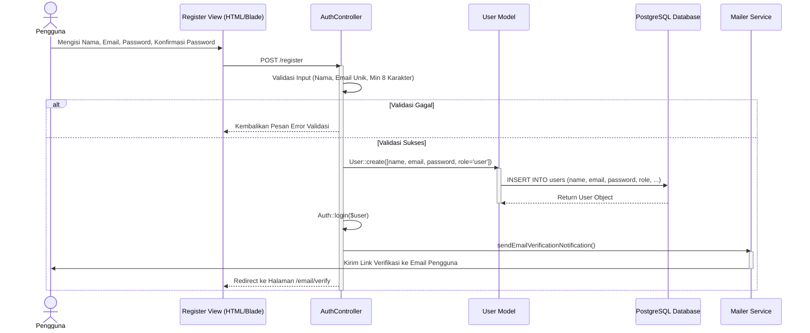
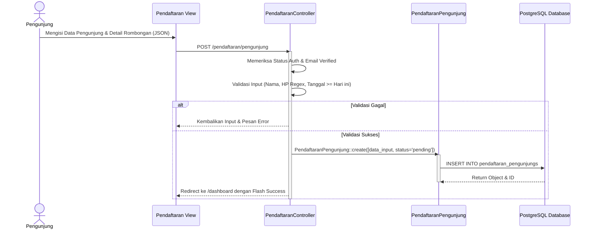
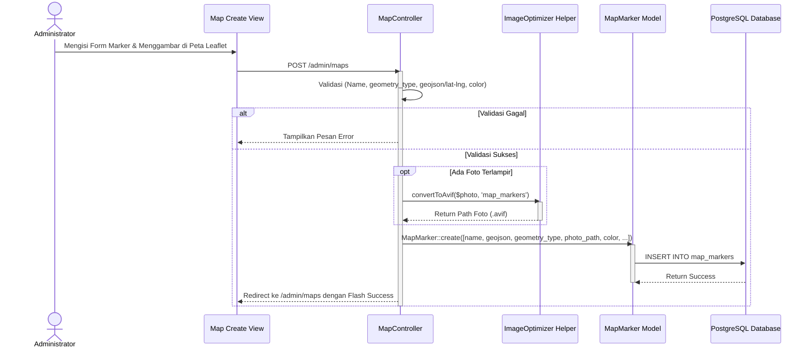
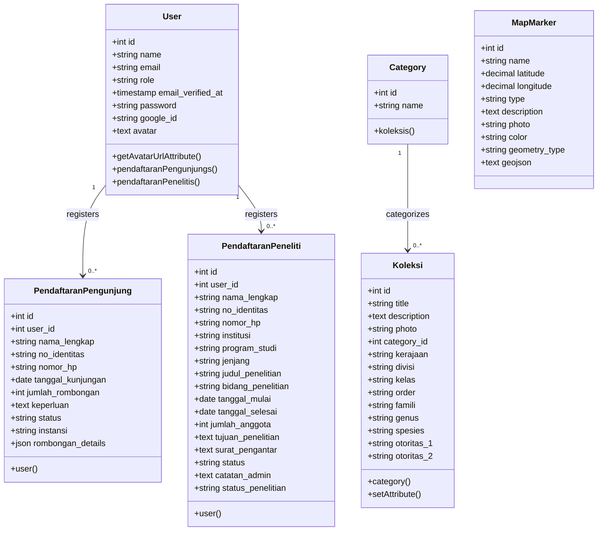
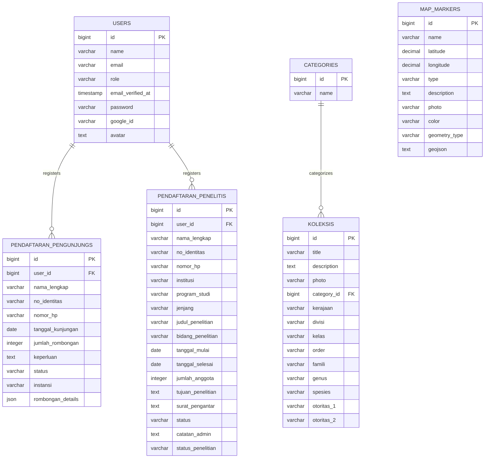
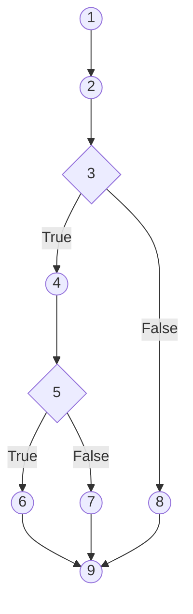
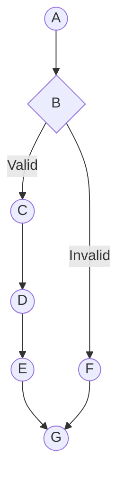

# BAB 5
# HASIL DAN PENELITIAN

## 5.1 Perancangan dan Pengembangan
Tahap perancangan dan pengembangan bertujuan menerjemahkan kebutuhan sistem WebGIS berbasis Progressive Web App (PWA) pada Kebun Raya Sambas menjadi rancangan teknis yang siap diimplementasikan sebagai sistem aplikasi web terintegrasi. Pendekatan yang digunakan mencakup arsitektur web berbasis kerangka kerja (framework) Laravel 12, pengelolaan basis data spasial dan relasional menggunakan PostgreSQL, serta visualisasi peta interaktif berbasis Leaflet.js. Sistem ini juga mengintegrasikan Google OAuth untuk mempermudah pendaftaran pengguna serta Service Worker untuk mendukung kemampuan akses luring (offline-first).

Untuk menjabarkan tahapan tersebut secara terstruktur, pembahasan pada sub-bab ini diawali dengan pendefinisian kebutuhan (requirement) sebagai dasar spesifikasi sistem, dilanjutkan dengan pemaparan arsitektur aplikasi secara menyeluruh. Selanjutnya, rancangan logika dan perilaku sistem divisualisasikan melalui beberapa diagram Unified Modelling Language (UML) yang meliputi Use Case Diagram, Activity Diagram, Class Diagram, dan Sequence Diagram. Pembahasan ini kemudian ditutup dengan pemodelan struktur penyimpanan data yang dipetakan menggunakan Diagram Hubungan Entitas (Entity Relationship Diagram - ERD) serta spesifikasi tabel database.

### 5.1.1 Requirement
Pendefinisian requirement dilakukan guna mengidentifikasi secara mendalam kebutuhan fungsional dan non-fungsional dari sistem WebGIS Berbasis PWA Pada Kebun Raya Sambas.

#### 5.1.1.1 Kebutuhan Sistem
Kebutuhan sistem dirumuskan untuk menggambarkan apa saja kemampuan (fitur) yang harus disediakan oleh sistem berdasarkan hak akses (role) pengguna yang terdaftar, yaitu Pengunjung Umum, Peneliti, dan Administrator (Pengelola). Rincian kebutuhan sistem adalah sebagai berikut:
a. **Kebutuhan Sistem dari Sisi Pengunjung Umum**:
   1. Menampilkan halaman beranda yang memuat informasi ringkas profil Kebun Raya Sambas, galeri katalog flora terbaru, dan ringkasan peta fasilitas dan zonasi area.
   2. Menampilkan profil lengkap UPTD Kebun Raya Sambas (sejarah, visi, misi, dan struktur organisasi).
   3. Menampilkan peta geografis interaktif (WebGIS) berbasis Leaflet.js yang memvisualisasikan titik lokasi fasilitas umum, kantor pengelola, pos keamanan, dan batas-area koleksi flora.
   4. Melakukan registrasi akun baru menggunakan email dan password secara aman.
   5. Melakukan login manual serta login cepat terintegrasi Google Account (Google Socialite/OAuth).
   6. Melakukan verifikasi email (Email Verification) demi keamanan data pengguna.
   7. Melakukan pendaftaran rencana kunjungan umum untuk rombongan secara mandiri dengan mengisi form (nama lengkap, nomor HP, tanggal kunjungan, instansi, keperluan, dan rincian data anggota rombongan).
   8. Mengakses dasbor pengguna untuk memantau riwayat pendaftaran kunjungan, status persetujuan admin (pending, disetujui, ditolak), serta mengedit atau membatalkan pendaftaran sebelum disetujui.
   9. Menyediakan fitur *Add to Home Screen* (A2HS) agar aplikasi web dapat diinstal di perangkat mobile tanpa melalui Google Play Store.
   10. Menyediakan kemampuan akses luring (*offline access*) melalui cache Service Worker agar halaman utama, profil, dan peta dasar yang pernah dimuat tetap dapat diakses tanpa koneksi internet.

b. **Kebutuhan Sistem dari Sisi Peneliti**:
   1. Memiliki seluruh hak akses dasar pengunjung umum.
   2. Melakukan pendaftaran izin penelitian di area Kebun Raya Sambas secara daring dengan mengisi form riset (institusi, program studi, jenjang akademik, judul penelitian, bidang penelitian, tanggal mulai, tanggal selesai, dan tujuan penelitian).
   3. Mengunggah dokumen administrasi pendukung, yaitu Surat Izin Penelitian (dari instansi/kampus) dan *Curriculum Vitae* (CV) dalam format PDF atau gambar.
   4. Memantau status persetujuan riset secara real-time melalui dasbor serta melihat status pelaksanaan riset (*sedang berjalan* atau *selesai*).
   5. Menerima email notifikasi konfirmasi secara otomatis ketika status pendaftaran diperbarui oleh admin.

c. **Kebutuhan Sistem dari Sisi Administrator**:
   1. Mengakses dasbor admin untuk melihat ringkasan statistik operasional (total pengguna, total koleksi flora, total penanda peta, total pengunjung disetujui, dan total peneliti terdaftar).
   2. Mengelola data master pengguna (CRUD Users) dan menentukan hak akses (role: admin atau user).
   3. Mengelola data master kategori flora (CRUD Categories).
   4. Mengelola katalog koleksi flora (CRUD Koleksi) secara dinamis, termasuk data taksonomi (Kerajaan, Divisi, Kelas, Order, Famili, Genus, Spesies, serta Otoritas takson).
   5. Melakukan optimasi kompresi gambar secara otomatis dengan mengonversi berkas foto koleksi tanaman yang diunggah ke format AVIF guna menghemat kapasitas penyimpanan server.
   6. Mengelola penanda peta (CRUD Maps/Markers) baik berupa titik koordinat tunggal (Point) maupun koordinat banyak yang membentuk jalur (Polyline) atau area batas zonasi (Polygon) berbasis data GeoJSON.
   7. Memproses status pendaftaran kunjungan umum dan permohonan izin penelitian (menyetujui atau menolak pendaftaran, serta memperbarui status penelitian).
   8. Melakukan ekspor data rekapitulasi pengunjung dan peneliti ke format dokumen unduhan (CSV/Excel).

#### 5.1.1.2 Kebutuhan Pengguna
Kebutuhan pengguna dilakukan untuk memahami siapa saja pihak yang terlibat dalam penggunaan sistem WebGIS Berbasis PWA Pada Kebun Raya Sambas serta kebutuhan mereka dalam menjalankan aktivitas di dalamnya. Pengguna sistem dibagi menjadi tiga kelompok utama sesuai dengan peran operasional yang ada, yaitu pengunjung umum sebagai pengguna publik yang mengakses informasi dan melakukan pendaftaran kunjungan, peneliti sebagai pengguna yang mengajukan permohonan izin riset di kawasan kebun raya, serta administrator sebagai pengelola keseluruhan sistem dan data. Kebutuhan pengguna ini menjadi dasar dalam merancang fitur, antarmuka, serta alur proses pada sistem yang dikembangkan.

a. Kebutuhan Pengguna dari Sisi Pengunjung Umum
   a) Pengunjung umum dapat mengakses halaman beranda yang memuat profil singkat Kebun Raya Sambas, galeri koleksi flora terbaru, dan ringkasan peta fasilitas dan zonasi area secara langsung tanpa harus login terlebih dahulu.
   b) Pengunjung umum dapat menjelajahi halaman profil UPTD Kebun Raya Sambas yang memuat informasi sejarah pendirian, visi dan misi, serta struktur organisasi pengelola.
   c) Pengunjung umum dapat melihat peta geografis interaktif berbasis Leaflet.js yang menampilkan titik lokasi fasilitas umum, kantor pengelola, pos keamanan, dan batas area zonasi koleksi dalam format GeoJSON.
   d) Pengunjung umum dapat menelusuri katalog koleksi flora yang tersedia dengan fitur pencarian berdasarkan nama lokal, nama ilmiah (genus/spesies), atau famili tanaman.
   e) Pengunjung umum dapat melihat halaman detail koleksi flora yang memuat foto spesimen, deskripsi botani, serta klasifikasi taksonomi lengkap (Kerajaan, Divisi, Kelas, Order, Famili, Genus, Spesies, dan Otoritas takson).
   f) Pengunjung umum dapat melakukan registrasi akun baru menggunakan email dan kata sandi, atau masuk menggunakan akun Google melalui fitur Google OAuth (Socialite).
   g) Pengunjung umum dapat melakukan verifikasi email setelah registrasi sebagai syarat aktivasi akun dan akses fitur pendaftaran kunjungan.
   h) Pengunjung umum yang telah login dan terverifikasi dapat mengajukan pendaftaran rencana kunjungan rombongan secara mandiri dengan mengisi formulir yang memuat nama lengkap, nomor HP, tanggal kunjungan, instansi, keperluan, serta rincian data anggota rombongan.
   i) Pengunjung umum dapat mengakses dasbor pribadi untuk memantau riwayat pendaftaran kunjungan, melihat status persetujuan admin (*pending*, *disetujui*, atau *ditolak*), serta mengedit atau membatalkan pendaftaran yang masih berstatus *pending*.
   j) Pengunjung umum dapat menginstal aplikasi WebGIS ke layar utama perangkat *smartphone* melalui fitur *Add to Home Screen* (PWA) tanpa perlu mengunduh melalui toko aplikasi.
   k) Pengunjung umum dapat mengakses halaman beranda, profil, dan tampilan peta yang pernah dimuat sebelumnya secara luring (*offline*) melalui mekanisme *cache* Service Worker.

b. Kebutuhan Pengguna dari Sisi Peneliti
   a) Peneliti dapat mengakses seluruh fitur yang dimiliki oleh pengunjung umum.
   b) Peneliti yang telah login dan terverifikasi dapat mengajukan permohonan izin penelitian di kawasan Kebun Raya Sambas secara daring dengan mengisi formulir yang memuat nama institusi, program studi, jenjang akademik, judul penelitian, bidang kajian, tanggal mulai dan selesai, serta tujuan penelitian.
   c) Peneliti dapat mengunggah dokumen administrasi pendukung berupa Surat Izin Penelitian dari instansi atau kampus dan *Curriculum Vitae* (CV) dalam format PDF atau gambar.
   d) Peneliti dapat memantau status persetujuan permohonan riset secara *real-time* melalui dasbor pribadi, termasuk melihat status pelaksanaan penelitian (*sedang berjalan* atau *selesai*).
   e) Peneliti dapat mengedit atau membatalkan permohonan riset yang masih berstatus *pending* sebelum diproses oleh administrator.

c. Kebutuhan Pengguna dari Sisi Administrator
   a) Administrator dapat mengakses dasbor admin yang menampilkan ringkasan statistik operasional secara visual, meliputi total pengguna terdaftar, total koleksi flora, total penanda peta, total pengunjung yang disetujui, dan total peneliti aktif.
   b) Administrator dapat mengelola data pengguna sistem (CRUD Users) serta menentukan hak akses peran (*role*) masing-masing pengguna, yaitu *admin* atau *user*.
   c) Administrator dapat mengelola data kategori koleksi flora (CRUD Categories) sebagai klasifikasi pengelompokan tanaman dalam sistem.
   d) Administrator dapat mengelola katalog koleksi flora (CRUD Koleksi) secara dinamis, termasuk menginput data taksonomi botani lengkap dan mengunggah foto spesimen yang secara otomatis dioptimalkan ke format AVIF.
   e) Administrator dapat mengelola penanda peta (CRUD Maps/Markers) berupa titik koordinat tunggal (*Point*), jalur jalan (*Polyline*), maupun batas zonasi area (*Polygon*) berbasis data GeoJSON langsung melalui antarmuka peta Leaflet.
   f) Administrator dapat memproses status pendaftaran kunjungan rombongan dengan menyetujui atau menolak permohonan yang masuk, disertai kemampuan mengekspor rekapitulasi data pengunjung ke format CSV/Excel.
   g) Administrator dapat memproses permohonan izin penelitian dengan menyetujui atau menolak berkas, menuliskan catatan masukan, serta memperbarui status pelaksanaan riset dari *sedang berjalan* menjadi *selesai*.


#### 5.1.1.3 Kebutuhan Perangkat Lunak
Pengembangan Sistem WebGIS Berbasis PWA Pada Kebun Raya Sambas ini menggunakan spesifikasi perangkat lunak sebagai berikut:
a. Perangkat lunak lingkungan pengembangan:
   1) Sistem Operasi: Windows 10/11 sebagai lingkungan pengembangan lokal.
   2) PHP versi 8.2.12 sebagai bahasa pemrograman sisi server (*backend*).
   3) Visual Studio Code versi terbaru sebagai *code editor* pengembangan aplikasi.
   4) Git versi terbaru sebagai *version control system* pengelolaan kode sumber.
b. Perangkat lunak framework dan library backend:
   1) Laravel Framework versi 12.43.1 sebagai *framework* MVC *backend* utama aplikasi.
   2) Laravel Socialite versi 5.24 sebagai paket integrasi autentikasi Google OAuth.
c. Perangkat lunak frontend dan build tools:
   1) Node.js versi 24.12.0 sebagai *runtime* JavaScript untuk proses kompilasi aset.
   2) npm versi 11.7.0 sebagai manajer paket JavaScript.
   3) Vite versi 7.0.7 sebagai *build tool* dan *dev server* aset *frontend*.
   4) Tailwind CSS versi 4 (^4.1.18) sebagai *framework* CSS *utility-first* untuk perancangan antarmuka.
   5) Alpine.js versi 3.15.3 sebagai *library* JavaScript ringan untuk interaktivitas antarmuka.
   6) Leaflet.js versi 1.9.4 sebagai *library* pemetaan interaktif berbasis JavaScript.
d. Perangkat lunak basis data dan layanan eksternal:
   1) PostgreSQL versi 15+ sebagai sistem manajemen basis data relasional.
   2) SMTP Gmail sebagai layanan pengiriman email notifikasi administrasi.

#### 5.1.1.4 Kebutuhan Perangkat Keras
Perangkat keras yang digunakan dalam pengembangan dan operasional sistem WebGIS Berbasis PWA Pada Kebun Raya Sambas adalah sebagai berikut:
1. Perangkat Server / *Hosting*
   a. Spesifikasi minimal server yang dibutuhkan:
      a) Prosesor: Minimal 2 *Core* CPU (disarankan 4 *Core* untuk proses konversi gambar ke format AVIF secara otomatis).
      b) RAM: Minimal 2 GB (disarankan 4 GB untuk kelancaran kompilasi aset Vite dan pengelolaan koneksi PostgreSQL).
      c) Penyimpanan: SSD minimal 20 GB untuk penyimpanan kode aplikasi, aset foto koleksi flora, dan berkas dokumen peneliti.
   b. Digunakan untuk menjalankan aplikasi web Laravel, Vite *build server*, dan database PostgreSQL (dapat di-*deploy* secara lokal *on-premise* maupun di VPS *Cloud*).
2. Perangkat Administrator / Pengelola
   a. Laptop atau PC dengan spesifikasi minimal:
      a) Prosesor: Intel Core i3 atau setara.
      b) RAM: Minimal 4 GB.
      c) *Browser* modern (Google Chrome, Microsoft Edge) versi terbaru.
   b. Digunakan untuk mengelola panel admin, memproses verifikasi pendaftaran pengunjung dan peneliti, mengelola peta Leaflet, katalog flora dan taksonomi, serta mengekspor laporan rekapitulasi.
3. Perangkat Pengguna (*User / Client*)
   a. *Smartphone* atau *Tablet* berbasis Android / iOS:
      a) Versi sistem operasi minimal: Android 8.0 (*Oreo*) atau iOS 12.
      b) RAM minimal: 3 GB.
      c) *Browser* modern (Chrome, Safari, Edge) yang mendukung Service Worker API dan Geolocation API.
   b. Digunakan untuk mengakses peta WebGIS interaktif, menelusuri katalog flora, melakukan pendaftaran kunjungan secara mandiri, serta menginstal aplikasi melalui fitur *Progressive Web App* (PWA).
4. Jaringan Internet
   a. Koneksi internet stabil minimal 10 Mbps dan *Router* Wi-Fi/LAN berkualitas baik.
   b. Digunakan untuk komunikasi dengan server aplikasi Laravel, integrasi Google OAuth, pengiriman notifikasi email via SMTP Gmail, serta pemuatan ubin peta dasar (*basemap tiles*) OpenStreetMap secara *real-time*.


---

### 5.1.2 Arsitektur Sistem
Arsitektur Sistem WebGIS Berbasis PWA Pada Kebun Raya Sambas dirancang menggunakan pola arsitektur 3-Tier (tiga lapis) yang terstruktur, modular, dan handal untuk memastikan pemisahan tanggung jawab yang jelas antara antarmuka pengguna (GUI), logika bisnis server, dan penyimpanan data. Pola 3-Tier ini membagi sistem menjadi Presentation Tier, Application Tier, dan Data Tier, dengan integrasi layanan pihak ketiga (External Services) yang diletakkan di luar batasan sistem utama. Rincian desain arsitektur sistem ini divisualisasikan secara menyeluruh pada Gambar 5.1.


Berdasarkan gambar arsitektur sistem tersebut, penjelasan mengenai komponen pada masing-masing lapisan didefinisikan sebagai berikut:
a. **Presentation Tier (Lapisan Presentasi)**: Merupakan antarmuka grafis pengguna (GUI) paling atas dari sistem yang berjalan langsung di sisi peramban web (*client-side*) pada perangkat pengguna (seperti komputer desktop, laptop, tablet, maupun ponsel pintar). Lapisan ini bertanggung jawab menyajikan visualisasi data spasial dan menerima masukan pengguna. Di dalamnya terdapat dua komponen antarmuka utama:
   1) *User Portal UI (Client PWA)*: Antarmuka utama untuk pengunjung umum dan peneliti yang dibangun menggunakan mesin templat Laravel Blade, dipadukan dengan Tailwind CSS v4 untuk penataan visual, Alpine.js untuk interaktivitas dinamis ringan, serta Leaflet.js untuk merender data spasial berupa *marker*, *polyline*, dan *polygon* dari data GeoJSON. Pada lapisan ini dipasang berkas `manifest.json` dan Service Worker (`sw.js`) agar aplikasi dapat berjalan sebagai Progressive Web App (PWA) dengan kemampuan instalasi di layar utama perangkat (*Add to Home Screen*) dan akses luring (*offline access*).
   2) *Admin Dashboard UI*: Antarmuka khusus untuk administrator (pengelola) yang memuat berbagai panel kontrol administratif, antarmuka manajemen pengguna, pengelolaan kategori dan katalog tanaman, pengelolaan data GeoJSON batas area, serta halaman pemrosesan persetujuan pendaftaran.
b. **Application Tier (Lapisan Aplikasi)**: Merupakan lapisan tengah yang bertanggung jawab mengeksekusi logika bisnis aplikasi dan berjalan pada server aplikasi berbasis kerangka kerja Laravel 12. Lapisan ini memproses masukan dari klien dan berinteraksi dengan lapisan data. Komponen utama pada lapisan ini meliputi:
   1) *Web Router & Middleware*: Berkas `routes/web.php` memetakan request URL ke controller yang sesuai, dilindungi oleh middleware keamanan seperti `auth` (proteksi sesi login), `verified` (verifikasi email aktif), dan `admin` (proteksi hak akses pengelola).
   2) *Auth & Profile Controllers*: Mengelola proses autentikasi akun (pendaftaran akun baru, verifikasi email, login pengguna, serta manajemen akun profil).
   3) *Koleksi & Map Controllers*: Menangani logika pengelolaan katalog tanaman flora (CRUD koleksi) serta titik koordinat spasial dan batas area geografis (GeoJSON).
   4) *Pendaftaran Controllers*: Mengelola logika pengajuan rencana kunjungan rombongan bagi pengunjung umum dan pengajuan izin penelitian/riset untuk peneliti.
   5) *Application Services & Helpers*: Kelas pembantu pendukung, meliputi `ImageOptimizer` untuk kompresi dan konversi otomatis berkas foto koleksi tanaman ke format AVIF untuk efisiensi penyimpanan, serta kelas mailer `PendaftaranPenelitiMail` untuk memproses pengiriman notifikasi surat elektronik.
c. **Data Tier (Lapisan Data)**: Merupakan lapisan terbawah yang berkaitan erat dengan penyimpanan, pengelolaan, dan pengambilan data sistem secara terpusat. Lapisan ini berkomunikasi dengan Application Tier melalui lapisan abstraksi model internal. Komponennya terdiri atas:
   1) *Eloquent ORM Models*: Model-model data relasional (`User.php`, `Koleksi.php`, `MapMarker.php`, `PendaftaranPengunjung.php`, `PendaftaranPeneliti.php`) yang menerjemahkan objek pemrograman Laravel menjadi query basis data relasional.
   2) *PostgreSQL Database*: DBMS utama untuk menyimpan tabel database (users, koleksis, map_markers, pendaftaran_pengunjungs, pendaftaran_penelitis, categories) serta menyimpan batas area geografis spasial dalam bentuk data string GeoJSON.
d. **External Services (Layanan Eksternal)**: Komponen layanan pihak ketiga yang berada di luar server aplikasi dan diakses melalui koneksi jaringan internet API. Seluruh layanan ini diletakkan bebas di sisi kiri luar diagram sistem untuk menegaskan batas arsitektur lokal, meliputi:
   1) *OpenStreetMap*: Menyediakan API ubin peta dasar (*basemap tiles*) yang dimuat secara dinamis oleh Leaflet.js pada sisi klien.
   2) *Google OAuth API*: Menyediakan layanan autentikasi pihak ketiga terintegrasi menggunakan paket Laravel Socialite agar pengguna dapat login menggunakan akun Google.
   3) *SMTP Gmail Server*: Menyediakan layanan SMTP relay eksternal untuk pengiriman notifikasi email administratif sistem ke pengelola.

Untuk menjamin kejelasan interaksi data tanpa terjadinya tumpang tindih (*overlap*) atau duplikasi langkah, seluruh pertukaran data (*data flow*) dirancang sebagai siklus tertutup (*round-trip*) yang terisolasi ke dalam lima alur operasional utama berakhiran huruf akhiran unik (`a` sampai `e`) sebagai berikut:
1) **Alur A (Autentikasi Pengguna & Google OAuth - Suffix `a`)**: Alur login via Google Socialite. Dimulai dari langkah `1a. Request Login Google` dari User Portal ke Router, diteruskan melalui `2a. Route & Auth Middleware` ke Auth Controller, dilanjutkan dengan request redirect `3a` ke Google OAuth API dan return data pengguna `4a` ke Auth Controller. Auth Controller memanggil model `5a` untuk eksekusi SQL SELECT/INSERT `6a` ke PostgreSQL Database. Database mengembalikan status `7a` ke model, dilanjutkan return model instance `8a` ke Auth Controller, pembuatan sesi `9a` ke Router, dan diakhiri dengan redirect `10a. Redirect to Authenticated UI` kembali ke User Portal UI.
2) **Alur B (Peta Spasial & Katalog Flora - Suffix `b`)**: Pemuatan katalog dan visualisasi spasial tanaman. Request berawal dari `1b. Request Map / Catalog Page` ke Router, diarahkan via `2b` ke Koleksi & Map Controller, yang melakukan query `3b` ke model dan eksekusi SQL SELECT `4b` ke PostgreSQL. Database mengembalikan data `5b` ke model, dilanjutkan ke controller `6b`. Controller memanggil `7b` ke ImageOptimizer untuk kompresi AVIF, menerima return path `8b`, mengirim return rendered HTML/GeoJSON `9b` ke Router, dan berakhir di `10b. Display Map & Catalog UI` di User Portal.
3) **Alur C (Load Basemap Tiles - Suffix `c`)**: Alur asinkron di mana browser memuat ubin peta Leaflet langsung dari OpenStreetMap melalui request `1c. Load Basemap Tiles` dan menerima return gambar ubin peta pada `2c. Return Basemap Tile Images` langsung ke sisi User Portal.
4) **Alur D (Pendaftaran Kunjungan & Peneliti - Suffix `d`)**: Formulir pendaftaran dikirim via `1d` ke Router, diteruskan via `2d` ke Pendaftaran Controller, yang memanggil model `3d` untuk eksekusi INSERT `4d` ke PostgreSQL. Database mengembalikan status `5d` ke model dan `6d` ke Controller. Controller memicu notifikasi email `7d` ke SMTP Mailer Helper, yang mengirim data SMTP Relay `8d` ke SMTP Gmail Server. Server eksternal mengembalikan respon status SMTP `9d` ke Mailer, diteruskan ke Controller `10d`, lalu dikirim kembali via `11d` ke Router, dan diakhiri dengan tampilan sukses `12d. Display Success / Invoice PWA` di User Portal.
5) **Alur E (Admin Dashboard - Manajemen & Persetujuan - Suffix `e`)**: Aksi admin dikirim via `1e` dari Admin UI ke Router, diteruskan via `2e` ke Pendaftaran Controller. Controller memicu mutasi status `3e` ke model, dilanjutkan eksekusi SQL UPDATE/DELETE `4e` ke PostgreSQL. Database mengembalikan status update `5e` ke model, diteruskan ke Controller `6e`, lalu dikirim kembali via `7e` ke Router, dan diakhiri dengan pembaruan tampilan tabel `8e. Update Dashboard View / Table` di Admin Dashboard UI.

---


---

### 5.1.3 Unified Modelling Language (UML)
Pemodelan UML digunakan untuk memvisualisasikan struktur statis dan interaksi dinamis dari sistem yang dibangun.

#### 5.1.3.1 Use Case Diagram
Use Case Diagram merinci hubungan interaksi antara tiga aktor utama (Pengunjung Umum, Peneliti, Admin) dengan fungsi-fungsi utama sistem:

```mermaid
leftToRightDirection
actor "Pengunjung Umum" as Pengunjung
actor "Peneliti" as Peneliti
actor "Administrator" as Admin

rectangle "Sistem WebGIS Berbasis PWA Pada Kebun Raya Sambas" {
    usecase "Registrasi & Login Akun" as UC1
    usecase "Login Google OAuth" as UC1b
    usecase "Melihat Profil & Beranda" as UC2
    usecase "Melihat Peta Interaktif (WebGIS)" as UC3
    usecase "Mencari & Melihat Detail Flora" as UC4
    usecase "Pendaftaran Rencana Kunjungan" as UC5
    usecase "Pendaftaran Izin Penelitian (Upload Dokumen)" as UC6
    usecase "Mengakses Dasbor Pengguna" as UC7
    usecase "Mengelola Pengguna (CRUD)" as UC8
    usecase "Mengelola Peta & Marker (GeoJSON)" as UC9
    usecase "Mengelola Koleksi Flora & Taksonomi" as UC10
    usecase "Konfirmasi Pendaftaran & Ekspor Dokumen" as UC11
}

Pengunjung --> UC1
Pengunjung --> UC1b
Pengunjung --> UC2
Pengunjung --> UC3
Pengunjung --> UC4
Pengunjung --> UC5
Pengunjung --> UC7

Peneliti --> UC1
Peneliti --> UC1b
Peneliti --> UC2
Peneliti --> UC3
Peneliti --> UC4
Peneliti --> UC5
Peneliti --> UC6
Peneliti --> UC7

Admin --> UC1
Admin --> UC8
Admin --> UC9
Admin --> UC10
Admin --> UC11
```

Aktor Pengunjung Umum dan Peneliti berinteraksi dengan sistem untuk melihat peta interaktif, mencari flora, dan melakukan pendaftaran. Peneliti memiliki use case khusus yaitu pendaftaran izin penelitian yang mewajibkan unggah dokumen. Sementara Administrator memiliki otorisasi penuh untuk mengelola data master pengguna, koleksi flora, marker peta berbasis GeoJSON, serta mengonfirmasi pendaftaran kunjungan/penelitian.

#### 5.1.3.2 Activity Diagram
Activity diagram memetakan alur kerja aktivitas sistem pada proses bisnis utama.

##### 5.1.3.2.1 Activity Diagram Pendaftaran Pengunjung
Diagram ini menggambarkan alur saat pengunjung melakukan pendaftaran kunjungan rombongan secara online:



##### 5.1.3.2.2 Activity Diagram Pendaftaran Peneliti
Diagram ini menggambarkan alur pendaftaran izin penelitian yang membutuhkan unggah file CV dan Surat Izin:



##### 5.1.3.2.3 Activity Diagram Kelola Peta/Markers (Admin)
Diagram ini menjelaskan bagaimana admin menambahkan marker baru (Point, Polyline, Polygon) ke dalam peta WebGIS:



#### 5.1.3.3 Sequence Diagram
Sequence diagram menggambarkan interaksi antar-objek berdasarkan urutan waktu.

##### 5.1.3.3.1 Sequence Diagram Registrasi Pengguna
Diagram ini merinci urutan pendaftaran akun pengguna baru secara manual:



##### 5.1.3.3.2 Sequence Diagram Pendaftaran Pengunjung
Diagram ini memetakan urutan proses pendaftaran kunjungan rombongan oleh pengguna yang telah login:



##### 5.1.3.3.3 Sequence Diagram Kelola Peta/Markers oleh Admin
Diagram ini memetakan urutan penambahan marker baru oleh admin:



#### 5.1.3.4 Class Diagram
Class diagram menggambarkan hubungan antarkelas model Eloquent pada aplikasi WebGIS Kebun Raya Sambas:



Model `User` merepresentasikan pengguna sistem yang dapat melakukan banyak pendaftaran pengunjung (`PendaftaranPengunjung`) maupun pendaftaran peneliti (`PendaftaranPeneliti`). Model `Koleksi` memuat atribut taksonomi botani lengkap dan terasosiasi ke satu `Category`. Model `MapMarker` berdiri sendiri untuk menyimpan entitas objek spasial geografis di peta Leaflet.

---

### 5.1.4 Perancangan Basis Data
Perancangan basis data dilakukan dengan melakukan normalisasi untuk menghasilkan tabel-tabel yang optimal dan minim redundansi data.

#### 5.1.4.1 Normalisasi
Proses normalisasi basis data spasial relasional ini diuraikan dari bentuk tidak normal (UNF) hingga bentuk normal ketiga (3NF):

a. **Bentuk Tidak Normal (UNF - Unnormalized Form)**:
   Format UNF menampung seluruh atribut mentah dari seluruh kebutuhan sistem tanpa adanya pengelompokan tabel:
   `{ id_user, name, email, role, email_verified_at, password, google_id, avatar, id_category, category_name, id_koleksi, title, description, photo, category_id, kerajaan, divisi, kelas, order, famili, genus, spesies, otoritas_1, otoritas_2, id_marker, marker_name, latitude, longitude, type, marker_description, marker_photo, color, geometry_type, geojson, id_pengunjung, pengunjung_user_id, nama_lengkap, no_identitas, nomor_hp, tanggal_kunjungan, jumlah_rombongan, keperluan, status_pengunjung, instansi, rombongan_details, id_peneliti, peneliti_user_id, peneliti_nama_lengkap, peneliti_no_hp, institusi, program_studi, jenjang, judul_penelitian, bidang_penelitian, tanggal_mulai, tanggal_selesai, jumlah_anggota, tujuan_penelitian, surat_pengantar, status_peneliti, catatan_admin, status_penelitian }`

b. **Bentuk Normal Pertama (1NF)**:
   Menghilangkan atribut berulang dan memastikan seluruh kolom bersifat atomik (tunggal). Kunci primer (Primary Key) ditentukan pada setiap entitas:
   `{ @id_user, name, email, role, email_verified_at, password, google_id, avatar, @id_category, category_name, @id_koleksi, title, description, photo, category_id, kerajaan, divisi, kelas, order, famili, genus, spesies, otoritas_1, otoritas_2, @id_marker, marker_name, latitude, longitude, type, marker_description, marker_photo, color, geometry_type, geojson, @id_pengunjung, user_id, nama_lengkap, no_identitas, nomor_hp, tanggal_kunjungan, jumlah_rombongan, keperluan, status, instansi, rombongan_details, @id_peneliti, user_id, nama_lengkap, no_identitas, nomor_hp, institusi, program_studi, jenjang, judul_penelitian, bidang_penelitian, tanggal_mulai, tanggal_selesai, jumlah_anggota, tujuan_penelitian, surat_pengantar, status, catatan_admin, status_penelitian }`

c. **Bentuk Normal Kedua (2NF)**:
   Memisahkan tabel berdasarkan ketergantungan fungsional penuh terhadap kunci primer, sehingga tidak ada ketergantungan parsial:
   - `users = { @id, name, email, role, email_verified_at, password, google_id, avatar }`
   - `categories = { @id, name }`
   - `koleksis = { @id, title, description, photo, category_id, kerajaan, divisi, kelas, order, famili, genus, spesies, otoritas_1, otoritas_2 }`
   - `map_markers = { @id, name, latitude, longitude, type, description, photo, color, geometry_type, geojson }`
   - `pendaftaran_pengunjungs = { @id, user_id, nama_lengkap, no_identitas, nomor_hp, tanggal_kunjungan, jumlah_rombongan, keperluan, status, instansi, rombongan_details }`
   - `pendaftaran_penelitis = { @id, user_id, nama_lengkap, no_identitas, nomor_hp, institusi, program_studi, jenjang, judul_penelitian, bidang_penelitian, tanggal_mulai, tanggal_selesai, jumlah_anggota, tujuan_penelitian, surat_pengantar, status, catatan_admin, status_penelitian }`

d. **Bentuk Normal Ketiga (3NF)**:
   Bentuk 3NF mensyaratkan tidak adanya ketergantungan transitif (non-kunci tidak boleh bergantung pada non-kunci lainnya). Karena seluruh atribut non-kunci di 2NF sudah secara langsung bergantung penuh pada primary key masing-masing tabel tanpa transitivitas, maka struktur tabel hasil 2NF di atas telah memenuhi kriteria **3NF** dan siap diimplementasikan ke PostgreSQL.

#### 5.1.4.2 Diagram Hubungan Entitas
Diagram Hubungan Entitas (ERD) menggambarkan korelasi relasional antartabel dalam basis data:



#### 5.1.4.3 Spesifikasi Struktur Tabel Database
Berikut adalah rincian detail spesifikasi teknis dari masing-masing struktur tabel database dalam sistem WebGIS Kebun Raya Sambas:

##### Tabel 5.1 Spesifikasi Tabel `users`
| Nama Kolom | Tipe Data | Keterangan |
| :--- | :--- | :--- |
| `id` | bigint | Primary Key, Auto Increment |
| `name` | varchar(100) | Nama lengkap pengguna |
| `email` | varchar(150) | Email pengguna, unik |
| `role` | varchar(30) | Hak akses pengguna (admin / user) |
| `email_verified_at`| timestamp | Waktu verifikasi email |
| `password` | varchar(255) | Hash kata sandi pengguna |
| `google_id` | varchar(255) | ID login Google, nullable |
| `avatar` | text | URL/Path foto profil Google, nullable |
| `remember_token` | varchar(100) | Token sesi login, nullable |

##### Tabel 5.2 Spesifikasi Tabel `categories`
| Nama Kolom | Tipe Data | Keterangan |
| :--- | :--- | :--- |
| `id` | bigint | Primary Key, Auto Increment |
| `name` | varchar(100) | Nama kategori koleksi flora |

##### Tabel 5.3 Spesifikasi Tabel `koleksis`
| Nama Kolom | Tipe Data | Keterangan |
| :--- | :--- | :--- |
| `id` | bigint | Primary Key, Auto Increment |
| `title` | varchar(255) | Nama lokal/umum tanaman |
| `description` | text | Deskripsi lengkap flora |
| `photo` | varchar(255) | Path file foto tanaman (.avif) |
| `category_id` | bigint | Foreign Key ke tabel `categories`, nullable |
| `kerajaan` | varchar(100) | Klasifikasi Kerajaan (Kingdom) |
| `divisi` | varchar(100) | Klasifikasi Divisi (Division) |
| `kelas` | varchar(100) | Klasifikasi Kelas (Class) |
| `order` | varchar(100) | Klasifikasi Bangsa (Order) |
| `famili` | varchar(100) | Klasifikasi Suku (Family) |
| `genus` | varchar(100) | Klasifikasi Marga (Genus) |
| `spesies` | varchar(100) | Klasifikasi Jenis (Species) |
| `otoritas_1` | varchar(100) | Nama penemu taksonomi 1 |
| `otoritas_2` | varchar(100) | Nama penemu taksonomi 2 |

##### Tabel 5.4 Spesifikasi Tabel `map_markers`
| Nama Kolom | Tipe Data | Keterangan |
| :--- | :--- | :--- |
| `id` | bigint | Primary Key, Auto Increment |
| `name` | varchar(255) | Nama objek spasial |
| `latitude` | decimal(10,8) | Koordinat lintang (point), nullable |
| `longitude` | decimal(11,8) | Koordinat bujur (point), nullable |
| `type` | varchar(50) | Tipe marker (area_koleksi, fasilitas_umum, dll.) |
| `description` | text | Deskripsi detail lokasi |
| `photo` | varchar(255) | Path berkas foto lokasi (.avif), nullable |
| `color` | varchar(7) | Kode Hex warna penanda (e.g. #064e3b) |
| `geometry_type` | varchar(20) | Tipe geometri (point, polyline, polygon) |
| `geojson` | text | JSON koordinat koordinat path/area |

##### Tabel 5.5 Spesifikasi Tabel `pendaftaran_pengunjungs`
| Nama Kolom | Tipe Data | Keterangan |
| :--- | :--- | :--- |
| `id` | bigint | Primary Key, Auto Increment |
| `user_id` | bigint | Foreign Key ke tabel `users`, nullable |
| `nama_lengkap` | varchar(255) | Nama lengkap pendaftar rombongan |
| `no_identitas` | varchar(50) | NIK/KTP/SIM pendaftar |
| `nomor_hp` | varchar(20) | Nomor kontak WhatsApp pendaftar |
| `tanggal_kunjungan`| date | Tanggal pelaksanaan kunjungan |
| `jumlah_rombongan`| int | Total orang dalam rombongan |
| `keperluan` | text | Keperluan kunjungan (wisata/edukasi) |
| `status` | varchar(30) | Status (pending, disetujui, ditolak) |
| `instansi` | varchar(255) | Asal instansi/domisili |
| `rombongan_details`| json | List nama & HP anggota rombongan |

##### Tabel 5.6 Spesifikasi Tabel `pendaftaran_penelitis`
| Nama Kolom | Tipe Data | Keterangan |
| :--- | :--- | :--- |
| `id` | bigint | Primary Key, Auto Increment |
| `user_id` | bigint | Foreign Key ke tabel `users` |
| `nama_lengkap` | varchar(255) | Nama lengkap peneliti utama |
| `no_identitas` | varchar(50) | NIK/NIM/NIDN pendaftar |
| `nomor_hp` | varchar(20) | Nomor kontak WhatsApp peneliti |
| `institusi` | varchar(255) | Kampus atau Instansi asal |
| `program_studi` | varchar(255) | Program studi asal |
| `jenjang` | varchar(20) | Jenjang akademik (S1, S2, S3, Dosen, dll.) |
| `judul_penelitian` | varchar(500) | Judul penelitian botani |
| `bidang_penelitian`| varchar(500) | Bidang kajian penelitian |
| `tanggal_mulai` | date | Tanggal mulai penelitian |
| `tanggal_selesai` | date | Tanggal perkiraan selesai penelitian |
| `jumlah_anggota` | int | Jumlah anggota peneliti |
| `tujuan_penelitian`| text | Tujuan dan luaran hasil penelitian |
| `surat_pengantar` | text | JSON path dokumen surat izin & CV |
| `status` | varchar(30) | Status persetujuan (pending, disetujui, dll.) |
| `catatan_admin` | text | Catatan alasan penolakan/masukan |
| `status_penelitian`| varchar(30) | Status riset (sedang, selesai) |

---

## 5.2 Demonstrasi
Tahap demonstrasi memaparkan implementasi nyata perancangan program dalam bentuk kode program dan antarmuka sistem (frontend).

### 5.2.1 Implementasi Perancangan Logika Sistem (Leaflet.js)
Logika pemrograman sistem dikembangkan menggunakan arsitektur model MVC Laravel, di mana controller bertindak sebagai pengatur logika bisnis dan integrasi pustaka pemetaan Leaflet.js.

#### 5.2.1.1 Implementasi Koneksi Database PostgreSQL
Koneksi basis data relasional dikonfigurasikan pada berkas environment `.env` dan dibaca secara global oleh kernel Laravel melalui `config/database.php`. Potongan kode konfigurasi database PostgreSQL (`pgsql`) diatur sebagai berikut:

```php
'pgsql' => [
    'driver' => 'pgsql',
    'url' => env('DB_URL'),
    'host' => env('DB_HOST', '127.0.0.1'),
    'port' => env('DB_PORT', '5432'),
    'database' => env('DB_DATABASE', 'webkrsv3'),
    'username' => env('DB_USERNAME', 'postgres'),
    'password' => env('DB_PASSWORD', 'secret'),
    'charset' => env('DB_CHARSET', 'utf8'),
    'prefix' => '',
    'prefix_indexes' => true,
    'search_path' => 'public',
    'sslmode' => 'prefer',
],
```

Konfigurasi ini memungkinkan Eloquent ORM menjalankan operasi kueri spasial dan relasional dengan cepat menggunakan driver PDO PostgreSQL (`pdo_pgsql`).

#### 5.2.1.2 Implementasi Autentikasi dan Otoritas Pengguna
Autentikasi menggunakan pustaka bawaan Laravel Auth. Keamanan otorisasi hak akses (Role Management) dipisahkan antara peran `admin` dan `user` menggunakan middleware kustom `AdminMiddleware`. Berikut adalah contoh implementasi logika autentikasi login manual pada `AuthController::store`:

```php
public function store(Request $request)
{
    // Validasi input email dan password
    $credentials = $request->validate([
        'email' => ['required', 'email'],
        'password' => ['required'],
    ]);

    // Memproses upaya login
    if (Auth::attempt($credentials)) {
        $request->session()->regenerate(); // Mencegah serangan session fixation

        // Pemeriksaan otoritas peran (role)
        if (Auth::user()->role === 'admin') {
            return redirect()->intended('/admin/dashboard');
        }

        return redirect()->intended('/dashboard');
    }

    // Mengembalikan error jika login gagal
    return back()->withErrors([
        'email' => 'Email atau password salah.',
    ])->onlyInput('email');
}
```

#### 5.2.1.3 Implementasi Registrasi Pengguna
Registrasi pengguna baru dilakukan secara manual melalui `AuthController::storeRegister` yang mengenkripsi password dengan algoritma bcrypt secara otomatis sebelum menyimpannya ke database, kemudian memicu pengiriman email verifikasi:

```php
public function storeRegister(Request $request)
{
    $request->validate([
        'name' => ['required', 'string', 'max:100'],
        'email' => ['required', 'string', 'email', 'max:150', 'unique:users'],
        'password' => ['required', 'confirmed', 'min:8'],
    ]);

    $user = User::create([
        'name' => $request->name,
        'email' => $request->email,
        'role' => 'user',
        'password' => Hash::make($request->password), // Enkripsi password bcrypt
    ]);

    Auth::login($user); // Autologin setelah registrasi

    // Memicu pengiriman email verifikasi secara asinkron
    $user->sendEmailVerificationNotification();

    return redirect()->route('verification.notice');
}
```

---

### 5.2.2 Implementasi Perancangan Interface Web (Frontend)
Halaman antarmuka dirancang responsif menggunakan Tailwind CSS dan Leaflet.js untuk peta interaktif. Sub-bab ini mendemonstrasikan tampilan utama sistem.

#### 5.2.2.1 Implementasi Halaman Beranda
Halaman beranda merupakan pintu utama aplikasi. Bagian atas menyajikan navigasi header (Beranda, Profil, Katalog Koleksi, Peta Interaktif, serta tombol Login/Register). Pada bagian utama (hero section) terdapat ringkasan profil Kebun Raya Sambas, visualisasi 4 koleksi tanaman terpopuler, serta peta mini interaktif yang merender data spasial awal.

#### 5.2.2.2 Implementasi Halaman Profil
Halaman ini menyajikan informasi lengkap UPTD Kebun Raya Sambas untuk kebutuhan edukasi publik. Konten memuat sejarah pendirian kawasan konservasi (sejak tahun 2007 hingga peresmian tahun 2023), visi dan misi organisasi, serta struktur organisasi manajemen UPTD (dari pimpinan hingga staf pelaksana teknis di lapangan).

#### 5.2.2.3 Implementasi Halaman Peta Interaktif
Halaman ini adalah inti dari visualisasi WebGIS. Merender peta dasar OpenStreetMap secara dinamis menggunakan Leaflet.js. Sistem secara otomatis membaca koordinat bertipe Point, Polyline, dan Polygon dari database dalam format GeoJSON. 
Fitur pendukung peta ini meliputi:
- *Color-coded markers*: Warna penanda dibedakan otomatis berdasarkan tipe objek spasial (area koleksi, fasilitas umum, kantor pengelola, pos keamanan).
- *Popup info*: Mengeklik objek peta akan memunculkan informasi ringkas berupa nama lokasi, deskripsi, koordinat geografis, serta foto lokasi berformat AVIF.
- *Live Geolocation*: Tombol khusus untuk mendeteksi lokasi GPS terkini perangkat pengguna secara langsung di atas peta (sangat berguna saat pengguna berada di dalam area blank spot Kebun Raya Sambas).

#### 5.2.2.4 Implementasi Halaman Katalog Koleksi Flora
Halaman ini menyajikan daftar katalog flora secara terstruktur. Pengguna dapat melakukan pencarian cepat menggunakan kata kunci berdasarkan nama lokal tanaman, nama ilmiah (genus/spesies), atau famili. Halaman ini juga dilengkapi penyaringan (*filtering*) berdasarkan kategori klasifikasi tanaman.

#### 5.2.2.5 Implementasi Halaman Detail Koleksi Flora
Tampilan detail flora menampilkan informasi botani tanaman secara mendalam untuk kebutuhan edukasi dan penelitian. Informasi yang disajikan meliputi nama lokal, foto spesimen resolusi tinggi, deskripsi botani, serta tabel klasifikasi taksonomi botani (Kerajaan, Divisi, Kelas, Order, Famili, Genus, Spesies, serta Otoritas takson).

#### 5.2.2.6 Implementasi Halaman Pendaftaran Pengunjung
Formulir pendaftaran kunjungan rombongan secara online. Pengguna yang telah terverifikasi dapat menginput data rombongan secara dinamis (nama-nama anggota rombongan beserta kontak WhatsApp dan instansi) yang kemudian dikemas otomatis ke dalam tipe data JSON di database.

#### 5.2.2.7 Implementasi Halaman Pendaftaran Peneliti
Formulir permohonan izin riset botani bagi instansi eksternal (peneliti/mahasiswa). Halaman ini menyediakan form isian detail riset (institusi asal, judul, bidang riset, rentang tanggal pelaksanaan) serta fitur unggah dokumen (Surat Izin Instansi & CV) yang akan divalidasi langsung oleh sistem.

#### 5.2.2.8 Implementasi Halaman Dashboard User
Halaman dasbor pribadi pengunjung/peneliti. Pengguna dapat melihat daftar seluruh pengajuan kunjungan atau permohonan riset yang pernah diajukan beserta status persetujuannya. Selama status pendaftaran masih berstatus `pending`, pengguna diberikan akses tombol edit untuk mengubah data atau menghapus/membatalkan pendaftaran.

#### 5.2.2.9 Implementasi Halaman Dashboard Admin
Halaman panel kendali utama administrator. Menampilkan visualisasi ringkasan statistik operasional berupa kartu grafik (*stat cards*) interaktif (total user terdaftar, total koleksi tanaman, total marker peta) serta grafik diagram status pendaftaran kunjungan dan perkembangan riset peneliti.

#### 5.2.2.10 Implementasi Halaman Kelola Pengguna
Panel manajemen data pengguna untuk admin. Admin dapat melihat seluruh daftar akun yang terdaftar di sistem, memantau metode autentikasi login (manual / Google), serta mengubah data pengguna, menambahkan staf admin baru, atau menghapus akun user.

#### 5.2.2.11 Implementasi Halaman Kelola Koleksi Flora
Panel manajemen koleksi tanaman. Admin dapat menambah koleksi flora baru dengan menginput detail data taksonomi botani secara dinamis, mengunggah foto spesimen (yang otomatis dikompres ke AVIF), serta mengaitkan koleksi ke kategori tertentu.

#### 5.2.2.12 Implementasi Halaman Kelola Peta/Markers
Panel visual manajemen spasial peta. Admin dapat menambahkan marker penanda baru langsung dengan mengeklik dan menggambar di peta interaktif Leaflet yang disediakan di panel admin. Sistem secara otomatis merekam koordinat geografis tersebut menjadi string GeoJSON untuk disimpan ke basis data PostgreSQL.

#### 5.2.2.13 Implementasi Halaman Kelola Pendaftaran Pengunjung
Halaman verifikasi pendaftaran kunjungan rombongan. Admin dapat memeriksa data rombongan yang masuk, kemudian mengeklik tombol setujui (*approve*) atau tolak (*reject*). Halaman ini dilengkapi fitur ekspor rekapitulasi data pendaftar rombongan ke format CSV/Excel.

#### 5.2.2.14 Implementasi Halaman Kelola Pendaftaran Peneliti
Halaman verifikasi perizinan riset peneliti. Admin dapat mengunduh dan memeriksa file dokumen Surat Izin dan CV yang diunggah peneliti, memperbarui status perizinan, menuliskan catatan masukan admin, serta memantau progres pelaksanaan penelitian (mengubah status riset dari *sedang berjalan* menjadi *selesai*).

---

## 5.3 Evaluasi
Evaluasi dilakukan untuk menjamin keandalan sistem yang dibangun dari aspek internal kode pemrograman dan fungsionalitas antarmuka.

### 5.3.1 Pengujian White-Box (Basis Path Testing)
Pengujian white-box difokuskan pada analisis logika internal alur eksekusi kode menggunakan metode Basis Path Testing. Pengujian dilakukan dengan memetakan potongan kode ke dalam Control Flow Graph (CFG), menghitung kompleksitas siklomatis ($V(G)$), menentukan jalur independen (*independent paths*), dan menguji kasus uji (*test cases*).

#### Kasus 1: Evaluasi Logika Autentikasi Login (`AuthController::store`)
Fungsi `store` pada `AuthController` menangani validasi kredensial login manual, otentikasi kecocokan password, verifikasi role pengguna, dan pengalihan rute.

##### a. Pemetaan Node Control Flow Graph (CFG)
1. **Node 1**: Inisialisasi request parameter login.
2. **Node 2**: Menjalankan kueri validasi input `email` dan `password`.
3. **Node 3**: Percabangan `if (Auth::attempt($credentials))` (Otentikasi).
4. **Node 4**: Melakukan regenerasi session ID (`session()->regenerate()`).
5. **Node 5**: Percabangan `if (Auth::user()->role === 'admin')` (Verifikasi Peran).
6. **Node 6**: Redirect ke halaman admin `/admin/dashboard`.
7. **Node 7**: Redirect ke halaman dashboard user `/dashboard`.
8. **Node 8**: Mengembalikan error ke halaman login `back()->withErrors()`.
9. **Node 9**: Terminasi/Exit fungsi.

##### b. Hubungan Alir Kendali antar Node (Edges)
1 -> 2 -> 3  
3 -> 4 (Kondisi Otentikasi True)  
3 -> 8 (Kondisi Otentikasi False)  
4 -> 5  
5 -> 6 (Kondisi Role Admin True)  
5 -> 7 (Kondisi Role Admin False)  
6 -> 9  
7 -> 9  
8 -> 9  

##### c. Representasi Visual Control Flow Graph (CFG)


##### d. Perhitungan Kompleksitas Siklomatis ($V(G)$)
Perhitungan nilai $V(G)$ menggunakan rumus berdasarkan jumlah Edge ($E$) dan Node ($N$):
$E = 9$  
$N = 9$  
$V(G) = E - N + 2 = 9 - 9 + 2 = 2$  

Perhitungan berdasarkan jumlah Predicate Node ($P$, yaitu titik keputusan bercabang 3 dan 5):
$P = 2$  
$V(G) = P + 1 = 2 + 1 = 3$  

Perhitungan secara konsisten menghasilkan nilai kompleksitas siklomatis **$V(G) = 3$**, yang menandakan terdapat tepat 3 jalur independen yang wajib diuji.

##### e. Penentuan Jalur Independen (Independent Paths)
- **Jalur 1 (Kredensial Salah)**: Node 1 -> 2 -> 3 -> 8 -> 9.
- **Jalur 2 (Login Sukses - Role Admin)**: Node 1 -> 2 -> 3 -> 4 -> 5 -> 6 -> 9.
- **Jalur 3 (Login Sukses - Role User)**: Node 1 -> 2 -> 3 -> 4 -> 5 -> 7 -> 9.

##### f. Matriks Kasus Uji (Test Cases)
| Kasus Uji | Jalur | Input (Email, Password) | Output Harapan | Status |
| :--- | :--- | :--- | :--- | :--- |
| TC-WB-01-01 | Jalur 1 | Email/Password tidak cocok / salah | Kembali ke form + Pesan Error "Email atau password salah." | Lolos |
| TC-WB-01-02 | Jalur 2 | admin@kebunrayasambas.go.id, pass: admin123 | Login berhasil, redirect ke `/admin/dashboard` | Lolos |
| TC-WB-01-03 | Jalur 3 | pengunjung@gmail.com, pass: user123 | Login berhasil, redirect ke `/dashboard` | Lolos |

---

#### Kasus 2: Evaluasi Logika Menyimpan Pendaftaran Pengunjung (`PendaftaranController::storePengunjung`)
Fungsi `storePengunjung` bertugas memvalidasi input rombongan, mengkalkulasi total jumlah anggota rombongan, dan menyimpan data ke database.

##### a. Pemetaan Node Control Flow Graph (CFG)
1. **Node A**: Menerima request input pendaftaran rombongan.
2. **Node B**: Percabangan validasi kriteria input (nama, nomor HP, tanggal kunjungan).
3. **Node C**: Menghitung jumlah rombongan dinamis (`1 + count($rombonganDetails)`).
4. **Node D**: Melakukan kueri penyimpanan database `PendaftaranPengunjung::create()`.
5. **Node E**: Mengembalikan respon redirect ke dasbor dengan flash success.
6. **Node F**: Mengembalikan error validasi ke halaman form.
7. **Node G**: Terminasi/Exit fungsi.

##### b. Hubungan Alir Kendali antar Node (Edges)
A -> B  
B -> C (Validasi Sukses)  
B -> F (Validasi Gagal)  
C -> D -> E -> G  
F -> G  

##### c. Representasi Visual Control Flow Graph (CFG)


##### d. Perhitungan Kompleksitas Siklomatis ($V(G)$)
$E = 6$  
$N = 7$  
$V(G) = E - N + 2 = 6 - 7 + 2 = 1$ (Kalkulasi Node sederhana).  
Menggunakan rumus Predicate Node ($P = 1$, yaitu Node B):  
$V(G) = P + 1 = 1 + 1 = 2$.  
Diperoleh nilai **$V(G) = 2$** jalur independen yang wajib diuji.

##### e. Penentuan Jalur Independen (Independent Paths)
- **Jalur 1 (Validasi Gagal)**: Node A -> B -> F -> G.
- **Jalur 2 (Pendaftaran Sukses)**: Node A -> B -> C -> D -> E -> G.

##### f. Matriks Kasus Uji (Test Cases)
| Kasus Uji | Jalur | Input (Tanggal, HP, Rombongan) | Output Harapan | Status |
| :--- | :--- | :--- | :--- | :--- |
| TC-WB-02-01 | Jalur 1 | Tanggal: kemarin, HP: salahformat | Validasi gagal, kembali ke form + error | Lolos |
| TC-WB-02-02 | Jalur 2 | Tanggal: besok, HP: 081234567890, Rombongan: 3 orang | Berhasil disimpan ke DB dengan status 'pending', redirect ke dasbor | Lolos |

---

## 5.4 Komunikasi
Tahap komunikasi merupakan langkah pengenalan dan pelatihan penggunaan Sistem WebGIS Berbasis PWA Pada Kebun Raya Sambas kepada para pemangku kepentingan (*stakeholders*). Sosialisasi difokuskan pada dua kategori pengguna:

a. **Sosialisasi Sisi Administrator (Staff Kantor Pengelola UPTD)**:
   Pelatihan intensif dilakukan untuk membekali staff admin UPTD Kebun Raya Sambas mengenai cara mengoperasikan panel admin. Materi mencakup penambahan titik/area spasial di peta Leaflet secara presisi, pengunggahan foto spesimen flora yang secara otomatis dioptimalkan ke format AVIF, serta prosedur verifikasi berkas izin penelitian dan verifikasi kunjungan rombongan pengunjung. Staf administrasi kini dapat beralih sepenuhnya dari pencatatan logbook fisik konvensional ke database digital.

b. **Sosialisasi Sisi Pengguna (Pengunjung Umum & Peneliti)**:
   Pengenalan fitur Progressive Web App (PWA) kepada pengunjung di kawasan Kebun Raya Sambas. Pengunjung diberikan panduan visual untuk menginstal aplikasi ke layar utama smartphone mereka (*Add to Home Screen*) tanpa melalui Google Play Store. Melalui sosialisasi ini, pengunjung memahami manfaat caching offline, di mana mereka tetap dapat membuka katalog flora dan melacak posisi GPS mereka di peta interaktif meskipun berada di area blank spot konservasi hutan Kebun Raya Sambas yang minim sinyal internet.


