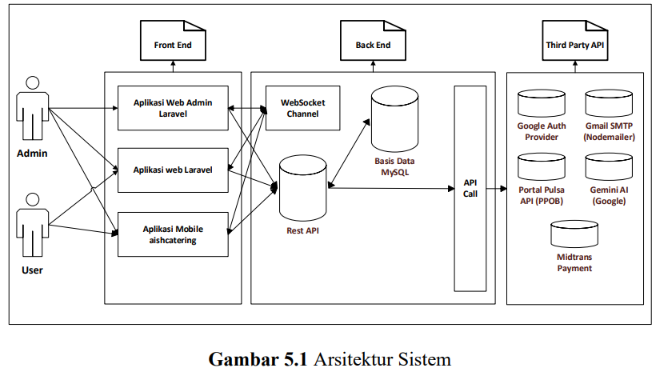

# BAB 5
## ANALISIS DAN DESAIN SISTEM

### 5.1 Perancangan dan Pengembangan
Tahap perancangan dan pengembangan bertujuan menerjemahkan kebutuhan sistem WebGIS berbasis *Progressive Web App* pada Kebun Raya Sambas menjadi rancangan teknis yang siap diimplementasikan sebagai aplikasi web. Pendekatan yang digunakan mencakup arsitektur web berbasis Laravel 12, pengelolaan basis data menggunakan PostgreSQL, serta integrasi layanan eksternal seperti Google OAuth untuk autentikasi dan Gmail SMTP untuk notifikasi sistem.

Penjabaran tahapan tersebut dilakukan secara terstruktur dengan mengawali pembahasan pada pendefinisian kebutuhan (*requirement*) sebagai spesifikasi dasar sistem. Langkah berikutnya adalah memaparkan arsitektur aplikasi secara menyeluruh. Rancangan logika dan perilaku sistem divisualisasikan melalui beberapa diagram UML (*Unified Modeling Language*) yang meliputi *use case diagram*, *activity diagram*, *class diagram*, dan *sequence diagram*. Pemodelan struktur penyimpanan data dibahas pada bagian akhir dengan memetakan relasi tabel menggunakan *Entity Relationship Diagram* (ERD).

#### 5.1.1 Requirement
##### 5.1.1.1 Kebutuhan Sistem
Kebutuhan sistem merupakan proses untuk merumuskan poin-poin kebutuhan yang diperlukan pada pengembangan sistem WebGIS berbasis *Progressive Web App* pada Kebun Raya Sambas. Langkah ini penting dilakukan agar solusi yang dibangun dapat menjawab permasalahan yang telah diidentifikasi pada bagian analisis. Kebutuhan sistem ini dibagi berdasarkan peran hak akses (*role*) yang terdaftar di dalam sistem, yaitu kebutuhan dari sisi Pengguna Umum (Pengunjung), Peneliti, dan Administrator sebagai pengelola tertinggi. Berikut adalah rincian kebutuhan sistem berdasarkan hasil penelitian pada Kebun Raya Sambas:

a. Kebutuhan Sistem dari Sisi Pengguna Umum (Pengunjung):
* **a)** Menampilkan halaman beranda yang memuat informasi ringkas profil Kebun Raya Sambas, katalog flora terbaru, dan peta sebaran flora.
* **b)** Menampilkan halaman profil Kebun Raya Sambas yang memuat sejarah singkat, visi, misi, dan struktur organisasi.
* **c)** Menampilkan daftar katalog koleksi tanaman (flora) secara terstruktur berdasarkan kategori.
* **d)** Melakukan pencarian cepat koleksi flora berdasarkan kata kunci nama lokal, nama ilmiah, genus, famili, atau deskripsi.
* **e)** Menampilkan detail informasi botani tanaman, meliputi nama ilmiah, nama lokal, klasifikasi taksonomi, foto spesimen, deskripsi tanaman, serta titik koordinat lokasinya.
* **f)** Menampilkan peta geografis interaktif berbasis Leaflet yang memuat koordinat lokasi tanaman, batas area koleksi, fasilitas umum, kantor pengelola, dan pos keamanan.
* **g)** Menyediakan fitur registrasi akun baru dan login menggunakan email dan password secara aman.
* **h)** Menyediakan opsi login cepat yang terintegrasi dengan akun Google (Google OAuth).
* **i)** Menyediakan alur verifikasi email otomatis untuk memastikan validitas akun pengguna.
* **j)** Menyediakan dasbor pengguna untuk memantau riwayat pendaftaran kunjungan.
* **k)** Melakukan pendaftaran kunjungan umum secara online dengan mengisi data rombongan (nama, kontak, instansi, tanggal kunjungan, keperluan, dan daftar anggota rombongan).
* **l)** Melakukan perubahan atau pembatalan data pendaftaran kunjungan selama statusnya masih berstatus pending.
* **m)** Menampilkan halaman profil akun untuk memperbarui data diri dan mengubah kata sandi secara mandiri.
* **n)** Menyediakan kemampuan instalasi aplikasi secara langsung ke layar utama perangkat (*Add to Home Screen*) tanpa melalui toko aplikasi resmi.
* **o)** Menyediakan akses luring (*offline access*) menggunakan penyimpanan cache lokal untuk melihat halaman profil dan katalog flora yang pernah dimuat sebelumnya.

b. Kebutuhan Sistem dari Sisi Peneliti:
* **a)** Melakukan verifikasi peran pengguna sebagai peneliti ketika hendak melakukan pengajuan izin penelitian.
* **b)** Melakukan pendaftaran permohonan izin penelitian secara online dengan mengisi formulir riset (nama peneliti, kontak, institusi, program studi, jenjang akademik, judul penelitian, bidang penelitian, tanggal mulai, tanggal selesai, dan tujuan penelitian).
* **c)** Menyediakan fitur unggah dokumen administrasi pendukung, yaitu Curriculum Vitae (CV) dan Surat Izin Penelitian dalam format PDF/gambar.
* **d)** Mengirimkan email notifikasi konfirmasi secara otomatis ke email admin setelah permohonan riset diajukan.
* **e)** Menyediakan halaman dasbor peneliti untuk memantau status persetujuan penelitian (*pending*, *disetujui*, *ditolak*) secara real-time.
* **f)** Melakukan perubahan atau pembatalan permohonan penelitian jika status pendaftaran belum diverifikasi oleh admin.

c. Kebutuhan Sistem dari Sisi Administrator:
* **a)** Menampilkan halaman dasbor utama yang memuat ringkasan statistik operasional, seperti total pengguna, total koleksi flora, total penanda peta, total pengunjung disetujui, dan total peneliti terdaftar.
* **b)** Mengelola data master pengguna (CRUD Users), termasuk menambahkan akun staf baru, mengubah data akun, menghapus akun, serta mengatur peran (*role*) admin atau user.
* **c)** Mengelola data master kategori tanaman (CRUD Categories) untuk klasifikasi kelompok flora.
* **d)** Mengelola katalog koleksi flora (CRUD Koleksi) secara dinamis, meliputi nama, genus, spesies, famili, deskripsi, kelompok kategori, lokasi koordinat, serta unggahan foto tanaman.
* **e)** Melakukan optimasi gambar secara otomatis dengan mengonversi berkas foto koleksi tanaman ke format AVIF guna menghemat ruang penyimpanan server.
* **f)** Mengelola data koordinat spasial peta (CRUD Maps/Markers), baik berupa penanda titik (*Point*), garis (*Polyline*), maupun area (*Polygon*) berbasis GeoJSON.
* **g)** Mengatur klasifikasi visualisasi penanda peta (Area Koleksi, Fasilitas Umum, Kantor Pengelola, Pos Keamanan) lengkap dengan ikon, warna penanda, dan foto lokasi.
* **h)** Mengelola status pendaftaran kunjungan umum dengan memverifikasi data rombongan dan mengubah status pendaftaran (*pending*, *disetujui*, *ditolak*).
* **i)** Mengelola status permohonan penelitian dengan memeriksa dokumen yang diunggah dan mengubah status pendaftaran.
* **j)** Mengakses fitur pencarian cepat, pengurutan (*sorting*), serta penyaringan (*filtering*) pada data pengguna, koleksi flora, peta, dan pendaftaran kunjungan.
* **k)** Melakukan ekspor data rekapitulasi pendaftaran pengunjung umum dan peneliti yang telah disetujui ke format cetak atau dokumen unduhan (CSV/Excel).
* **l)** Mengelola profil pribadi admin dan mengubah kata sandi secara berkala demi keamanan sistem.

##### 5.1.1.2 Kebutuhan Pengguna
Kebutuhan pengguna diidentifikasi untuk memahami interaksi dan ekspektasi fungsional dari setiap aktor yang terlibat langsung dengan sistem WebGIS. Pengelompokan pengguna dilakukan berdasarkan hak akses dan tanggung jawab operasional di dalam sistem. Hasil identifikasi ini menjadi landasan utama dalam menyusun tata letak antarmuka (*user interface*) dan alur kerja aplikasi agar dapat digunakan secara efektif. Berikut adalah kebutuhan pengguna berdasarkan peran masing-masing:

a. Kebutuhan Pengguna dari Sisi Pengunjung:
* **a)** Pengunjung dapat melihat profil lengkap, sejarah, visi, dan misi Kebun Raya Sambas secara online.
* **b)** Pengunjung dapat mencari dan menjelajahi informasi katalog koleksi tanaman secara terstruktur dan responsif.
* **c)** Pengunjung dapat melihat sebaran flora dan fasilitas pendukung melalui peta interaktif berbasis Leaflet.
* **d)** Pengunjung dapat mendaftarkan akun baru dan masuk ke sistem menggunakan email atau Google OAuth.
* **e)** Pengunjung dapat melakukan pendaftaran rencana kunjungan umum untuk rombongan secara online.
* **f)** Pengunjung dapat memantau status persetujuan kunjungan rombongan melalui halaman dasbor.
* **g)** Pengunjung dapat melakukan pembaruan data atau membatalkan kunjungan sebelum disetujui oleh admin.
* **h)** Pengunjung dapat memperbarui data profil akun pribadi dan mengganti kata sandi secara mandiri.
* **i)** Pengunjung dapat menginstal aplikasi WebGIS langsung ke layar utama perangkat mobile atau desktop mereka.
* **j)** Pengunjung dapat mengakses sebagian informasi katalog tanaman secara offline ketika perangkat kehilangan koneksi internet.

b. Kebutuhan Pengguna dari Sisi Peneliti:
* **a)** Peneliti dapat mengajukan izin penelitian di area Kebun Raya Sambas secara online melalui sistem.
* **b)** Peneliti dapat menginputkan detail agenda riset seperti judul, bidang studi, institusi, dan jangka waktu penelitian.
* **c)** Peneliti dapat mengunggah berkas syarat pendaftaran (Curriculum Vitae dan Surat Izin Penelitian) ke server.
* **d)** Peneliti dapat memantau status verifikasi izin penelitian melalui halaman dasbor.
* **e)** Peneliti dapat mengedit atau membatalkan permohonan penelitian sebelum diverifikasi oleh admin.

c. Kebutuhan Pengguna dari Sisi Administrator:
* **a)** Admin dapat memantau statistik operasional dan grafik ringkasan data sistem melalui dasbor utama.
* **b)** Admin dapat mengelola akun pengguna, staf, serta menetapkan hak akses pengguna secara penuh.
* **c)** Admin dapat mengelola data kategori dan katalog flora spesimen Kebun Raya Sambas secara dinamis.
* **d)** Admin dapat menambahkan koordinat geografis titik (*Point*), garis (*Polyline*), atau area poligon (*Polygon*) pada peta Leaflet.
* **e)** Admin dapat menyetujui atau menolak pendaftaran kunjungan dari pengunjung umum maupun peneliti.
* **f)** Admin dapat mengunduh rekap laporan data pendaftaran kunjungan dan penelitian yang telah disetujui.
* **g)** Admin dapat memperbarui informasi profil admin pribadi dan mengubah kata sandi secara berkala.

##### 5.1.1.3 Kebutuhan Perangkat Lunak
Pengembangan sistem WebGIS ini memerlukan beberapa perangkat lunak pendukung untuk memastikan proses implementasi berjalan dengan baik. Pilihan teknologi yang digunakan disesuaikan dengan kebutuhan performa, keandalan, dan kemudahan dalam integrasi spasial serta kemampuan PWA. Berikut adalah daftar perangkat lunak yang digunakan dalam pengembangan sistem:
* **a)** Visual Studio Code versi terbaru digunakan sebagai *code editor* utama untuk menuliskan seluruh kode program PHP, JavaScript, dan HTML.
* **b)** Node.js versi 18.x digunakan sebagai runtime environment untuk menjalankan dependensi frontend dan *asset compilation tools*.
* **c)** Laravel Framework versi 12 digunakan sebagai framework utama berbasis PHP untuk mengatur routing, middleware, database ORM, dan logika bisnis sistem.
* **d)** Vite versi terbaru digunakan sebagai build tool frontend untuk mengompilasi aset-aset JavaScript dan CSS agar proses rendering antarmuka berjalan optimal.
* **e)** Tailwind CSS versi 4 digunakan sebagai framework CSS utama untuk merancang antarmuka pengguna yang responsif, modern, dan konsisten.
* **f)** Alpine.js digunakan sebagai library JavaScript ringan untuk menambahkan fungsionalitas interaktif pada sisi klien tanpa membebani browser.
* **g)** Leaflet.js versi terbaru digunakan sebagai library JavaScript untuk memvisualisasikan peta geografis interaktif Kebun Raya Sambas, memuat ubin peta, dan merender marker spasial.
* **h)** PostgreSQL versi 15 atau lebih baru digunakan sebagai sistem manajemen basis data relasional (*RDBMS*) untuk menyimpan data pengguna, katalog tanaman, koordinat peta, dan pendaftaran kunjungan.
* **i)** Laravel Socialite digunakan sebagai library pendukung untuk mengintegrasikan sistem autentikasi cepat menggunakan akun Google (OAuth 2.0).
* **j)** Intervention Image Helper digunakan sebagai library PHP untuk memproses kompresi gambar dan konversi format file foto koleksi tanaman secara otomatis ke format AVIF.
* **k)** Git dan GitHub digunakan sebagai sistem kontrol versi (*version control system*) untuk mengelola repositori kode program.
* **l)** VPS Hosting (Virtual Private Server) berbasis Linux Ubuntu Server digunakan sebagai server produksi untuk menyebarkan aplikasi ke internet.
* **m)** NPM (Node Package Manager) digunakan untuk mengelola dependensi modul frontend JavaScript.
* **n)** *Web App Manifest* (`manifest.json`) digunakan untuk mendefinisikan metadata aplikasi (ikon, nama, warna tema, dan tipe tampilan) agar aplikasi dapat diinstal di perangkat pengguna.
* **o)** *Service Worker* berbasis JavaScript digunakan untuk memproses intersepsi request jaringan, pengelolaan cache lokal, dan pengaktifan mode luring (*offline mode*).
* **p)** *Cache API* digunakan sebagai media penyimpanan lokal untuk menyimpan aset-aset statis seperti dokumen HTML, stylesheet CSS, berkas gambar, dan library JavaScript langsung di browser pengguna.

##### 5.1.1.4 Kebutuhan Perangkat Keras
Perangkat keras yang digunakan dalam pengembangan dan operasional aplikasi harus memenuhi spesifikasi minimal agar sistem dapat berjalan dengan stabil dan lancar. Spesifikasi tersebut dibagi ke dalam beberapa kategori berdasarkan lingkungan penggunaannya:

1. Perangkat Server / Hosting:
* **a)** Prosesor: Minimal 2 Core CPU (disarankan 4 Core) untuk menangani request asinkron dan proses optimasi gambar.
* **b)** RAM: Minimal 2 GB (disarankan 4 GB) untuk kelancaran jalannya aplikasi Laravel, database PostgreSQL, dan mailer server.
* **c)** Penyimpanan: Minimal 20 GB SSD untuk menyimpan file sistem, database, dan media foto flora format AVIF.
* **d)** Peran: Berfungsi untuk menjalankan aplikasi web, menyimpan basis data relasional, merender peta spasial, dan menyimpan repositori gambar secara terpusat.

2. Perangkat Administrator:
* **a)** Komputer / Laptop dengan spesifikasi minimal:
  - Prosesor: Intel Core i3 atau AMD Ryzen 3 (setara atau lebih tinggi).
  - RAM: Minimal 4 GB (disarankan 8 GB) untuk menunjang aktivitas pengelolaan data.
  - Browser: Google Chrome, Mozilla Firefox, Microsoft Edge versi terbaru.
* **b)** Peran: Digunakan oleh pengelola untuk memverifikasi pendaftaran pengunjung, memperbarui peta Leaflet, dan mengelola katalog koleksi flora.

3. Perangkat Pengguna (Pengunjung dan Peneliti):
* **a)** Komputer, Laptop, atau Smartphone berbasis Android / iOS.
* **b)** Sistem Operasi: Windows, macOS, Linux, Android (minimal versi 8.0), atau iOS (minimal versi 12).
* **c)** RAM: Minimal 3 GB agar proses rendering peta Leaflet berbasis ubin geografis (*map tiles*) dapat berjalan dengan lancar tanpa kendala lag.
* **d)** Browser: Safari, Google Chrome, Firefox, Samsung Internet.
* **e)** Peran: Digunakan untuk menjelajahi katalog tanaman, melihat visualisasi peta geografis, mendaftar akun, dan melakukan pendaftaran kunjungan atau penelitian.

4. Jaringan Internet:
* **a)** Koneksi internet stabil dengan kecepatan minimal 10 Mbps (diperlukan untuk sinkronisasi awal dan pemuatan ubin peta, sedangkan akses dasar katalog flora dapat dilayani secara luring melalui cache *Service Worker*).
* **b)** Peran: Diperlukan untuk memuat ubin peta dasar OpenStreetMap secara online, melakukan pengiriman formulir pendaftaran, memproses login Google OAuth, dan mengirim notifikasi email SMTP.

---

#### 5.1.2 Arsitektur Sistem
Arsitektur sistem WebGIS dirancang menggunakan pola arsitektur monolitik terintegrasi (*integrated monolithic architecture*). Pola ini menggabungkan seluruh komponen antarmuka pengguna (*frontend*) dan logika bisnis (*backend*) ke dalam satu kesatuan kode aplikasi berbasis Laravel 12. Pengguna mengakses sistem melalui browser pada berbagai perangkat, yang kemudian dilayani oleh server Laravel yang terhubung langsung dengan database PostgreSQL dan layanan eksternal. Struktur pembagian tanggung jawab sistem dibagi menjadi lima lapisan utama sebagai berikut:

a) Lapisan Presentasi (*Presentation Layer*): Lapisan ini mengelola bagian antarmuka pengguna yang dirender di peramban web (*browser*). Komponen yang digunakan meliputi template engine Laravel Blade untuk modularitas HTML, framework Tailwind CSS v4 untuk styling, Alpine.js untuk penanganan interaksi klien yang dinamis, Axios untuk pengiriman request AJAX asinkron, serta library Leaflet.js untuk visualisasi peta geografis secara dinamis. *Web App Manifest* dan *Service Worker* juga ditempatkan pada lapisan ini untuk menangani *caching* aset statis dan kemampuan instalasi mandiri aplikasi (*Add to Home Screen*).

b) Lapisan Aplikasi (*Application Layer*): Lapisan ini bertugas menjalankan logika bisnis dan pemrosesan data di sisi server. Komponen utamanya dikembangkan menggunakan framework Laravel 12 berbasis PHP 8.2+. Lapisan ini mencakup Web Router untuk menangani rute URL, Controller untuk memproses request dan merumuskan response, Middleware untuk pembatasan akses berdasarkan status login dan verifikasi email, Eloquent ORM untuk pemrosesan query database, serta Mailer Service untuk pengiriman email SMTP.

c) Lapisan Data (*Data Layer*): Lapisan ini berfungsi sebagai tempat penyimpanan data relasional terstruktur pada sistem. Aplikasi menggunakan database PostgreSQL dengan nama `db_webgis`. Basis data ini menyimpan tabel pengguna (`users`), katalog flora (`koleksis`), kategori (`categories`), data koordinat spasial (`map_markers`), tabel relasi (`koleksi_map_marker`), pendaftaran pengunjung (`pendaftaran_pengunjungs`), dan pendaftaran peneliti (`pendaftaran_penelitis`).

d) Lapisan Layanan Eksternal (*External Service Layer*): Lapisan ini digunakan untuk mengintegrasikan sistem dengan layanan pihak ketiga guna melengkapi fitur aplikasi. Integrasi tersebut meliputi Google OAuth Client API untuk masuk cepat pengguna, OpenStreetMap Tiles API untuk memuat ubin peta bumi dasar, serta Gmail SMTP Server untuk mengirimkan surat elektronik konfirmasi pendaftaran.

e) Lapisan Keamanan (*Security Layer*): Lapisan ini berfungsi untuk mengamankan data dan akses pada aplikasi. Sandi pengguna disimpan di dalam database dengan enkripsi satu arah berbasis *bcrypt*. Sesi pengguna dikelola menggunakan session berbasis cookie HTTP-only yang terlindungi dari serangan cross-site scripting (XSS). Akses ke halaman administratif admin dilindungi secara ketat menggunakan middleware khusus role admin, serta pengiriman formulir dilengkapi dengan token CSRF (Cross-Site Request Forgery) protection.

Visualisasi arsitektur sistem WebGIS ini dapat digambarkan pada Gambar 5.1 berikut.

---

#### 5.1.3 Unified Modelling Language (UML)
Pemodelan UML digunakan untuk memvisualisasikan rancangan logika, struktur kelas, dan perilaku sistem WebGIS secara komprehensif. Diagram yang digunakan dalam penelitian ini meliputi *use case diagram*, *activity diagram*, *class diagram*, dan *sequence diagram*. Hasil pemodelan ini membantu memperjelas batasan fungsionalitas sistem, alur kerja proses bisnis, serta struktur hubungan antar objek yang akan diimplementasikan pada kode program Laravel.

##### 5.1.3.1 Use Case Diagram
Use Case Diagram dirancang untuk memetakan hubungan antara aktor yang terlibat dengan berbagai fungsionalitas utama yang disediakan oleh sistem. Sistem WebGIS memiliki tiga aktor utama dengan hak akses dan peran operasional yang terpisah:
1. **Pengunjung (Visitor)**: Aktor umum yang dapat mengakses informasi publik seperti profil, katalog flora, peta interaktif, melakukan registrasi akun, masuk dengan akun Google, serta mengajukan pendaftaran kunjungan rombongan dan memantau statusnya.
2. **Peneliti (Researcher)**: Aktor tersertifikasi (user terautentikasi dan terverifikasi) yang memiliki hak khusus untuk mengajukan permohonan izin penelitian dengan mengunggah CV dan Surat Izin Penelitian, serta memantau status pengajuannya.
3. **Administrator (Admin)**: Aktor pengelola sistem yang memiliki otoritas penuh untuk mengelola pengguna, mengedit data master kategori dan spesimen flora, memetakan koordinat peta Leaflet, serta memverifikasi dan menyetujui/menolak pendaftaran kunjungan maupun permohonan penelitian.

Visualisasi interaksi ketiga aktor ini dalam sistem WebGIS dapat digambarkan pada Gambar 5.2 berikut.

Penjelasan mengenai alur use case tersebut menunjukkan bahwa setiap aktor harus melalui proses autentikasi (login) untuk dapat mengakses modul transaksi seperti pendaftaran kunjungan, pengajuan penelitian, dan dasbor pemantauan status. Admin memegang kendali tertinggi dalam memvalidasi data pengajuan kunjungan dari pengunjung dan peneliti, serta mengelola basis data flora dan koordinat spasial peta secara dinamis.

##### 5.1.3.2 Activity Diagram
Activity Diagram digunakan untuk menggambarkan alur aktivitas proses bisnis yang terjadi di dalam sistem WebGIS secara visual, mulai dari aksi awal pengguna hingga respon balik dari sistem. Berikut adalah rincian aktivitas pada proses-proses utama aplikasi:

1. **Activity Diagram Login & OAuth (Gambar 5.3)**: Mengilustrasikan alur ketika pengguna masuk ke dalam sistem. Alur dimulai saat pengguna membuka halaman login. Sistem menampilkan form login manual dan tombol login Google. Jika memilih manual, pengguna menginput email dan password, lalu sistem memvalidasi data ke database. Jika memilih Google login, sistem mengarahkan ke halaman autentikasi Google, menerima callback data user, dan memverifikasi akun. Apabila data valid, sistem membuat sesi login, melakukan pengecekan peran (role), dan mengarahkan admin ke Halaman Admin atau pengunjung ke Halaman Dashboard. Jika gagal, sistem menampilkan pesan error dan mengembalikan ke form login.

2. **Activity Diagram Pencarian Katalog Flora (Gambar 5.4)**: Menggambarkan alur saat pengunjung mencari koleksi tanaman. Pengunjung membuka halaman katalog. Sistem memuat seluruh data spesimen flora dari database secara default. Pengunjung dapat memasukkan kata kunci pencarian pada kolom input atau memilih filter kategori kelompok tanaman. Sistem memproses query pencarian secara dinamis. Apabila data ditemukan, sistem merender grid daftar spesimen yang cocok di layar browser. Jika tidak cocok, sistem menampilkan pesan 'Flora Tidak Ditemukan' dan bersiap menerima input pencarian baru.

3. **Activity Diagram Pendaftaran Pengunjung (Gambar 5.5)**: Menjelaskan alur pendaftaran kunjungan umum rombongan. Pengunjung yang telah login dan terverifikasi emailnya membuka form pendaftaran pengunjung. Pengunjung mengisi data rombongan seperti nama perwakilan, kontak, instansi, tanggal kunjungan, keperluan, dan anggota rombongan tambahan. Pengunjung menekan tombol kirim data. Sistem melakukan validasi form. Jika data valid, sistem menyimpan data ke tabel `pendaftaran_pengunjungs` dengan status default 'pending', lalu mengalihkan ke dashboard dengan menampilkan pesan sukses. Jika tidak valid, sistem menampilkan error isian form.

4. **Activity Diagram Pendaftaran Peneliti (Gambar 5.6)**: Menggambarkan alur pengajuan permohonan izin penelitian. Peneliti mengakses form pendaftaran peneliti. Peneliti menginputkan detail rencana riset dan mengunggah berkas CV serta Surat Izin Penelitian. Peneliti mengirimkan data. Sistem memvalidasi input dan berkas lampiran. Jika valid, sistem menyimpan file dokumen ke media storage, menyimpan data pendaftaran ke tabel `pendaftaran_penelitis` dengan status 'pending', memicu pengiriman email notifikasi otomatis via SMTP Gmail ke email admin, dan mengalihkan peneliti ke dasbor. Jika tidak valid, sistem mengembalikan form dengan pesan error.

5. **Activity Diagram Pemantauan & Batal Pendaftaran (Gambar 5.7)**: Menjelaskan alur saat user memantau atau membatalkan booking di dasbor. User mengakses halaman dasbor. Sistem memuat daftar riwayat pendaftaran pengunjung dan peneliti milik user tersebut. User dapat melihat status pendaftaran (pending, disetujui, ditolak). Jika status masih pending, sistem menampilkan tombol ubah dan batal. Apabila user mengklik tombol batal dan mengonfirmasi pembatalan, sistem mengirimkan request DELETE ke server, menghapus data dari database, dan memuat ulang tampilan dasbor dengan notifikasi pembatalan sukses.

6. **Activity Diagram Verifikasi Pendaftaran Admin (Gambar 5.8)**: Menggambarkan alur kerja admin dalam memverifikasi data kunjungan. Admin masuk ke menu kelola pendaftaran pengunjung atau peneliti. Sistem menampilkan daftar data pendaftaran masuk. Admin memeriksa berkas (untuk peneliti) dan rincian rombongan. Admin memilih tindakan setujui atau tolak. Jika disetujui, sistem memperbarui kolom status menjadi 'disetujui' dan memperbarui agregasi total statistik kunjungan. Jika ditolak, sistem memperbarui status menjadi 'ditolak' dan menyimpan catatan admin terkait alasan penolakan.

7. **Activity Diagram Kelola Koleksi Flora (Gambar 5.9)**: Menjelaskan alur penambahan katalog flora oleh admin. Admin membuka form tambah koleksi. Admin menginput nama, genus, spesies, famili, deskripsi, kelompok kategori, lokasi koordinat, dan mengunggah foto tanaman. Admin mengirimkan data. Sistem memvalidasi input. Jika valid, sistem menjalankan helper optimasi gambar dengan mengompresi dan mengonversi format gambar ke AVIF, menyimpan file foto AVIF ke storage, menyimpan baris data ke tabel `koleksis`, dan menampilkan pesan sukses di panel admin.

8. **Activity Diagram Kelola Titik Peta (Gambar 5.10)**: Menggambarkan alur manajemen spasial peta oleh admin. Admin membuka menu kelola peta. Sistem merender peta dasar Kebun Raya Sambas menggunakan Leaflet.js. Admin dapat menggambar penanda baru (menentukan titik marker, menarik garis polyline, atau menggambar poligon area) langsung pada peta interaktif, serta mengisi nama lokasi, warna, tipe, dan mengunggah foto. Admin menyimpan data. Sistem menangkap koordinat geografis (latitude/longitude atau GeoJSON) dan menyimpannya ke tabel `map_markers`.

9. **Activity Diagram Kelola User (Gambar 5.11)**: Menjelaskan alur manajemen pengguna oleh admin. Admin mengakses halaman manajemen user. Sistem menampilkan daftar user terdaftar. Admin dapat menambah akun staf baru dengan mengisi nama, email, password, dan memilih hak akses (admin/user). Admin juga dapat menghapus user biasa atau mengubah informasi akun. Sistem memperbarui database tabel `users` dan menampilkan data terbaru di antarmuka admin.

##### 5.1.3.3 Class Diagram
Class Diagram memodelkan struktur kelas, atribut, metode, serta hubungan asosiasi antar entitas data yang digunakan di dalam sistem WebGIS. Diagram ini disusun berdasarkan skema database relasional PostgreSQL yang diimplementasikan pada model-model framework Laravel. Struktur ini memastikan integritas data spasial dan relasional dapat terhubung secara konsisten.

Visualisasi hubungan antar kelas data ini dapat dilihat pada Gambar 5.12 berikut.

Penjelasan hubungan asosiasi antar kelas pada Gambar 5.12 adalah sebagai berikut:
1. Kelas `User` memiliki hubungan satu-ke-banyak (*one-to-many*) dengan `PendaftaranPengunjung` dan `PendaftaranPeneliti`. Hal ini menunjukkan bahwa satu akun pengguna dapat mengajukan banyak permohonan kunjungan maupun penelitian, sedangkan setiap pendaftaran hanya terikat pada satu akun pengguna pengaju.
2. Kelas `Category` memiliki hubungan satu-ke-banyak (*one-to-many*) dengan `Koleksi`. Satu kategori kelompok tanaman dapat mengelompokkan banyak data tanaman koleksi, namun setiap spesimen flora hanya memiliki satu kategori utama.
3. Kelas `Koleksi` terhubung dengan kelas `MapMarker` melalui tabel pivot `KoleksiMapMarker` dengan relasi banyak-ke-banyak (*many-to-many*). Satu spesimen tanaman koleksi dapat dikaitkan dengan satu atau lebih marker titik lokasi di peta, dan sebaliknya satu marker lokasi dapat menandai lokasi sebaran beberapa spesimen tanaman.
4. Kelas `Koleksi` memiliki hubungan satu-ke-satu (*one-to-one*) dengan `KoleksiLocation` yang menyimpan rincian deskripsi area spesifik atau tata letak fisik penempatan tanaman di area kebun raya.
5. Tabel penunjang sistem seperti `Session`, `Cache`, `Job`, dan `PasswordResetToken` berdiri sendiri untuk mendukung fungsionalitas framework Laravel dalam mengelola antrean pengiriman email, caching data peta, dan pengelolaan sesi autentikasi.

##### 5.1.3.4 Sequence Diagram
Sequence Diagram memvisualisasikan interaksi dinamis antar objek di dalam sistem WebGIS secara berurutan (*sequential*) berdasarkan urutan waktu kejadian. Berikut adalah penjelasan alur sekuensial untuk modul-modul utama sistem:

1. **Sequence Diagram Login & OAuth (Gambar 5.13)**: Menunjukkan interaksi saat user melakukan login. User mengirimkan kredensial email & password ke Web Router, yang diteruskan ke AuthController. Controller melakukan kueri ke User Model untuk mengambil data user. Jika menggunakan Google OAuth, SocialiteController mengalihkan request ke Google Identity Provider, menerima callback profile data, lalu mencocokkan Google ID ke database. Jika valid, AuthController membuat session baru dan mengembalikan respon redirect halaman dasbor ke browser user. Jika gagal, controller mengembalikan pesan error.

2. **Sequence Diagram Pencarian Koleksi Flora (Gambar 5.14)**: Menggambarkan proses pencarian tanaman. Pengunjung mengirimkan request pencarian dengan parameter kata kunci/kategori melalui peramban. Request diterima oleh KoleksiController. Controller memproses parameter pencarian dan melakukan query ke database menggunakan Eloquent ORM pada Koleksi Model. Database mengembalikan data koleksi tanaman yang cocok. KoleksiController merender data ke dalam template Blade, lalu mengembalikan dokumen HTML yang berisi susunan grid spesimen tanaman untuk ditampilkan di layar pengunjung.

3. **Sequence Diagram Pendaftaran Kunjungan (Gambar 5.15)**: Menunjukkan alur pengiriman formulir booking oleh pengunjung atau peneliti. User mengisi formulir dan menekan tombol kirim. Request dikirim ke PendaftaranController. Controller memverifikasi status verifikasi email user melalui Auth Middleware. Jika email verified, controller memvalidasi input. Untuk pengunjung, data disimpan ke PendaftaranPengunjung Model. Untuk peneliti, berkas CV dan Surat Izin diunggah ke Storage, data disimpan ke PendaftaranPeneliti Model, dan controller memicu PendaftaranPenelitiMail untuk mengirim email notifikasi ke admin melalui SMTP Mailer. Setelah sukses, controller mengembalikan status sukses ke dasbor user.

4. **Sequence Diagram Pemantauan & Batal Kunjungan (Gambar 5.16)**: Mengilustrasikan alur saat user membatalkan pendaftaran. User mengklik tombol batal kunjungan di halaman dasbor. Browser mengirimkan request DELETE ke PendaftaranController. Controller memeriksa apakah status pendaftaran masih pending. Jika benar, controller memanggil method delete() pada model PendaftaranPengunjung/PendaftaranPeneliti. Model menghapus baris data di database PostgreSQL. Server mengirimkan status konfirmasi pembatalan berhasil, lalu browser memuat ulang antarmuka dasbor.

5. **Sequence Diagram Verifikasi Status Kunjungan (Gambar 5.17)**: Menggambarkan proses verifikasi oleh admin. Admin membuka panel manajemen pendaftaran. Browser mengirim request ke PendaftaranManageController. Controller menarik data pendaftaran dari database dan menampilkannya di halaman admin. Admin mengklik opsi setujui atau tolak. Browser mengirim request PATCH berisi parameter status baru ke controller. Controller memperbarui kolom status pada model pendaftaran, menyimpan perubahan ke database, dan mengembalikan respon pembaruan sukses ke browser admin.

6. **Sequence Diagram Pengelolaan Koleksi & Optimasi Gambar (Gambar 5.18)**: Menunjukkan proses admin menambah spesimen flora. Admin menginput form data flora dan mengunggah foto, lalu mengirim request ke KoleksiController. Controller memvalidasi input data botani dan berkas gambar. Jika valid, controller memanggil helper Image Optimization. Helper mengompresi dan mengonversi format gambar menjadi berkas AVIF, menyimpannya ke storage, dan menginstruksikan Koleksi Model untuk menyimpan nama berkas beserta data flora ke database. Database mengonfirmasi penyimpanan sukses, dan controller mengirim respon sukses ke admin.

7. **Sequence Diagram Pengelolaan Titik Peta (Gambar 5.19)**: Menggambarkan pemetaan titik koordinat. Admin menggambar penanda lokasi pada peta dasar Leaflet di browser. Admin mengisi data detail penanda dan menekan simpan. Request koordinat GeoJSON dikirim ke MapController. Controller memproses koordinat dan menyimpannya menggunakan MapMarker Model ke database PostgreSQL. Database mengembalikan konfirmasi sukses. MapController merender data penanda baru tersebut untuk dimuat kembali oleh Leaflet.js di sisi frontend.

8. **Sequence Diagram Kelola User (Gambar 5.20)**: Menunjukkan manajemen akun oleh admin. Admin mengirim request tambah/hapus user ke UserController. Controller memproses data, melakukan enkripsi password dengan bcrypt (jika user baru), dan menginstruksikan User Model untuk menyimpan atau menghapus data di database. Database memperbarui tabel user, lalu controller mengirimkan data daftar user terbaru kembali ke browser admin.

---

#### 5.1.4 Perancangan Basis Data
Perancangan basis data bertujuan untuk merancang struktur penyimpanan data aplikasi sistem WebGIS agar terorganisasi dengan baik, memiliki performa query yang cepat, serta terhindar dari duplikasi data yang tidak perlu. Pemodelan basis data ini menggunakan PostgreSQL sebagai sistem manajemen database relasional dengan menerapkan tahapan normalisasi, pembuatan kamus data spesifikasi tabel, serta penggambaran hubungan antar-entitas (ERD).

##### 5.1.4.1 Normalisasi
Proses normalisasi dilakukan secara bertahap mulai dari bentuk tidak normal (*Unnormalized Form*) hingga mencapai bentuk normal ketiga (*Third Normal Form* / 3NF) untuk menghilangkan redundansi data dan mencegah terjadinya anomali data saat proses manipulasi data (*insert*, *update*, *delete*) berlangsung.

a. Bentuk Tidak Normal (UNF):
Bentuk ini menampung seluruh atribut data yang diidentifikasi dari berbagai kebutuhan sistem ke dalam satu kesatuan data tanpa adanya pengelompokan entitas.
{ id_user + name + email + role + password + email_verified_at + google_id + remember_token + user_created_at + user_updated_at + id_category + category_name + category_created_at + category_updated_at + id_koleksi + category_id + nama_koleksi + genus + spesies + famili + deskripsi_flora + foto_flora + coordinates_koleksi + koleksi_created_at + koleksi_updated_at + id_map_marker + marker_name + type_marker + color_marker + photo_marker + geom_marker + marker_created_at + marker_updated_at + id_pendaftaran_pengunjung + pengunjung_nama_lengkap + pengunjung_no_identitas + pengunjung_nomor_hp + pengunjung_tanggal_kunjungan + pengunjung_jumlah_rombongan + pengunjung_keperluan + pengunjung_instansi + pengunjung_rombongan_details + pengunjung_status + pengunjung_created_at + pengunjung_updated_at + id_pendaftaran_peneliti + peneliti_nama_lengkap + peneliti_no_identitas + peneliti_nomor_hp + peneliti_institusi + peneliti_program_studi + peneliti_jenjang + peneliti_judul_penelitian + peneliti_bidang_penelitian + peneliti_tanggal_mulai + peneliti_tanggal_selesai + peneliti_jumlah_anggota + peneliti_tujuan_penelitian + peneliti_surat_pengantar + peneliti_status + peneliti_created_at + peneliti_updated_at + id_koleksi_location + location_description }

b. Normalisasi Tahap Pertama (1NF):
Tahap ini memastikan bahwa setiap kolom beratribut atomik (tidak ada grup berulang atau multi-nilai dalam satu kolom) dan menentukan primary key (@) untuk mengidentifikasi baris data secara unik.
{ @id_user + name + email + role + password + email_verified_at + google_id + remember_token + user_created_at + user_updated_at + @id_category + category_name + category_created_at + category_updated_at + @id_koleksi + category_id + nama_koleksi + genus + spesies + famili + deskripsi_flora + foto_flora + coordinates_koleksi + koleksi_created_at + koleksi_updated_at + @id_map_marker + marker_name + type_marker + color_marker + photo_marker + geom_marker + marker_created_at + marker_updated_at + @id_pendaftaran_pengunjung + pengunjung_nama_lengkap + pengunjung_no_identitas + pengunjung_nomor_hp + pengunjung_tanggal_kunjungan + pengunjung_jumlah_rombongan + pengunjung_keperluan + pengunjung_instansi + pengunjung_rombongan_details + pengunjung_status + pengunjung_created_at + pengunjung_updated_at + @id_pendaftaran_peneliti + peneliti_nama_lengkap + peneliti_no_identitas + peneliti_nomor_hp + peneliti_institusi + peneliti_program_studi + peneliti_jenjang + peneliti_judul_penelitian + peneliti_bidang_penelitian + peneliti_tanggal_mulai + peneliti_tanggal_selesai + peneliti_jumlah_anggota + peneliti_tujuan_penelitian + peneliti_surat_pengantar + peneliti_status + peneliti_created_at + peneliti_updated_at + @id_koleksi_location + location_description }

c. Normalisasi Tahap Kedua (2NF):
Tahap ini mengelompokkan data berdasarkan ketergantungan fungsional penuh terhadap primary key masing-masing entitas guna menghilangkan ketergantungan parsial.
- `users` = { @id + name + email + role + password + email_verified_at + google_id + remember_token + created_at + updated_at }
- `categories` = { @id + name + created_at + updated_at }
- `koleksis` = { @id + category_id + name + genus + species + family + description + photo + coordinates + created_at + updated_at }
- `map_markers` = { @id + name + type + color + photo + geom + created_at + updated_at }
- `pendaftaran_pengunjungs` = { @id + user_id + nama_lengkap + no_identitas + nomor_hp + tanggal_kunjungan + jumlah_rombongan + keperluan + instansi + rombongan_details + status + created_at + updated_at }
- `pendaftaran_penelitis` = { @id + user_id + nama_lengkap + no_identitas + nomor_hp + institusi + program_studi + jenjang + judul_penelitian + bidang_penelitian + tanggal_mulai + tanggal_selesai + jumlah_anggota + tujuan_penelitian + surat_pengantar + status + created_at + updated_at }
- `koleksi_locations` = { @id + koleksi_id + location_description + created_at + updated_at }
- `koleksi_map_marker` = { @koleksi_id + @map_marker_id }

d. Normalisasi Tahap Ketiga (3NF):
Tahap ini memastikan tidak ada ketergantungan transitif di dalam tabel (seluruh atribut non-key hanya bergantung penuh pada primary key, bukan pada atribut non-key lainnya). Semua tabel hasil pemisahan pada tahap 2NF telah memenuhi syarat 3NF karena tidak mengandung ketergantungan transitif. Kunci tamu (foreign key) ditandai dengan simbol (@@) untuk menghubungkan relasi antar-tabel secara konsisten:
- `users` = { @id + name + email + role + password + email_verified_at + google_id + remember_token + created_at + updated_at }
- `categories` = { @id + name + created_at + updated_at }
- `koleksis` = { @id + @@category_id + name + genus + species + family + description + photo + coordinates + created_at + updated_at }
- `map_markers` = { @id + name + type + color + photo + geom + created_at + updated_at }
- `pendaftaran_pengunjungs` = { @id + @@user_id + nama_lengkap + no_identitas + nomor_hp + tanggal_kunjungan + jumlah_rombongan + keperluan + instansi + rombongan_details + status + created_at + updated_at }
- `pendaftaran_penelitis` = { @id + @@user_id + nama_lengkap + no_identitas + nomor_hp + institusi + program_studi + jenjang + judul_penelitian + bidang_penelitian + tanggal_mulai + tanggal_selesai + jumlah_anggota + tujuan_penelitian + surat_pengantar + status + created_at + updated_at }
- `koleksi_locations` = { @id + @@koleksi_id + location_description + created_at + updated_at }
- `koleksi_map_marker` = { @@koleksi_id + @@map_marker_id }

##### 5.1.4.2 Spesifikasi Struktur Tabel Database
Spesifikasi struktur basis data menjabarkan detail tipe data, panjang kolom, serta karakteristik kunci dari setiap tabel database PostgreSQL yang digunakan pada sistem WebGIS. Tabel 5.2 berikut memuat detail kamus data spesifikasi tabel secara lengkap.

**Tabel 5.2 Spesifikasi Struktur Tabel Database WebGIS**

| No | Nama Tabel | Kolom Utama / Kolom Atribut | Tipe Data | Keterangan |
| :--- | :--- | :--- | :--- | :--- |
| 1 | `users` | `id` `name` `email` `role` `email_verified_at` `password` `google_id` `remember_token` `created_at` `updated_at` | BigInt Varchar(255) Varchar(255) Varchar(255) Timestamp Varchar(255) Varchar(255) Varchar(100) Timestamp Timestamp | PK, Auto Increment Nama akun user/admin Email unik user/admin Role ('admin' / 'user') Waktu verifikasi email Hash password bcrypt Google OAuth ID Token remember login Waktu baris dibuat Waktu baris diperbarui |
| 2 | `categories` | `id` `name` `created_at` `updated_at` | BigInt Varchar(255) Timestamp Timestamp | PK, Auto Increment Nama kategori flora Waktu baris dibuat Waktu baris diperbarui |
| 3 | `koleksis` | `id` `category_id` `name` `genus` `species` `family` `description` `photo` `coordinates` `created_at` `updated_at` | BigInt BigInt Varchar(255) Varchar(255) Varchar(255) Varchar(255) Text Varchar(255) Varchar(255) Timestamp Timestamp | PK, Auto Increment FK ke `categories` Nama lokal flora Genus taksonomi flora Spesies taksonomi flora Famili taksonomi flora Deskripsi ilmiah flora Nama berkas foto AVIF Koordinat lokasi flora Waktu baris dibuat Waktu baris diperbarui |
| 4 | `map_markers` | `id` `name` `type` `color` `photo` `geom` `created_at` `updated_at` | BigInt Varchar(255) Varchar(255) Varchar(50) Varchar(255) Text Timestamp Timestamp | PK, Auto Increment Nama lokasi marker Tipe area (Point/Polygon/dll) Warna representasi marker Foto lokasi marker GeoJSON spasial marker Waktu baris dibuat Waktu baris diperbarui |
| 5 | `pendaftaran_pengunjungs` | `id` `user_id` `nama_lengkap` `no_identitas` `nomor_hp` `tanggal_kunjungan` `jumlah_rombongan` `keperluan` `instansi` `rombongan_details` `status` `created_at` `updated_at` | BigInt BigInt Varchar(255) Varchar(255) Varchar(255) Date Integer Text Varchar(255) Text (JSON) Varchar(50) Timestamp Timestamp | PK, Auto Increment FK ke `users` (nullable) Nama perwakilan rombongan NIK/No Identitas perwakilan No HP perwakilan rombongan Tanggal kunjungan umum Total jumlah anggota rombongan Tujuan/keperluan berkunjung Instansi asal rombongan JSON nama & HP rombongan Status ('pending'/'disetujui'/'ditolak') Waktu baris dibuat Waktu baris diperbarui |
| 6 | `pendaftaran_penelitis` | `id` `user_id` `nama_lengkap` `no_identitas` `nomor_hp` `institusi` `program_studi` `jenjang` `judul_penelitian` `bidang_penelitian` `tanggal_mulai` `tanggal_selesai` `jumlah_anggota` `tujuan_penelitian` `surat_pengantar` `status` `created_at` `updated_at` | BigInt BigInt Varchar(255) Varchar(255) Varchar(255) Varchar(255) Varchar(255) Varchar(50) Varchar(500) Varchar(500) Date Date Integer Text Text (JSON) Varchar(50) Timestamp Timestamp | PK, Auto Increment FK ke `users` (nullable) Nama peneliti utama NIK/No Identitas peneliti No HP peneliti utama Institusi/Kampus asal peneliti Program studi peneliti Jenjang ('S1'/'S2'/'Dosen'/dll) Judul riset penelitian Bidang riset penelitian Tanggal mulai penelitian Tanggal selesai penelitian Total jumlah anggota peneliti Tujuan pelaksanaan penelitian JSON jalur berkas CV & Izin Status ('pending'/'disetujui'/'ditolak') Waktu baris dibuat Waktu baris diperbarui |
| 7 | `koleksi_locations` | `id` `koleksi_id` `location_description` `created_at` `updated_at` | BigInt BigInt Text Timestamp Timestamp | PK, Auto Increment FK ke `koleksis` Deskripsi lokasi fisik tanaman Waktu baris dibuat Waktu baris diperbarui |
| 8 | `koleksi_map_marker` | `koleksi_id` `map_marker_id` | BigInt BigInt | Composite PK & FK ke `koleksis` Composite PK & FK ke `map_markers` |

Penjelasan mengenai struktur penyimpanan data inti sistem WebGIS berdasarkan Tabel 5.2:
1. Tabel `users` menyimpan kredensial akun pengguna, termasuk token unik dari Google ID untuk fungsionalitas Google Sign-In, serta kolom `role` untuk membedakan hak akses admin dan user.
2. Tabel `categories` menyimpan nama-nama kelompok klasifikasi tanaman koleksi sebagai data master.
3. Tabel `koleksis` menyimpan data spesimen flora lengkap dengan klasifikasi taksonominya, deskripsi ilmiah, nama berkas foto tanaman, serta koordinat lokasi penanamannya.
4. Tabel `map_markers` menyimpan data spasial geografis koordinat penanda lokasi. Kolom `geom` bertipe data khusus spasial (seperti teks JSON/Geometry) untuk menampung koordinat spasial berbentuk titik, garis, maupun area poligon batas wilayah.
5. Tabel `pendaftaran_pengunjungs` dan `pendaftaran_penelitis` menyimpan data transaksi pendaftaran rencana kunjungan dan izin penelitian. Kolom status bertipe string untuk menyimpan status validasi ('pending', 'disetujui', 'ditolak').
6. Tabel `koleksi_map_marker` bertindak sebagai tabel penghubung (*pivot table*) yang menjembatani hubungan banyak-ke-banyak (*many-to-many*) antara data katalog flora dengan titik spasial koordinatnya di peta.
7. Tabel `koleksi_locations` menyimpan catatan rinci deskripsi lokasi penempatan tanaman di area fisik kebun raya.

##### 5.1.4.3 Diagram Hubungan Entitas (ERD)
Diagram Hubungan Entitas (ERD) menunjukkan hubungan keterkaitan logis dan derajat relasi (*cardinality*) antar-tabel relasional di dalam basis data PostgreSQL pada sistem WebGIS. Hubungan ini memetakan bagaimana data master, data transaksi pendaftaran, dan data koordinat spasial peta Leaflet terintegrasi dalam sistem.

Visualisasi dari diagram relasi database ini disajikan pada Gambar 5.21.

Deskripsi relasi utama berdasarkan Gambar 5.21 adalah sebagai berikut:
1. Hubungan satu-ke-banyak (*one-to-many*) terjalin antara tabel `users` dengan tabel `pendaftaran_pengunjungs` dan `pendaftaran_penelitis`. Satu pengguna dapat memiliki banyak data riwayat pendaftaran kunjungan umum maupun permohonan penelitian di Kebun Raya Sambas.
2. Hubungan satu-ke-banyak (*one-to-many*) terjalin antara tabel `categories` dengan tabel `koleksis`. Satu kategori kelompok tanaman dapat mengelompokkan banyak data tanaman koleksi.
3. Hubungan satu-ke-satu (*one-to-one*) terjalin antara tabel `koleksis` dengan tabel `koleksi_locations`. Setiap spesimen koleksi flora memiliki satu deskripsi lokasi penempatan fisik yang spesifik.
4. Hubungan banyak-ke-banyak (*many-to-many*) terjalin antara tabel `koleksis` dengan tabel `map_markers` yang dijembatani oleh tabel pivot `koleksi_map_marker`. Hubungan ini memungkinkan satu tanaman koleksi dikaitkan dengan beberapa penanda koordinat lokasi di peta Leaflet, serta satu marker lokasi dapat menandai lokasi keberadaan beberapa tanaman koleksi sekaligus.

Penerapan rancangan database yang terstruktur ini memungkinkan sistem WebGIS untuk mengelola pencarian katalog flora secara cepat, merender koordinat spasial peta secara akurat, serta memproses administrasi transaksi pendaftaran pengunjung dan peneliti secara terintegrasi dan aman.
